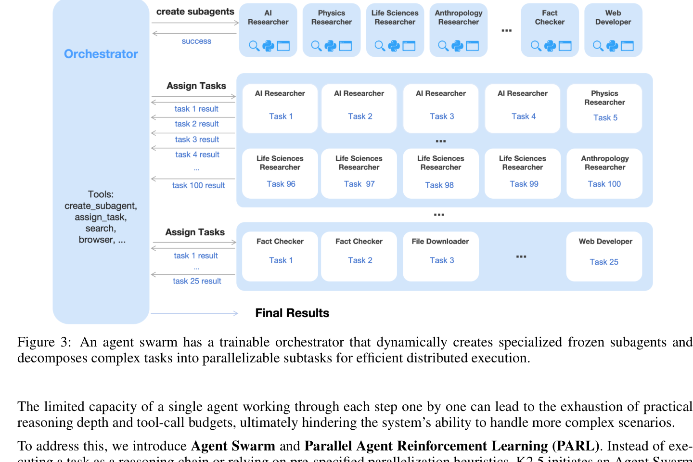
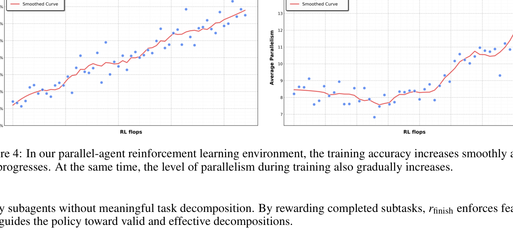
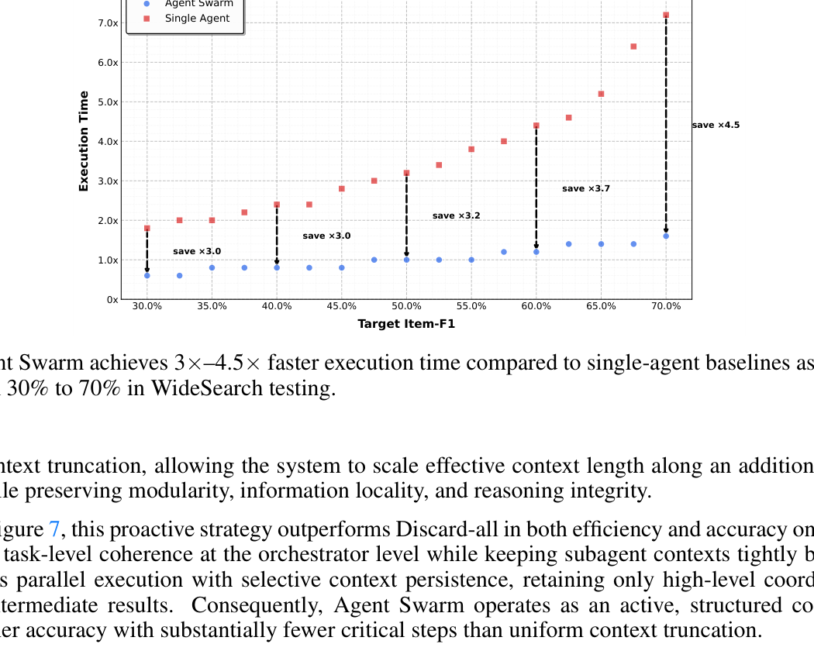

# Week 10 — Paper Notes
**Paper:** Kimi K2.5: Visual Agentic Intelligence — Technical Report of Kimi K2.5, Kimi Team, February 2026 (Moonshot AI)

---

## Table of Contents

1. [Overview](#overview)
2. [Things That Came Up During Reading](#things-that-came-up-during-reading)
3. [Key Points](#key-points)
4. [Foundation: Kimi K2 Base](#foundation-kimi-k2-base)
5. [Joint Optimization of Text and Vision](#joint-optimization-of-text-and-vision)
   - [Native Multimodal Pre-Training](#native-multimodal-pre-training)
   - [Zero-Vision SFT](#zero-vision-sft)
   - [Joint Multimodal RL](#joint-multimodal-rl)
6. [Architecture and Pre-training Pipeline](#architecture-and-pre-training-pipeline)
7. [Post-Training](#post-training)
   - [Policy Optimization Loss](#policy-optimization-loss)
   - [Reward Functions and GRMs](#reward-functions-and-grms)
   - [Toggle: Token-Efficient RL](#toggle-token-efficient-rl)
8. [Agent Swarm](#agent-swarm)
   - [Parallel Agent RL (PARL)](#parallel-agent-rl-parl)
   - [Critical Steps as the Resource Constraint](#critical-steps-as-the-resource-constraint)
9. [Training Infrastructure](#training-infrastructure)
10. [Evaluation Results](#evaluation-results)
11. [Connections to Previous Weeks](#connections-to-previous-weeks)
12. [Glossary](#glossary)

---

## Overview
*Paper reference: Abstract & Section 1 (pp. 1–2)*

Kimi K2.5 is an open-source multimodal agentic model from Moonshot AI, released as the visual-agentic successor to Kimi K2 (text-only) and Kimi K2 Thinking. The paper makes three top-level claims. First, **joint optimization of text and vision is mutually beneficial** rather than antagonistic — early-fusion multimodal pre-training with a *moderate* (10%) vision-token ratio outperforms the conventional approach of injecting vision late at high (50%+) ratios. Second, post-training with **zero-vision SFT** (text-only SFT data with image manipulations proxied through Python operations) is sufficient to unlock visual capabilities for downstream RL — the heavy lifting of visual reasoning is then learned through outcome-based visual RL. Third, **Agent Swarm**, a self-directed parallel agent orchestration framework, takes the same model and converts complex tasks into heterogeneous parallelizable sub-problems, achieving up to **4.5× latency reduction** vs. single-agent baselines while improving accuracy.

The headline numerical results: Kimi K2.5 achieves state-of-the-art results across a wide spectrum — AIME 2025 96.1, HLE-Full with tools 50.2, IMO-AnswerBench 81.8, BrowseComp 60.6 (74.9 with discard-all context management, **78.4 with Agent Swarm**), SWE-Bench Verified 76.8, OSWorld-Verified 63.3, MathVision 84.2, OmniDocBench 88.8, OCRBench 92.3. The model post-trains from Kimi K2's 1.04T-parameter MoE foundation (32B activated, 384 experts with 8 activated), augmented with the **MoonViT-3D** vision encoder (a 3D extension of MoonViT) sharing parameters between image and video understanding. Agent Swarm, in particular, sets a new SOTA on BrowseComp and on Moonshot's in-house Swarm Bench.

---

## Things That Came Up During Reading

> *(Add specific observations, confusions, and aha moments here as you read.)*

- The **conventional wisdom rejection** is striking — most prior multimodal work pushes vision to high ratios *late* in training. K2.5's Table 1 shows that a 10% vision ratio early actually wins. Why does this work? The "modality domain shift" argument — that late-stage vision injection *disrupts* established linguistic representations — is plausible but not directly tested.
- **Cross-modal transfer**: outcome-based visual RL improves text-only benchmarks (MMLU-Pro +1.7, GPQA-Diamond +2.1). The paper attributes this to "calibration in areas requiring structured information extraction." Worth interrogating.
- **Agent Swarm's reward design** is unusual: $r_\mathrm{parallel}$ + $r_\mathrm{finish}$ + $r_\mathrm{perf}$, with the first two annealed to zero by end of training. They're scaffolding signals — the orchestrator initially needs encouragement to parallelize and to ensure subtasks succeed, but ultimately must optimize for outcomes alone.
- **Critical Steps** as a resource metric is a clever reformulation: instead of total tokens or wall time, count the longest path through the agent dependency graph. This explicitly disincentivizes hollow parallelism.
- **Zero-Vision SFT** is conceptually related to RLHF's "teacher-free" approach — bootstrap visual capabilities without expensive human-annotated visual CoT data, using text-only data with code-mediated image ops as a proxy.
- The **Toggle** algorithm alternating between budget-limited and full-context phases looks like curriculum learning for token efficiency. The conditional gate ($\bar{r}(x) < \lambda$) on Phase 0 is interesting — only enforce budget when the model is *already* doing well enough at this difficulty.

---

## Key Points
*Paper reference: Sections 1–4 (pp. 1–9)*

- Kimi K2.5 builds on **Kimi K2** — a 1.04T-parameter MoE Transformer pre-trained on 15T text tokens, with 32B activated, 384 experts, and 8 activated experts per token (sparsity = 48). K2 uses the **MuonClip** optimizer with QK-Clip for stability.
- K2.5 adds the **MoonViT-3D** native-resolution vision encoder (initialized from SigLIP-SO400M, generalizes the "patch n' pack" strategy to 4-frame temporal volumes) and an **MLP projector** to bridge ViT outputs into the LLM token space.
- Pre-training pipeline (Table 3): **ViT Training (1T tokens)** → **Joint Pre-training (15T tokens at 4K seq)** → **Joint Long-context Mid-training (500B → 200B tokens, 32K → 256K seq via YaRN)**.
- Vision-text ratio ablation (Table 1) at fixed total token budget: **early fusion at 10:90 ratio wins (Vision Knowledge 25.8 vs. 24.2 for late 80:20)**. The paper's most counterintuitive design lesson.
- **Zero-Vision SFT** uses *text-only* SFT data, with image manipulations programmatically replaced by IPython operations (binarization, counting, OCR) — sufficient to bootstrap RL visual capabilities without curated visual CoT.
- **Outcome-based visual RL** improves vision benchmarks (MMMU Pro: 0.71 → 0.76; MathVision: 0.69 → 0.78; OCRBench: 0.79 → 0.91) and *also* text benchmarks (MMLU-Pro: 84.7 → 86.4; GPQA-Diamond: 84.3 → 86.4; LongBench v2: 56.7 → 58.9).
- **Joint multimodal RL** — RL domains organized by ability (knowledge, reasoning, coding, agentic), *not* by modality — exposes domain experts to both text and multimodal queries simultaneously.
- **Agent Swarm** uses **Parallel Agent RL (PARL)**: a trainable orchestrator instantiates frozen sub-agents from policy checkpoints, decomposing tasks for concurrent execution. PARL avoids end-to-end joint optimization to circumvent credit-assignment ambiguity.
- Agent Swarm reduces wall-clock execution by **3×–4.5×** as task complexity increases (Item-F1 30% → 70%) on WideSearch, while a single-agent baseline grows from 1.8× to 7×+ baseline time.
- **Toggle** is a training heuristic alternating between **Phase 0** (budget-limited; reward gated by $\mathbb{I}[\bar{r}(x) < \lambda \;\text{or}\; |y| \leq \mathrm{budget}(x)]$) and **Phase 1** (standard scaling). Reduces output tokens by 25–30% with negligible accuracy loss.
- **Decoupled Encoder Process (DEP)** training infrastructure decouples vision-encoder forward/backward from the LLM backbone — achieves 90% of pure-text training efficiency despite multimodal load imbalance.
- New SOTAs on BrowseComp 78.4 (Agent Swarm), WideSearch 79.0 (Agent Swarm), In-house Swarm Bench 58.3 (Agent Swarm), OSWorld-Verified 63.3 (computer use), MathVision 84.2, OmniDocBench 88.8.

---

## Foundation: Kimi K2 Base Model
*Paper reference: Section 4.1 (p. 6)*

Kimi K2.5 doesn't introduce a new base model — it post-trains from Kimi K2:

| Hyperparameter | Value |
|----------------|-------|
| Architecture | MoE Transformer |
| Total parameters | **1.04T** |
| Activated parameters per token | **32B** |
| Total experts | 384 |
| Activated experts per token | 8 |
| Sparsity ratio | 48 |
| Pre-training tokens | 15T (text only) |
| Optimizer | MuonClip (Muon + QK-Clip) |

The K2 paper details these design choices; for K2.5, this is treated as a fixed foundation onto which multimodality is added.

---

## Joint Optimization of Text and Vision
*Paper reference: Section 2 (pp. 2–4)*

### Native Multimodal Pre-Training

**The conventional wisdom** for multimodal LLMs has been: (1) train text-only LLM, (2) inject high-ratio vision tokens late to "convert" it into a VLM. The justification is that linguistic competence should be established first, then vision bolted on as a post-hoc capability.

**K2.5's contrarian finding** (Table 1, condensed):

| Vision Injection Timing | Vision Ratio | Vision Knowledge | OCR | Text Knowledge | Code |
|-------------------------|--------------|-------------------|-----|----------------|------|
| **Early (0% offset)** | 10:90 | **25.8** | **65.7** | **45.5** | **24.8** |
| Mid (50% offset) | 20:80 | 25.0 | 64.1 | 43.9 | 24.0 |
| Late (80% offset) | 50:50 | 24.2 | 61.5 | 43.1 | 24.0 |

Under a *fixed* total vision-text token budget, **early fusion with the lowest vision ratio yields the best results** — across both vision and text benchmarks. The authors call this "native multimodal pre-training": vision and text are mixed at a constant 10:90 ratio throughout, rather than ramped up.

**Why does this work?** The authors argue that late-stage vision injection at high ratios induces **modality domain shift** — the established linguistic representation space is disrupted by sudden vision exposure. Figure 9 (appendix) shows a "dip-and-recover" pattern in text performance under late fusion: text capability initially degrades when vision is introduced, then partially recovers. Early fusion avoids this — text and vision co-evolve from the start.

### Zero-Vision SFT

**The cold-start problem for multimodal RL.** Pretrained VLMs do not naturally perform vision-based tool calling. Conventional fixes (manually annotated CoT data with `crop`, `rotate`, `flip` operations) are limited in diversity and primarily teach simple geometric manipulations.

**Zero-Vision SFT** is a clever workaround: use **only text SFT data**, but proxy all image manipulations through programmatic IPython operations. So instead of teaching the model to call a special "image_crop" tool, the SFT trajectories teach it to write and execute Python code that performs binarization, counting, OCR, etc. This generalizes to visually-grounded tasks because the underlying Python primitives (NumPy slicing, OpenCV ops) are themselves visual operations.

The result: zero-vision SFT alone is sufficient to **activate visual RL** (Figure 2). Visual RL FLOPs scale smoothly to high vision benchmark scores (OCR 0.79 → 0.91; MathVision 0.69 → 0.78). A separate experiment shows text-vision SFT (with curated visual CoT data) underperforms zero-vision SFT on visual/agentic tasks — counter to expectation, but consistent with the diversity story.

### Joint Multimodal RL

#### Visual RL Improves Text Performance (Cross-Modal Transfer)

Table 2 documents an unexpected gain:

| Benchmark | Before Vision-RL | After Vision-RL | Improvement |
|-----------|------------------|------------------|-------------|
| MMLU-Pro | 84.7 | 86.4 | **+1.7** |
| GPQA-Diamond | 84.3 | 86.4 | **+2.1** |
| LongBench v2 | 56.7 | 58.9 | **+2.2** |

The interpretation: visual RL (counting, OCR, structured visual extraction) tightens the model's calibration on tasks that *resemble* visually-grounded reasoning even when the input is text — extracting structured information from passages, tracking quantities, etc.

#### Joint Multimodal RL Organization

K2.5's RL domains are organized **by ability, not by modality**:
- Knowledge (text + vision-knowledge mixed)
- Reasoning (text + math/STEM with visual input)
- Coding (text + image-to-code)
- Agentic (text-tool + visual-tool mixed)

Domain experts and the GRM both ingest pure-text and multimodal queries within their domain. The argument: capability gains acquired through one modality's input naturally generalize to the other when the underlying ability is shared.

---

## Architecture and Pre-training Pipeline
*Paper reference: Section 4 (pp. 6–7)*

The multimodal architecture has three components:

```
Image / Video → MoonViT-3D → MLP Projector → Kimi K2 MoE LLM → Output
```

### MoonViT-3D: Shared Embedding Space for Images and Videos

**MoonViT** (in Kimi-VL) extended the **NaViT** "patch n' pack" strategy to native-resolution images: 2D patches are flattened and packed into 1D sequences for joint training across resolutions.

**MoonViT-3D** generalizes this to a temporal dimension — *consecutive 4 video frames* are treated as a single spatiotemporal volume; their 2D patches are concatenated into one 1D sequence. Critical design choice: **fully shared parameters** between image and video pipelines, with only the additional temporal attention component for videos.

| Property | MoonViT (2D) | MoonViT-3D |
|----------|--------------|-------------|
| Initialization | SigLIP-SO400M | Continual from MoonViT |
| Input | Native-resolution image | Image OR 4-frame temporal volume |
| Parameter sharing | — | **Full sharing** between 2D and 3D paths |
| Temporal compression | None | 4× via lightweight pooling before projector |

The 4× temporal compression at the projector stage allows K2.5 to process 4× more video frames within the same context window. Empirically, MoonViT-3D achieves strong video understanding without specialized video modules.

### Pre-training Pipeline (Table 3)

| Stage | Data | Sequence Length | Tokens | Trainable |
|-------|------|------------------|--------|-----------|
| **ViT Training** | Alt text, synthesis caption, grounding, OCR, video | 4,096 | 1T | ViT only |
| **Joint Pre-training** | + text, knowledge, interleaving, video, OS screenshot | 4,096 | 15T | ViT & LLM |
| **Joint Long-context Mid-training** | + high-quality text, multimodal long text, long-CoT | 32,768 → 262,144 | 500B → 200B | ViT & LLM |

ViT training uses **only the caption-generation cross-entropy loss** $\mathcal{L}_\mathrm{caption}$, no contrastive loss (departure from CLIP-style training). A two-stage alignment: first update MoonViT-3D with Moonlight-16B-A3B as a frozen LLM target (1T tokens, light FLOPs), then update the MLP projector to bridge to the actual K2 base.

The third stage extends context length via **YaRN** interpolation, enabling 256K-token long-context understanding for both text and long video.

---

## Post-Training
*Paper reference: Section 4.4 (pp. 8–9)*

### Policy Optimization Loss

K2.5's RL objective extends K1.5 with a **token-level clipping mechanism** to handle off-policy drift in long-horizon agent tasks:

$$\mathcal{L}_\mathrm{RL}(\theta) = \mathbb{E}_{x \sim \mathcal{D}}\!\left[\frac{1}{N}\sum_{j=1}^{K}\sum_{i=1}^{|y_j|} \mathrm{Clip}\!\left(\frac{\pi_\theta(y_j^i \mid x, y_j^{0:i})}{\pi_\mathrm{old}(y_j^i \mid x, y_j^{0:i})}, \alpha, \beta\right) (r(x, y_j) - \bar{r}(x)) - \tau \log\!\left(\frac{\pi_\theta(y_j^i \mid x, y_j^{0:i})}{\pi_\mathrm{old}(y_j^i \mid x, y_j^{0:i})}\right)^2\right]$$

Where:
- $\pi_\theta$ = the current policy being trained
- $\pi_\mathrm{old}$ = the policy that generated the rollouts
- $\alpha, \beta, \tau > 0$ are hyperparameters
- $K$ = number of responses per problem
- $N = \sum_j |y_j|$ = total tokens in the batch
- $\bar{r}(x) = \frac{1}{K}\sum_j r(x, y_j)$ = mean reward over the $K$ responses (group-relative baseline)
- $\mathrm{Clip}(\cdot, \alpha, \beta)$ = a token-level *gradient masking* scheme: gradients flow normally inside $[\alpha, \beta]$, are zeroed out outside.

The crucial divergence from PPO clipping: standard PPO clips on the log-ratio *regardless of advantage sign*. K2.5 clips strictly on the log-ratio, and only zeroes gradients when out-of-range. This explicitly addresses **off-policy drift** rather than implicitly capping update magnitudes.

The optimizer is **MuonClip** (Muon with QK-Clip) — same as Kimi K2's pre-training.

### Reward Functions and GRMs

| Task Type | Reward Signal |
|-----------|----------------|
| Reasoning (verifiable) | Rule-based outcome reward (correct / incorrect) |
| Agentic (verifiable) | Rule-based outcome reward |
| Visual grounding / point localization | F1-based with **soft matching**: IoU for grounding, Gaussian-weighted distance for points |
| Polygon segmentation | Rasterize prediction → compute IoU vs. ground-truth mask |
| OCR | Normalized edit distance |
| Counting | Absolute difference between predicted and ground-truth count |
| Visual puzzles | LLM verifier (Kimi K2 used as reference) |
| Open-ended generation | **Generative Reward Models (GRMs)** with multiple alternative rubrics |

**Generative Reward Models** are a K2 inheritance, applied broadly in K2.5: the GRM is itself a generative policy that produces *granular* per-rubric judgments (helpfulness, response readiness, contextual relevance, aesthetic quality, instruction following). Multiple alternative GRMs with different rubrics are used in rotation to mitigate reward hacking on any single signal.

### Toggle: Token-Efficient RL

A pure budget-constrained training causes **length-overfitting**: models trained under rigid token budgets fail to generalize to higher compute scales — they default to truncated reasoning even when given more tokens. Toggle alternates between two phases every $m$ iterations:

| Phase | Iteration condition | Reward shaping |
|-------|---------------------|-----------------|
| **Phase 0** (budget-limited) | $\lfloor t/m \rfloor \mod 2 = 0$ | $\tilde{r}(x,y) = r(x,y) \cdot \mathbb{I}\!\left[\frac{1}{K}\sum_i r(x,y_i) < \lambda \;\text{or}\; |y| \leq \mathrm{budget}(x)\right]$ |
| **Phase 1** (standard scaling) | $\lfloor t/m \rfloor \mod 2 = 1$ | $\tilde{r}(x,y) = r(x,y)$ |

Where:
- $\mathrm{budget}(x) = \mathrm{Percentile}(\{|y_j| \mid r(x, y_j) = 1\}, \rho)$ = the $\rho$-th percentile of correct-response lengths, computed once at the start of training and held fixed.
- $\lambda$ = success-rate threshold (only enforce budget when problem-level mean accuracy exceeds $\lambda$, so easier problems are pushed to be concise but harder ones remain unconstrained)
- $K$ = rollouts per problem
- $\bar{r}(x) = \frac{1}{K}\sum_i r(x,y_i)$ = mean reward

The conditional gate is the clever part: only **suppress the reward** in Phase 0 if the model is already solving the problem at threshold accuracy *and* exceeding the budget. This prevents pre-mature compression on tough problems where the model still legitimately needs more tokens.

Empirical effect: **25–30% reduction in average output tokens** with negligible benchmark degradation (Figure 5). Tested on K2 Thinking, the gains transfer across math, code, and even out-of-domain GPQA / MMLU-Pro (mathematical tasks transfer to general reasoning).

---

## Agent Swarm
*Paper reference: Section 3 (pp. 4–6)*

### Motivation: Sequential Agents Saturate

Existing agentic systems (including Kimi K2 Thinking) execute reasoning + tool calls **sequentially**. As tasks scale in complexity, this sequential execution exhausts:
- The model's effective reasoning depth
- The tool-call budget
- The context window (accumulated history grows)

Agent Swarm replaces sequential execution with **dynamic task decomposition + parallel sub-agent instantiation + scheduled execution**.



*Figure 3: A trainable Orchestrator dynamically creates specialized frozen sub-agents (AI Researcher, Physics Researcher, Life Sciences Researcher, ..., Fact Checker, Web Developer) and assigns sub-tasks to them. Sub-agents execute concurrently. Tools available to the Orchestrator: `create_subagent`, `assign_task`, `search`, `browser`.*

### Parallel Agent RL (PARL)

The training framework decouples the orchestrator from the sub-agents:
- **Orchestrator**: actively trained via RL.
- **Sub-agents**: frozen at fixed intermediate policy checkpoints; their execution traces are **excluded from the RL objective**.

**Why decouple?** Two specific challenges with end-to-end multi-agent RL:
1. **Credit assignment ambiguity**: outcome-based rewards are inherently noisy — a correct final answer doesn't guarantee flawless sub-agent execution, and a failure doesn't imply universal sub-agent error.
2. **Training instability**: jointly optimizing many policies amplifies exploration variance.

By freezing sub-agents and treating their outputs as environmental observations, PARL reduces the multi-agent problem to a single-agent (orchestrator) problem with a complex action space.

**PARL Reward** is a sum of three terms (the first two are *scaffolding* signals, annealed to zero over training):

$$r_\mathrm{PARL}(x, y) = \lambda_1 \cdot r_\mathrm{parallel} + \lambda_2 \cdot r_\mathrm{finish} + r_\mathrm{perf}(x, y)$$

| Term | Purpose |
|------|---------|
| $r_\mathrm{parallel}$ | Instantiation reward — encourages the orchestrator to *spawn sub-agents at all*, preventing serial-collapse where it defaults to single-agent execution. |
| $r_\mathrm{finish}$ | Sub-agent finish rate — rewards successful subtask completion, preventing reward hacking through hollow parallelism (spawning many sub-agents that fail). |
| $r_\mathrm{perf}$ | Task-level performance reward (the actual outcome we care about). |

By the end of training, $\lambda_1, \lambda_2 \to 0$ — the orchestrator's behavior is shaped entirely by performance. The annealing + scaffolding philosophy is similar to RLHF's auxiliary KL penalty: training-time aid, not test-time constraint.



*Figure 4: Training accuracy increases smoothly while average parallelism gradually grows from ~8 to ~14 over RL training — the orchestrator learns to parallelize as it discovers the strategy is rewarded.*

### Critical Steps as the Resource Constraint

A naïve "minimize total tokens" or "minimize step count" objective rewards spurious parallelism. K2.5 introduces **Critical Steps** — the longest path through the agent execution graph:

$$\mathrm{CriticalSteps} = \sum_{t=1}^{T}\!\left(S_\mathrm{main}^{(t)} + \max_i S_{\mathrm{sub}, i}^{(t)}\right)$$

Where:
- $T$ = total stages in the execution
- $S_\mathrm{main}^{(t)}$ = steps taken by the main agent in stage $t$ (typically 1 per stage for the orchestrator)
- $S_{\mathrm{sub}, i}^{(t)}$ = steps taken by sub-agent $i$ in stage $t$
- $\max_i$ = the longest-running sub-agent dominates the wall-clock cost of the parallel group

By measuring against critical steps, **excessive subtask creation that doesn't reduce the maximum execution time is discouraged**, while well-balanced decomposition that shortens the longest branch directly reduces critical steps. The orchestrator is incentivized to balance load, not just spawn more agents.

### Wall-Clock Savings



*Figure 8: As target Item-F1 (task difficulty) increases from 30% to 70% on WideSearch, single-agent execution time grows from ~1.8× to over 7×. Agent Swarm maintains near-constant ~0.6×–1.6× the baseline, achieving 3.0×–4.5× faster execution at the harder end.*

Single-agent execution time grows super-linearly with task difficulty, while Agent Swarm stays nearly flat. The difficulty-induced gap is where parallelism pays off most.

---

## Training Infrastructure
*Paper reference: Section 4.5 (pp. 9–10)*

### Decoupled Encoder Process (DEP)

In standard multimodal training with Pipeline Parallelism (PP), the vision encoder + text embedding occupy Stage-0. This causes load imbalance because multimodal input sizes (image counts, resolutions) fluctuate, while pure-text training does not have this issue. Conventional fixes (manual PP rebalancing) compromise performance and break compatibility with text-only training strategies.

**DEP** decouples the vision encoder from the PP backbone:

| Phase | Operation |
|-------|-----------|
| **1. Balanced Vision Forward** | Replicate vision encoder on *all* GPUs (it's small). Forward all visual data with load balanced by image/patch count. Discard intermediate activations; retain only final outputs. Gather to PP Stage-0. |
| **2. Backbone Training** | Standard PP forward + backward for the LLM. Discard intermediate activations from phase 1. Accumulate gradients at the visual encoder output. |
| **3. Vision Recomputation & Backward** | Re-compute vision encoder forward, then backward to compute encoder parameter gradients. |

This decoupling preserves the LLM's parallel strategy validated in pure text training, and achieves **90%** of pure-text training efficiency despite multimodal load.

### Hardware

NVIDIA H800 clusters with 8× 400 Gbps RoCE interconnects across nodes. Parallelism: 16-way **PP** (with virtual stages) + 16-way **Expert Parallelism (EP)** + **ZeRO-1** data parallelism. EP all-to-all communication is overlapped with computation under interleaved 1F1B scheduling. Selective recomputation for `LayerNorm`, SwiGLU, and MLA up-projections.

### Unified Agentic RL Environment (Appendix D)

The RL framework provides a Gym-like interface and treats each agent task as an **independent asynchronous coroutine**. A `RolloutManager` orchestrates up to **100,000 concurrent agent tasks**. Pluggable components:
- **Toolset** (sandboxes, web search, code interpreter)
- **Judge** (multi-faceted reward scoring)
- **Prompt & Instruction Enhancement** (diversification, instruction-following augmentation)
- **LLM Gateway** for black-box envs that don't support advanced RL APIs

Inference engine co-design: **Token-in-Token-out paradigm** with log-prob recording for train-inference mismatch correction (a common source of RL training instability).

---

## Evaluation Results
*Paper reference: Section 5 (pp. 10–14)*

### Benchmark Descriptions (selected)

| Benchmark | What It Tests | Format | Metric |
|-----------|---------------|--------|--------|
| **HLE (Humanity's Last Exam)** | Multi-domain expert-level knowledge | Free-form QA, with/without tools | Pass@1 — higher is better |
| **AIME 2025** | American Invitational Mathematics Examination | Math, integer answer | Avg@64 accuracy — higher is better |
| **HMMT 2025 (Feb)** | Harvard-MIT Mathematics Tournament | Math, integer answer | Avg@64 accuracy — higher is better |
| **IMO-AnswerBench** | International Mathematical Olympiad-derived problems | Open-ended math | Pass@1 — higher is better |
| **GPQA-Diamond** | Graduate-level science (physics/chem/bio) | MC | Avg@8 — higher is better |
| **MMLU-Pro** | Hardened MMLU | MC | EM — higher is better |
| **AdvancedIF** | Advanced instruction-following with rubric-based eval | Free-form | Rubric score — higher is better |
| **LongBench v2** | Long-context multi-task suite | Mixed | EM — higher is better |
| **SWE-Bench Verified / Multilingual / Pro** | Real GitHub issue resolution | Patch generation | Resolved % — higher is better |
| **Terminal Bench 2.0** | Terminal command-line tasks | Command synthesis | Accuracy — higher is better |
| **LiveCodeBench v6** | Live competitive programming | Code generation | Pass@1 — higher is better |
| **PaperBench (CodeDev)** | Replicating ML research papers from descriptions | Code generation | Pass@1 — higher is better |
| **CyberGym** | Cybersecurity vulnerability finding | Security analysis | Pass@1 — higher is better |
| **BrowseComp** | Multi-step deep-web research | Web browsing | Pass@1 — higher is better |
| **WideSearch** | Broad multi-step information seeking | Web | Item-F1 — higher is better |
| **DeepSearchQA** | Deep research QA | QA | Pass@1 — higher is better |
| **MMMU-Pro** | Multimodal multi-discipline understanding | Multimodal MC | EM — higher is better |
| **MathVision** | Math problems with diagrams | Multimodal | Pass@1 — higher is better |
| **CharXiv (RQ)** | Realistic chart understanding | Chart Q&A | Pass@1 — higher is better |
| **OmniDocBench 1.5** | Document parsing with comprehensive annotations | Doc understanding | $(1 - \text{normalized Levenshtein})\times 100$ — higher is better |
| **OCRBench** | Multilingual OCR | OCR | Accuracy — higher is better |
| **VideoMMMU / MMVU / Video-MME** | Video understanding | Multimodal video | Pass@1 / EM — higher is better |
| **OSWorld-Verified** | GUI-based desktop computer use | Action sequence | Success — higher is better |
| **WebArena** | Web-based GUI agent | Action sequence | Success — higher is better |

### Headline Results (Table 4, condensed)

| Category | Benchmark | **Kimi K2.5** | Claude Opus 4.5 | GPT-5.2 (xhigh) | Gemini 3 Pro | DeepSeek-V3.2 |
|----------|-----------|---------------|------------------|-------------------|---------------|----------------|
| Reasoning | HLE Full | 30.1 | 30.8 | 34.5 | **37.5** | 25.1 |
| Reasoning | HLE Full w/ tools | **50.2** | 43.3 | 45.5 | 45.8 | 40.8 |
| Reasoning | AIME 2025 | 96.1 | 92.8 | **100** | 95.0 | 93.1 |
| Reasoning | HMMT 2025 (Feb) | 95.4 | 92.9 | **99.4** | 97.3 | 92.5 |
| Reasoning | IMO-AnswerBench | 81.8 | 78.5 | **86.3** | 83.1 | 78.3 |
| Reasoning | GPQA-Diamond | 87.6 | 87.0 | **92.4** | 91.9 | 82.4 |
| Reasoning | MMLU-Pro | 87.1 | 89.3 | 86.7 | **90.1** | 85.0 |
| Reasoning | SimpleQA Verified | 36.9 | 44.1 | 38.9 | **72.1** | 27.5 |
| Reasoning | AdvancedIF | 75.6 | 63.1 | **81.1** | 58.8 | — |
| Reasoning | LongBench v2 | 61.0 | 64.4 | 54.5 | **68.2** | 59.8 |
| Coding | SWE-Bench Verified | 76.8 | **80.9** | 80.0 | 76.2 | 73.1 |
| Coding | SWE-Bench Multilingual | 73.0 | **77.5** | 72.0 | 65.0 | 70.2 |
| Coding | LiveCodeBench v6 | 85.0 | 82.2 | — | **87.4** | 83.3 |
| Coding | Terminal Bench 2.0 | 50.8 | **59.3** | 54.0 | 54.2 | 46.4 |
| Coding | PaperBench (CodeDev) | 63.5 | **72.9** | 63.7 | — | 47.1 |
| Coding | CyberGym | 41.3 | **50.6** | — | 39.9 | 17.3 |
| Agentic | BrowseComp | 60.6 | 37.0 | 65.8 | 37.8 | 51.4 |
| Agentic | BrowseComp (w/ ctx mgmt) | 74.9 | 57.8 | — | 59.2 | 67.6 |
| Agentic | **BrowseComp (Agent Swarm)** | **78.4** | — | — | — | — |
| Agentic | WideSearch | 72.7 | **76.2** | — | 57.0 | 32.5 |
| Agentic | WideSearch (Agent Swarm) | **79.0** | — | — | — | — |
| Agentic | DeepSearchQA | **77.1** | 76.1 | 71.3 | 63.2 | 60.9 |
| Agentic | Seal-0 | **57.4** | 47.7 | 45.0 | 45.5 | 49.5 |
| Image | MMMU-Pro | 78.5 | 74.0 | 79.5 | **81.0** | — |
| Image | MMMU (val) | 84.3 | 80.7 | **86.7** | 87.5 | — |
| Image | CharXiv (RQ) | 77.5 | 67.2 | **82.1** | 81.4 | — |
| Image | MathVision | **84.2** | 77.1 | 83.0 | 86.1 | — |
| Image | SimpleVQA | **71.2** | 69.7 | 55.8 | 69.7 | — |
| Image | BLINK | **78.9** | 68.8 | — | 78.7 | — |
| Image | OmniDocBench 1.5 | **88.8** | 87.7 | 85.7 | 88.5 | — |
| Image | OCRBench | **92.3** | 86.5 | 80.7 | 90.3 | — |
| Image | InfoVQA (test) | **92.6** | 76.9 | 84.0 | 57.2 | — |
| Video | VideoMMMU | 86.6 | 84.4 | 85.9 | **87.6** | — |
| Video | MMVU | 80.4 | 77.3 | **80.8** | 77.5 | — |
| Video | MotionBench | **70.4** | 60.3 | 64.8 | 70.3 | — |
| Video | Video-MME | 87.4 | 77.6 | 86.0 | **88.4** | — |
| Video | LongVideoBench | **79.8** | 67.2 | 76.5 | 77.7 | — |
| Computer | OSWorld-Verified | **63.3** | 66.3 | 8.6 | 20.7 | — |
| Computer | WebArena | **58.9** | 63.4 | — | — | — |

#### Reading the Table

- **Reasoning gap with frontier proprietary** is real but narrowing. K2.5 leads HLE-with-tools (50.2 — a +4.4 over Gemini 3 Pro and +4.7 over GPT-5.2) and IMO-AnswerBench (after Agent Swarm augmentation). Pure HLE without tools is K2.5's weakest area (30.1) — knowledge benchmarks favor proprietary models.
- **Coding software engineering** is a near-tie with Opus 4.5 — K2.5 leads on LiveCodeBench v6 (live, harder distributional shift) but trails on SWE-Bench Verified (controlled benchmark).
- **Visual reasoning is K2.5's clearest win**: SOTA on MathVision (84.2), OmniDocBench (88.8), OCRBench (92.3), InfoVQA (92.6), SimpleVQA (71.2), BLINK (78.9), ZeroBench-Tools (11). Both math and OCR-heavy benchmarks improved significantly.
- **Computer use**: 63.3 on OSWorld-Verified vs. Qwen3-VL-235B-A22B's 38.1 and GPT-5.2's 8.6 — a substantial open-source SOTA. Opus 4.5 still wins (66.3) but the gap is small.
- **Agent Swarm gains** are the most interesting: BrowseComp 60.6 → 78.4 (+17.8 absolute), WideSearch 72.7 → 79.0 (+6.3), In-house Swarm Bench 41.6 → 58.3 (+16.7). Tasks built around parallelizable sub-problems benefit enormously.

### Token Efficiency on Reasoning (Table 5)

| Benchmark | Kimi K2.5 (k tokens) | Kimi K2 Thinking | Gemini-3.0 Pro | DeepSeek-V3.2 Thinking |
|-----------|----------------------|-------------------|------------------|--------------------------|
| AIME 2025 | 96.1 (25k) | 94.5 (30k) | 95.0 (15k) | 93.1 (16k) |
| HMMT Feb 2025 | 95.4 (27k) | 89.4 (35k) | 97.3 (16k) | 92.5 (19k) |
| LiveCodeBench | 85.0 (18k) | 82.6 (26k) | 87.4 (15k) | 83.3 (16k) |
| HLE-Text | 31.5 (24k) | 23.9 (24k) | **38.4 (13k)** | 25.1 (21k) |

K2.5 outperforms K2 Thinking with **fewer or equal tokens** in every shown case — Toggle is paying off. Gemini-3.0 Pro is more token-efficient (about half the tokens) but at lower accuracy on most rows.

---

## Connections to Previous Weeks

> **GPT-3 (W1):** GPT-3 demonstrated that scale + few-shot prompting unlocks emergent task generality. K2.5 inherits this paradigm (large MoE base, in-context capabilities) but introduces *agentic intelligence* as the new emergent capability — going beyond a passive completion model toward planning and parallel execution.

> **Attention Is All You Need (W2):** K2.5's MoonViT-3D extends the Transformer's self-attention to multimodal patches packed into a single 1D sequence. The "patch n' pack" / "spatiotemporal volume" tricks are clever stretches of the basic attention mechanism — same primitives, expanded input modality.

> **InstructGPT / RLHF (W4):** RLHF aligned a passive completion model to follow instructions. K2.5's joint multimodal RL plays the same role for *agentic* behavior — outcome-based RL replaces RLHF's preference learning, and Generative Reward Models (GRMs) replace scalar reward models. The token-level clipping in $\mathcal{L}_\mathrm{RL}$ is also a direct response to PPO's known instability when applied to long-horizon tasks (a problem InstructGPT didn't have to face at the same scale).

> **LLaMA 1 / LLaMA 2 (W5):** The two papers provided the open dense baseline; K2.5 sits on the opposite side of that architectural debate (massive MoE, 1.04T total / 32B activated). The progression from open dense → open MoE has effectively been led by DeepSeek-V3 and Kimi K2 — K2.5 extends that trajectory into multimodality.

> **Mistral 7B / Mixtral / Llama 3 (W6):** Mixtral validated open MoE; Llama 3 chose to stay dense. K2.5's K2 base (1.04T total / 32B activated, sparsity 48) far surpasses Mixtral's sparsity (8 experts top-2). Compared to Llama 3, K2.5 makes the opposite bet on every dimension — sparsity, multimodality, and post-training pipeline complexity.

> **DeepSeek-R1 (W8):** R1 demonstrated that pure RL on a strong base produces emergent reasoning. K2.5's RL framework refines this with token-level clipping, GRMs, and Toggle — solving practical RL stability issues R1 ran into. The `<think>...</think>` tagging and reasoning-effort levels (inherited via K2 Thinking) trace directly to R1's output format.

> **DeepSeek-V4 / Engram (W9):** All three of these recent papers (V4, Engram, K2.5) converge on the same architectural philosophy — MoE + sophisticated routing + advanced post-training. V4 and Engram attack efficiency along the *attention* and *embedding-lookup* axes; K2.5 attacks it along the *agentic-execution* axis (parallel sub-agents). DeepSeek-V4's Anticipatory Routing and K2.5's MuonClip are both stability hacks for the same core problem (MoE training instability under loss spikes), with different fixes.

---

## Glossary

| Term | Definition |
|------|------------|
| **Kimi K2** | The 1.04T-parameter MoE base model that K2.5 post-trains from. 32B activated, 384 experts (8 active), trained on 15T text tokens with MuonClip. |
| **Kimi K2 Thinking** | The "thinking-mode" variant of Kimi K2 that explicitly produces `<think>...</think>` reasoning traces before final answers. |
| **MoonViT** | Kimi-VL's vision encoder, based on the NaViT "patch n' pack" strategy for native-resolution image processing. |
| **MoonViT-3D** | K2.5's 3D extension of MoonViT, treating 4 consecutive video frames as a single spatiotemporal volume with shared parameters between image and video paths. |
| **NaViT** | "Native resolution Vision Transformer" — patches arbitrary-resolution images into a flat 1D token sequence ("patch n' pack"). |
| **Native Multimodal Pre-training** | K2.5's design: mix vision and text tokens at constant low ratio (10:90) early, rather than late-fusing high vision ratios. |
| **Zero-Vision SFT** | SFT using only text data, with image manipulations replaced by IPython operations. Sufficient cold-start for downstream visual RL. |
| **Cross-Modal Transfer** | The phenomenon that visual RL improves text-only benchmarks (e.g., MMLU-Pro +1.7), attributed to shared structured-information-extraction capabilities. |
| **MuonClip** | Muon optimizer + QK-Clip stability technique, used in Kimi K2 pre-training and inherited by K2.5 RL. |
| **GRM (Generative Reward Model)** | A reward model that *generates* rubric-based judgments rather than producing a scalar. K2.5 uses multiple alternative GRMs in rotation to mitigate reward hacking. |
| **Agent Swarm** | K2.5's parallel agent orchestration framework. A trainable orchestrator dynamically creates frozen sub-agents and assigns them subtasks. |
| **Orchestrator** | The trainable main agent in Agent Swarm. Has access to `create_subagent`, `assign_task`, `search`, `browser`. |
| **Sub-agent** | A specialized frozen agent instantiated by the orchestrator. Has its own system prompt; receives subtasks and executes them with bounded local context. |
| **PARL (Parallel Agent RL)** | The training paradigm for Agent Swarm. Decouples orchestrator (trained) from sub-agents (frozen) to avoid credit-assignment ambiguity. |
| **Critical Steps** | The longest path through the agent execution dependency graph. Used as the resource constraint metric in Agent Swarm — it disincentivizes spurious parallelism. |
| **Toggle** | Token-efficient RL training heuristic that alternates between budget-limited (Phase 0) and standard scaling (Phase 1) phases. Reduces output tokens 25–30% with negligible accuracy loss. |
| **DEP (Decoupled Encoder Process)** | Multimodal training infrastructure that decouples vision-encoder forward/backward from the LLM PP backbone, achieving 90% of pure-text training efficiency. |
| **Patch n' Pack** | The strategy of flattening 2D image patches into a 1D token sequence for joint training across resolutions. Originally from NaViT. |
| **YaRN** | Yet another RoPE extension — interpolation method for extending the effective context window. Used in K2.5's third pre-training stage to reach 256K tokens. |
| **Token-in-Token-out** | An RL training paradigm where the inference engine returns log probabilities for all output tokens, enabling train-inference mismatch correction. |
| **HLE (Humanity's Last Exam)** | Multi-domain expert-level knowledge benchmark; K2.5 leads on the with-tools variant (50.2). |
| **HMMT / IMO-AnswerBench / AIME** | Math competition benchmarks. K2.5 hits 95.4 / 81.8 / 96.1 respectively. |
| **BrowseComp / WideSearch / DeepSearchQA** | Deep-web research and information-seeking benchmarks. K2.5 leads on all three with Agent Swarm. |
| **OSWorld-Verified / WebArena** | Real-world computer-use benchmarks (GUI desktop / web). K2.5 reaches 63.3 / 58.9 — best among open-source. |
| **MathVision / CharXiv / OCRBench** | Multimodal math, chart, and OCR benchmarks. K2.5 SOTA on multiple. |
| **MMMU / MMMU-Pro / Video-MME / VideoMMMU** | General multimodal understanding benchmarks. |
