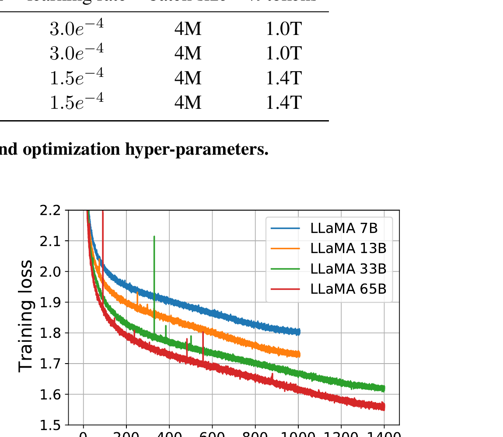
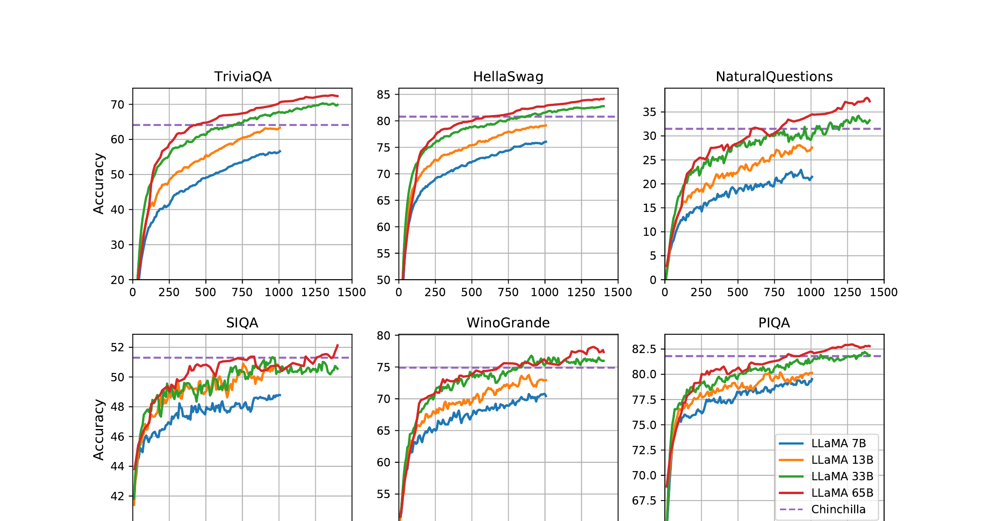

# Week 5 (Paper 1) — Paper Notes
**Paper:** LLaMA: Open and Efficient Foundation Language Models, Touvron et al. 2023 (Meta AI)

---

## Table of Contents

1. [Overview](#overview)
2. [Things That Came Up During Reading](#things-that-came-up-during-reading)
3. [Key Points](#key-points)
4. [Scaling Laws & Motivation](#scaling-laws--motivation)
5. [Training Data](#training-data)
6. [Architecture](#architecture)
7. [Training Details](#training-details)
8. [Benchmark Results](#benchmark-results)
9. [Instruction Finetuning (LLaMA-I)](#instruction-finetuning-llama-i)
10. [Bias, Toxicity, and Misinformation](#bias-toxicity-and-misinformation)
11. [Carbon Footprint](#carbon-footprint)
12. [Connections to Previous Weeks](#connections-to-previous-weeks)
13. [Glossary](#glossary)

---

## Overview
*Paper reference: Abstract & Section 1 (pp. 1–2)*

The dominant approach to improving language models has been to scale up parameters — GPT-3 (175B), PaLM (540B), Chinchilla (70B). LLaMA challenges this by asking: **what if we optimize for inference budget instead of training budget?** The Chinchilla scaling laws (Hoffmann et al., 2022) showed that for a fixed *training* compute budget, smaller models trained on more data can match larger models. LLaMA extends this insight to *inference*: given a target performance level, a smaller model trained longer will be cheaper to serve.

The result: **LLaMA-13B outperforms GPT-3 (175B) on most benchmarks** while being over 10x smaller (and runnable on a single GPU). LLaMA-65B is competitive with Chinchilla-70B and PaLM-540B. Crucially, LLaMA is trained **exclusively on publicly available data**, making it fully reproducible — unlike GPT-3, PaLM, or Chinchilla which rely on proprietary datasets.

---

## Things That Came Up During Reading

> *(Add specific observations, confusions, and aha moments here as you read.)*

---

## Key Points
*Paper reference: Section 1 (pp. 1–2)*

- The Chinchilla scaling laws optimize for training compute, but **inference cost matters more** when serving models at scale — a smaller model trained longer is cheaper to deploy
- LLaMA trains models from 7B to 65B parameters on **1.0T to 1.4T tokens** of publicly available data only
- LLaMA-13B outperforms GPT-3 (175B) on most benchmarks despite being 10x smaller
- LLaMA-65B is competitive with Chinchilla-70B and PaLM-540B on standard benchmarks
- Key architectural modifications over the original Transformer: **RMSNorm** (pre-normalization), **SwiGLU** activation, **Rotary Positional Embeddings (RoPE)**
- Training loss for the 7B model has not saturated even after 1T tokens — more data continues to help
- Brief instruction finetuning (LLaMA-I) reaches 68.9% on MMLU, outperforming all existing instruction-tuned models of similar size
- All models are released to the research community, advancing open-source LLM development

---

## Scaling Laws & Motivation
*Paper reference: Section 1 (pp. 1–2)*

### The Training vs. Inference Tradeoff

Two different scaling perspectives lead to very different model choices:

| Perspective | Goal | Recommendation | Example |
|-------------|------|---------------|---------|
| **Kaplan et al. (2020)** | Given a compute budget, maximize performance | Use a larger model, less data | Train 175B on 300B tokens |
| **Hoffmann et al. (2022)** — Chinchilla | Given a compute budget, jointly optimize model size and data | Use a smaller model, more data | Train 70B on 1.4T tokens (instead of 280B on 300B) |
| **LLaMA's insight** | Given a target **inference** budget, maximize performance | Train the smallest model that hits your target, on as much data as possible | Train 13B on 1T tokens to beat 175B GPT-3 |

**The key difference:** Chinchilla asks "what's the cheapest way to *train* a model to a given quality?" LLaMA asks "what's the cheapest way to *run* a model at a given quality?" Since a model is trained once but used millions of times, optimizing for inference is often more important.

**Concrete example:** Hoffmann et al. recommend training a 10B model on 200B tokens. But LLaMA shows that a 7B model trained on 1T tokens — 5x more data than "optimal" for training — continues to improve. The extra training cost is paid once; the inference savings (running a 7B instead of a 10B model) are permanent.



*Figure 1: Training loss over train tokens. Note that the 7B model's loss is still decreasing at 1T tokens — no sign of saturation.*

---

## Training Data
*Paper reference: Section 2.1 (pp. 2–3)*

LLaMA is trained exclusively on **publicly available data** — a deliberate choice to enable open-source reproducibility. The total dataset is approximately **1.4T tokens** after tokenization.

### Data Mixture

| Dataset | Sampling Proportion | Epochs | Disk Size | Description |
|---------|-------------------|--------|-----------|-------------|
| **English CommonCrawl** | 67.0% | 1.10 | 3.3 TB | Web crawl (2017–2020), deduplicated with CCNet, filtered with fastText language ID + quality classifier trained on Wikipedia references |
| **C4** | 15.0% | 1.06 | 783 GB | Diverse pre-processed CommonCrawl; quality filtering via heuristics (punctuation, word/sentence count) |
| **Github** | 4.5% | 0.64 | 328 GB | Public repos (Apache/BSD/MIT licenses), filtered by line length + alphanumeric ratio, deduplicated at file level |
| **Wikipedia** | 4.5% | 2.45 | 83 GB | June–August 2022 dumps, 20 languages (Latin + Cyrillic scripts), hyperlinks/comments/boilerplate removed |
| **Books (Gutenberg + Books3)** | 4.5% | 2.23 | 85 GB | Public domain books + Books3 from The Pile, deduplicated at book level (>90% overlap) |
| **ArXiv** | 2.5% | 1.06 | 92 GB | LaTeX source files, pre-first-section and bibliography removed, comments removed, macros inline-expanded |
| **Stack Exchange** | 2.0% | 1.03 | 78 GB | Top 28 largest sites, HTML tags removed, answers sorted by score (highest first) |

**Key design decisions:**
- Most tokens are seen only once during training (epochs ≈ 1.0), except Wikipedia and Books (~2.2–2.5 epochs)
- Wikipedia and Books are *upsampled* relative to their disk size because they are higher quality
- CommonCrawl dominates by volume but is the lowest quality source — heavy filtering is applied

### Tokenizer

- **BPE** (Byte Pair Encoding) via SentencePiece
- Vocabulary size: **32,000** tokens (compared to GPT-3's 50,257)
- All numbers split into individual digits (e.g., "2023" → "2", "0", "2", "3")
- Unknown UTF-8 characters decomposed to bytes as fallback

---

## Architecture
*Paper reference: Section 2.2 (pp. 3–4)*

LLaMA uses the standard Transformer decoder architecture (Vaswani et al., 2017) with three key modifications that have become standard practice in modern LLMs:

### Model Sizes

| | params | dimension ($d$) | $n$ heads | $n$ layers | learning rate | batch size | $n$ tokens |
|---|--------|------------|-----------|------------|---------------|------------|------------|
| **LLaMA-7B** | 6.7B | 4,096 | 32 | 32 | $3.0 \times 10^{-4}$ | 4M | 1.0T |
| **LLaMA-13B** | 13.0B | 5,120 | 40 | 40 | $3.0 \times 10^{-4}$ | 4M | 1.0T |
| **LLaMA-33B** | 32.5B | 6,656 | 52 | 60 | $1.5 \times 10^{-4}$ | 4M | 1.4T |
| **LLaMA-65B** | 65.2B | 8,192 | 64 | 80 | $1.5 \times 10^{-4}$ | 4M | 1.4T |

### Modification 1: Pre-Normalization with RMSNorm
*Inspired by: GPT-3 (Brown et al., 2020)*

The original Transformer applies Layer Normalization *after* each sub-layer (post-norm). LLaMA normalizes the *input* to each sub-layer instead (pre-norm), using **RMSNorm** (Zhang & Sennrich, 2019) instead of LayerNorm.

**LayerNorm** (original Transformer):

$$\text{LayerNorm}(x) = \frac{x - \mu}{\sqrt{\sigma^2 + \epsilon}} \cdot \gamma + \beta$$

Computes both mean $\mu$ and variance $\sigma^2$, then applies learnable scale $\gamma$ and shift $\beta$.

**RMSNorm** (LLaMA):

$$\text{RMSNorm}(x) = \frac{x}{\sqrt{\frac{1}{d}\sum_{i=1}^{d} x_i^2 + \epsilon}} \cdot \gamma$$

Only computes the root mean square — no mean subtraction, no learnable bias. This is simpler and slightly faster while achieving comparable training stability.

**Where it's applied** (using the 7B model as example, $d = 4{,}096$):

```
Original Transformer:    x → Attention → Add → LayerNorm → FFN → Add → LayerNorm
LLaMA:                   x → RMSNorm → Attention → Add → RMSNorm → FFN → Add
```

### Modification 2: SwiGLU Activation
*Inspired by: PaLM (Chowdhery et al., 2022), using Shazeer (2020)*

The original Transformer uses a ReLU activation in the feed-forward network:

$$\text{FFN}_{\text{ReLU}}(x) = W_2 \cdot \text{ReLU}(W_1 x + b_1) + b_2$$

LLaMA replaces this with the **SwiGLU** activation function, which uses a gating mechanism:

$$\text{FFN}_{\text{SwiGLU}}(x) = W_2 \cdot (\text{SiLU}(W_{\text{gate}} x) \otimes W_{\text{up}} x)$$

Where:
- $\text{SiLU}(z) = z \cdot \sigma(z)$ (Sigmoid Linear Unit, also called "Swish")
- $\otimes$ denotes element-wise multiplication
- $W_{\text{gate}}$ and $W_{\text{up}}$ are two separate "up-projection" matrices
- The gated branch ($\text{SiLU}(W_{\text{gate}} x)$) controls how much of the other branch ($W_{\text{up}} x$) passes through

**Dimensions** (for the 7B model, $d = 4{,}096$):

| Component | Original Transformer (ReLU) | LLaMA (SwiGLU) |
|-----------|---------------------------|-----------------|
| Up-projection | $W_1 \in \mathbb{R}^{d \times 4d}$ (4,096 → 16,384) | $W_{\text{gate}}, W_{\text{up}} \in \mathbb{R}^{d \times \frac{2}{3} \cdot 4d}$ (4,096 → 11,008) |
| Down-projection | $W_2 \in \mathbb{R}^{4d \times d}$ (16,384 → 4,096) | $W_2 \in \mathbb{R}^{\frac{2}{3} \cdot 4d \times d}$ (11,008 → 4,096) |
| Hidden dimension | $4d = 16{,}384$ | $\frac{2}{3} \times 4d \approx 10{,}922$ → rounded to 11,008 (multiple of 256) |
| Parameters per layer | $2 \times d \times 4d = 2 \times 4{,}096 \times 16{,}384$ | $3 \times d \times \frac{2}{3} \times 4d = 3 \times 4{,}096 \times 11{,}008$ |

The $\frac{2}{3}$ factor compensates for the extra matrix ($W_{\text{gate}}$), keeping the total parameter count roughly the same as ReLU while improving performance.

### Modification 3: Rotary Positional Embeddings (RoPE)
*Inspired by: GPTNeo (Su et al., 2021)*

The original Transformer adds **learned absolute position embeddings** to the token embeddings:

$$X_0 = X_{\text{embed}} + W_P$$

where $W_P \in \mathbb{R}^{T \times d}$ is a learned matrix (one vector per position). The problem: this doesn't generalize well to sequences longer than seen during training.

LLaMA replaces this with **Rotary Position Embeddings (RoPE)**, which encode position information directly into the attention computation. Instead of adding position vectors to the input, RoPE applies a rotation to the query and key vectors at each position:

$$\tilde{q}_t = R_t \cdot q_t, \quad \tilde{k}_s = R_s \cdot k_s$$

where $R_t$ is a rotation matrix determined by position $t$. The attention score between positions $t$ and $s$ then depends on the *relative* distance $(t - s)$:

$$\tilde{q}_t^T \tilde{k}_s = q_t^T R_{t-s} k_s$$

**Why this matters:**
- **Relative position:** Attention scores depend on the *distance* between tokens, not their absolute positions — more natural for language
- **Better generalization:** Can potentially handle sequences longer than those seen during training
- **Applied at every layer:** Unlike absolute embeddings (added once at the input), RoPE rotations are applied at every attention layer, giving each layer position information

**Summary of modifications:**

| Component | Original Transformer | LLaMA |
|-----------|---------------------|-------|
| Normalization | Post-LayerNorm | Pre-RMSNorm |
| Activation | ReLU | SwiGLU ($\frac{2}{3} \times 4d$ hidden dim) |
| Position encoding | Learned absolute embeddings | Rotary (RoPE) at every layer |
| Biases | Present in attention + FFN | **No biases** in linear layers |

---

## Training Details
*Paper reference: Sections 2.3–2.4 (pp. 3–4)*

### Optimizer

- **AdamW** with hyperparameters: $\beta_1 = 0.9$, $\beta_2 = 0.95$
- **Cosine learning rate schedule:** warm up over 2,000 steps, then cosine decay to 10% of peak
- **Weight decay:** 0.1
- **Gradient clipping:** 1.0

### Efficient Implementation

Two key optimizations reduce training time significantly:

1. **Efficient causal multi-head attention** (from the `xformers` library):
   - Does not store attention weights
   - Does not compute masked key/query scores (causal mask positions)
   - Based on FlashAttention (Dao et al., 2022)
   - Reduces memory usage from $O(T^2)$ to $O(T)$

2. **Activation checkpointing** (reducing recomputation):
   - Save activations that are expensive to compute (linear layer outputs)
   - Custom backward function for transformer layers (replacing PyTorch autograd)
   - Reduces memory at the cost of some recomputation

### Training Speed

For the 65B model on 2,048 A100 GPUs (80GB):
- **~380 tokens/sec/GPU**
- Training on 1.4T tokens takes approximately **21 days**

---

## Benchmark Results
*Paper reference: Section 3 (pp. 4–8)*

LLaMA is evaluated on 20 benchmarks using **zero-shot** and **few-shot** settings. Key: the model generates text or ranks completions by likelihood — no task-specific fine-tuning.

### Common Sense Reasoning (Zero-shot)

| | BoolQ | PIQA | SIQA | HellaSwag | WinoGrande | ARC-e | ARC-c | OBQA |
|---|-------|------|------|-----------|------------|-------|-------|------|
| GPT-3 175B | 60.5 | 81.0 | - | 78.9 | 70.2 | 68.8 | 51.4 | 57.6 |
| Chinchilla 70B | 83.7 | 81.8 | 51.3 | 80.8 | 74.9 | - | - | - |
| PaLM 540B | **88.0** | 82.3 | - | 83.4 | **81.1** | 76.6 | 53.0 | 53.4 |
| **LLaMA-7B** | 76.5 | 79.8 | 48.9 | 76.1 | 70.1 | 72.8 | 47.6 | 57.2 |
| **LLaMA-13B** | 78.1 | 80.1 | 50.4 | 79.2 | 73.0 | 74.8 | 52.7 | 56.4 |
| **LLaMA-33B** | 83.1 | 82.3 | 50.4 | 82.8 | 76.0 | **80.0** | **57.8** | 58.6 |
| **LLaMA-65B** | 85.3 | **82.8** | **52.3** | **84.2** | 77.0 | 78.9 | 56.0 | **60.2** |

**Key finding:** LLaMA-65B outperforms Chinchilla-70B on all reported benchmarks except BoolQ, and surpasses PaLM-540B everywhere except BoolQ and WinoGrande. LLaMA-13B outperforms GPT-3 on most benchmarks despite being 10x smaller.

### Closed-Book Question Answering

**NaturalQuestions (Exact Match):**

| | 0-shot | 1-shot | 5-shot | 64-shot |
|---|--------|--------|--------|---------|
| GPT-3 175B | 14.6 | 23.0 | - | 29.9 |
| Chinchilla 70B | 16.6 | - | 31.5 | 35.5 |
| PaLM 540B | 21.2 | 29.3 | - | 39.6 |
| **LLaMA-7B** | 16.8 | 18.7 | 22.0 | 26.1 |
| **LLaMA-13B** | 20.1 | 23.4 | 28.1 | 31.9 |
| **LLaMA-33B** | **24.9** | 28.3 | 32.9 | 36.0 |
| **LLaMA-65B** | 23.8 | **31.0** | **35.0** | **39.9** |

**TriviaQA (Exact Match):**

| | 0-shot | 1-shot | 5-shot | 64-shot |
|---|--------|--------|--------|---------|
| GPT-3 175B | 43.5 | - | 57.0 | 57.2 |
| Chinchilla 70B | 55.4 | - | 64.1 | 64.6 |
| **LLaMA-65B** | **68.2** | **71.6** | **72.6** | **73.0** |

LLaMA-65B achieves **state-of-the-art** on both QA benchmarks in zero-shot and few-shot settings.

### Mathematical Reasoning

| | MATH | +maj1@k | GSM8k | +maj1@k |
|---|------|---------|-------|---------|
| PaLM 62B | 4.4 | - | 33.0 | - |
| PaLM 540B | 8.8 | - | 56.5 | - |
| Minerva 62B | 27.6 | 43.4 | 52.4 | 68.5 |
| Minerva 540B | 33.6 | **50.3** | **68.5** | **78.5** |
| **LLaMA-7B** | 2.9 | 6.9 | 11.0 | 18.1 |
| **LLaMA-13B** | 3.9 | 8.8 | 17.8 | 29.3 |
| **LLaMA-33B** | 7.1 | 15.2 | 35.6 | 53.1 |
| **LLaMA-65B** | 10.6 | 20.5 | 50.9 | 69.7 |

LLaMA-65B outperforms Minerva-62B on GSM8k despite not being fine-tuned on math data.

### Code Generation (pass@)

| | Params | HumanEval @1 | @100 | MBPP @1 | @80 |
|---|--------|------|------|------|------|
| LaMDA | 137B | 14.0 | 47.3 | 14.8 | 62.4 |
| PaLM | 540B | **26.2** | 76.2 | 36.8 | 75.0 |
| **LLaMA-7B** | 6.7B | 10.5 | 36.5 | 17.7 | 56.2 |
| **LLaMA-13B** | 13.0B | 15.8 | 52.5 | 22.0 | 64.0 |
| **LLaMA-33B** | 32.5B | 21.7 | 70.7 | 30.2 | 73.4 |
| **LLaMA-65B** | 65.2B | 23.7 | **79.3** | **37.7** | **76.8** |

LLaMA-13B outperforms LaMDA-137B on both HumanEval and MBPP.

### Massive Multitask Language Understanding (MMLU, 5-shot)

| | Humanities | STEM | Social Sciences | Other | Average |
|---|-----------|------|-----------------|-------|---------|
| GPT-3 175B | 40.8 | 36.7 | 50.4 | 48.8 | 43.9 |
| Chinchilla 70B | 63.6 | 54.9 | 79.3 | **73.9** | 67.5 |
| PaLM 540B | **77.0** | **55.6** | **81.0** | 69.6 | **69.3** |
| **LLaMA-7B** | 34.0 | 30.5 | 38.3 | 38.1 | 35.1 |
| **LLaMA-13B** | 45.0 | 35.8 | 53.8 | 53.3 | 46.9 |
| **LLaMA-33B** | 55.8 | 46.0 | 66.7 | 63.4 | 57.8 |
| **LLaMA-65B** | 61.8 | 51.7 | 72.9 | 67.4 | 63.4 |

LLaMA-65B lags behind Chinchilla-70B and PaLM-540B on MMLU. The authors attribute this to limited books and academic papers in the training data (~177GB for ArXiv + Gutenberg + Books3, vs. up to 2TB for models like Gopher/Chinchilla/PaLM).

### Performance Evolution During Training



*Figure 2: Performance during training. On most benchmarks, performance improves steadily with training tokens and correlates with perplexity. Exceptions: SIQA shows high variance; WinoGrande doesn't correlate well with perplexity.*

---

## Instruction Finetuning (LLaMA-I)
*Paper reference: Section 4 (p. 8)*

A brief experiment shows that even minimal instruction finetuning dramatically improves MMLU performance. Following the protocol of Chung et al. (2022), the authors train **LLaMA-I** (65B):

| Model | Size | MMLU (5-shot) |
|-------|------|---------------|
| GPT-3 | 175B | 43.9 |
| PaLM | 62B | 55.1 |
| Chinchilla | 70B | 67.5 |
| LLaMA (base) | 65B | 63.4 |
| Flan-PaLM | 62B | 59.6 |
| Flan-PaLM-cont | 62B | 62.8 |
| **LLaMA-I** | **65B** | **68.9** |

LLaMA-I reaches **68.9%** on MMLU, outperforming all existing instruction-finetuned models of comparable size. This is notable because the instruction finetuning here is minimal — the authors state this is not the focus of the paper and only conducted a single experiment.

> **Key insight:** A strong pretrained base model + simple instruction finetuning can be very competitive. This sets up the motivation for Llama 2-Chat (the second paper this week), which applies much more sophisticated alignment techniques to LLaMA.

---

## Bias, Toxicity, and Misinformation
*Paper reference: Section 5 (pp. 8–11)*

### RealToxicityPrompts

| | Basic | Respectful |
|---|-------|-----------|
| LLaMA-7B | 0.106 | 0.081 |
| LLaMA-13B | 0.104 | 0.095 |
| LLaMA-33B | 0.107 | 0.087 |
| LLaMA-65B | 0.128 | 0.141 |

Toxicity scores are comparable to other models (e.g., Chinchilla: 0.087). However, **toxicity increases with model size**, especially for "respectful" prompts — larger models are better at generating toxic content when asked, even politely.

### CrowS-Pairs (Bias)

| Category | LLaMA-65B | GPT-3 | OPT-175B |
|----------|-----------|-------|----------|
| Gender | 70.6 | **62.6** | 65.7 |
| Religion | 79.0 | 73.3 | **68.6** |
| Race/Color | **57.0** | 64.7 | 68.6 |
| Sexual orientation | 81.0 | **76.2** | 78.6 |
| Age | 70.1 | **64.4** | 67.8 |
| Nationality | 64.2 | **61.6** | 62.9 |
| Disability | **66.7** | 76.7 | 76.7 |
| Physical appearance | 77.8 | **74.6** | 76.2 |
| Socioeconomic status | **71.5** | 73.8 | 76.2 |
| **Average** | **66.6** | 67.2 | 69.5 |

*(Lower is better — higher scores indicate more stereotypical bias.)*

LLaMA-65B is **slightly less biased** on average than GPT-3 and OPT-175B. It is particularly biased in the religion category (+10% vs OPT-175B), likely due to CommonCrawl training data. It performs best on race/color and socioeconomic status.

### TruthfulQA

| | | Truthful | Truthful*Informative |
|---|---|----------|---------------------|
| GPT-3 | 1.3B | 0.31 | 0.19 |
| GPT-3 | 175B | 0.28 | 0.25 |
| **LLaMA** | **7B** | 0.33 | 0.29 |
| **LLaMA** | **13B** | 0.47 | 0.41 |
| **LLaMA** | **33B** | 0.52 | 0.48 |
| **LLaMA** | **65B** | **0.57** | **0.53** |

LLaMA scores substantially higher than GPT-3 on both truthfulness and the combined truthful-and-informative metric. Truthfulness *increases* with LLaMA model size — unlike GPT-3, where larger models are actually less truthful (175B scores 0.28 vs 1.3B's 0.31). However, the absolute rate of correct answers is still low (~53% for 65B), indicating significant room for improvement.

---

## Carbon Footprint
*Paper reference: Section 6 (p. 10)*

| Model | GPU Type | GPU-hours | Total Power | Carbon Emitted (tCO₂eq) |
|-------|----------|-----------|-------------|------------------------|
| OPT-175B | A100-80GB | 809,472 | 356 MWh | 137 |
| BLOOM-175B | A100-80GB | 1,082,880 | 475 MWh | 183 |
| **LLaMA-7B** | A100-80GB | 82,432 | 36 MWh | 14 |
| **LLaMA-13B** | A100-80GB | 135,168 | 59 MWh | 23 |
| **LLaMA-33B** | A100-80GB | 530,432 | 233 MWh | 90 |
| **LLaMA-65B** | A100-80GB | 1,022,362 | 449 MWh | 173 |

Total estimated cost: **2,638 MWh** and **1,015 tCO₂eq** for developing all LLaMA models (approximately 5 months on 2,048 A100s). The authors argue that releasing these models reduces future carbon emissions since others don't need to retrain them.

---

## Connections to Previous Weeks

### From Transformers (W2) to LLaMA
LLaMA uses the same decoder-only transformer as GPT-3, but with three surgical improvements (RMSNorm, SwiGLU, RoPE) that emerged from the community between 2019–2022. These aren't new architectural paradigms — they're empirically validated refinements.

### From GPT-3 (W1) to LLaMA
GPT-3 demonstrated that scale enables few-shot learning. LLaMA shows that **you can get GPT-3-level performance at 1/10th the parameters** by training on more tokens with a better architecture. The shift is from "bigger is better" to "better-trained is better."

### From InstructGPT (W4) to LLaMA
InstructGPT showed that RLHF can align a pretrained model. LLaMA provides a stronger *pretrained base* for alignment. The brief LLaMA-I experiment (68.9% MMLU) hints at the potential — fully realized in Llama 2-Chat (the second paper this week).

### The Open-Source Inflection Point
Before LLaMA, no open-source model was competitive with GPT-3 or Chinchilla. OPT (Zhang et al., 2022), BLOOM (Scao et al., 2022), and GPT-NeoX (Black et al., 2022) tried, but fell short. LLaMA-65B changed this — it was the first open model competitive with the best closed models, catalyzing the open-source LLM movement (Alpaca, Vicuna, and eventually Llama 2).

---

## Glossary

| Term | Definition |
|------|-----------|
| **Scaling Laws** | Mathematical relationships between model size, dataset size, compute budget, and performance. Kaplan et al. (2020) showed performance scales as a power law with parameters; Hoffmann et al. (2022) showed data matters equally. |
| **Inference Budget** | The compute cost of running a trained model to generate predictions. Unlike training (one-time), inference is paid every time the model is used. Optimizing for inference favors smaller models trained longer. |
| **RMSNorm** | Root Mean Square Normalization — a simplified layer normalization that only scales by the RMS of activations, omitting the mean-centering step. Faster and comparably effective to LayerNorm. |
| **SwiGLU** | A gated activation function combining Swish (SiLU) with a Gated Linear Unit. Replaces ReLU in the FFN layers, using element-wise gating to improve the model's ability to learn complex functions. |
| **RoPE** | Rotary Position Embedding — encodes position by rotating query/key vectors in attention, so scores depend on relative distance between tokens rather than absolute position. |
| **BPE** | Byte Pair Encoding — a subword tokenization algorithm that iteratively merges the most frequent character pairs. LLaMA uses SentencePiece's BPE implementation with a 32k vocabulary. |
| **CommonCrawl** | A publicly available archive of web crawl data. LLaMA uses CCNet-processed CommonCrawl (deduplicated, language-identified, quality-filtered) as its primary data source (67%). |
| **Chinchilla** | A 70B-parameter model (Hoffmann et al., 2022) that demonstrated "compute-optimal" scaling: given a fixed training budget, models should be smaller but trained on more data than previously thought. |
| **Zero-shot / Few-shot** | Evaluation modes where the model receives either no examples (zero-shot) or a few examples (few-shot) of the task before being tested. No gradient updates occur — the model must generalize from its pretraining. |
| **MMLU** | Massive Multitask Language Understanding — a benchmark of multiple-choice questions across 57 subjects (humanities, STEM, social sciences, etc.), commonly used to measure broad knowledge. |
| **Activation Checkpointing** | A memory optimization technique that trades compute for memory by not storing intermediate activations during the forward pass, recomputing them during the backward pass instead. |
