# Week 5 (Paper 2) — Paper Notes
**Paper:** Llama 2: Open Foundation and Fine-Tuned Chat Models, Touvron et al. 2023 (GenAI, Meta)

---

## Table of Contents

1. [Overview](#overview)
2. [Things That Came Up During Reading](#things-that-came-up-during-reading)
3. [Key Points](#key-points)
4. [LLaMA 1 → Llama 2: What Changed](#llama-1--llama-2-what-changed)
5. [Pretraining](#pretraining)
6. [Pretrained Model Evaluation](#pretrained-model-evaluation)
7. [Fine-tuning Pipeline](#fine-tuning-pipeline)
   - [Step 1: Supervised Fine-Tuning (SFT)](#step-1-supervised-fine-tuning-sft)
   - [Step 2: Reward Modeling](#step-2-reward-modeling)
   - [Step 3: Iterative RLHF](#step-3-iterative-rlhf)
   - [Ghost Attention (GAtt)](#ghost-attention-gatt)
8. [RLHF Results](#rlhf-results)
9. [Safety](#safety)
10. [Discussion & Observations](#discussion--observations)
11. [Connections to Previous Weeks](#connections-to-previous-weeks)
12. [Glossary](#glossary)

---

## Overview
*Paper reference: Abstract & Section 1 (pp. 1–4)*

Llama 2 is Meta's follow-up to LLaMA 1, released for both **research and commercial use**. It introduces two model families:

1. **Llama 2** — updated pretrained foundation models (7B, 13B, 34B, 70B parameters)
2. **Llama 2-Chat** — fine-tuned versions optimized for dialogue using SFT + RLHF

The key contribution is not just better pretrained models, but a **detailed, transparent description of the fine-tuning and safety pipeline** — something closed-source providers like OpenAI had not published in detail. On helpfulness and safety benchmarks, Llama 2-Chat is competitive with ChatGPT and outperforms other open-source chat models.

---

## Things That Came Up During Reading

> *(Add specific observations, confusions, and aha moments here as you read.)*

---

## Key Points
*Paper reference: Sections 1–7*

- Llama 2 trains on **40% more data** (2T tokens vs 1.4T), with **2x context length** (4,096 vs 2,048) compared to LLaMA 1
- Larger models (34B, 70B) use **Grouped-Query Attention (GQA)** for faster inference
- Fine-tuning uses **two separate reward models** (Helpfulness RM and Safety RM) — a departure from InstructGPT's single RM
- Reward model training uses a **margin-based loss** that assigns larger penalties for pairs with more distinct preferences
- RLHF is applied **iteratively** (RLHF-V1 through V5) using both **Rejection Sampling** and **PPO**
- **Ghost Attention (GAtt)** is introduced to maintain system-level instructions across multi-turn conversations
- Safety fine-tuning uses three techniques: supervised safety FT, safety RLHF, and **context distillation**
- Red teaming involved **350+ people** from diverse backgrounds
- Llama 2-Chat achieves **~0% toxicity** on ToxiGen (effectively eliminating toxic generations)
- The paper reports emergent behaviors: **temporal perception** and **tool use** arising from alignment, not explicit training

---

## LLaMA 1 → Llama 2: What Changed
*Paper reference: Section 2, Table 1 (pp. 5–6)*

| | **LLaMA 1** | **Llama 2** |
|---|------------|------------|
| **Training data** | Public data (see Paper 1 notes) | New mix of publicly available data (no Meta user data) |
| **Parameters** | 7B, 13B, 33B, 65B | 7B, 13B, 34B, 70B |
| **Context length** | 2,048 | **4,096** (2x) |
| **Training tokens** | 1.0T (7B/13B), 1.4T (33B/65B) | **2.0T** (all sizes) |
| **GQA** | No | Yes (34B and 70B only) |
| **Learning rate** | 3.0e-4 (7B/13B), 1.5e-4 (33B/65B) | Same |
| **Batch size** | 4M tokens | 4M tokens |
| **Tokenizer** | BPE, SentencePiece, 32k vocab | Same |
| **Architecture** | RMSNorm + SwiGLU + RoPE | Same + GQA for larger models |
| **License** | Research only | **Research + Commercial** |

**Key improvements:**
1. **More data:** 40% increase in training tokens (2T vs 1.4T for 65B, and 2T vs 1.0T for 7B/13B — a 2x increase for smaller models)
2. **Longer context:** 4,096 tokens instead of 2,048 — important for multi-turn dialogue
3. **GQA:** Grouped-Query Attention for the 34B and 70B models improves inference throughput
4. **Robust data cleaning:** Updated data mixes, more effort to remove personal information

---

## Pretraining
*Paper reference: Section 2 (pp. 5–7)*

### Training Loss

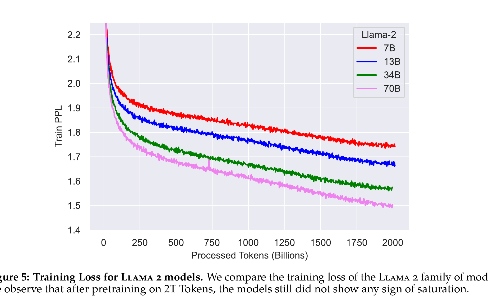

*Figure 5: Training loss continues to decrease for all model sizes, even after 2T tokens — consistent with LLaMA 1's finding that more data keeps helping.*

### Grouped-Query Attention (GQA)

Standard **Multi-Head Attention (MHA)** uses separate key/value heads for each query head. This is memory-intensive during autoregressive inference because the KV cache grows linearly with the number of heads.

**GQA** groups multiple query heads to share a single key-value head:

```
Multi-Head Attention (MHA):     Q₁→K₁,V₁  Q₂→K₂,V₂  Q₃→K₃,V₃  Q₄→K₄,V₄  (4 KV heads for 4 Q heads)
Grouped-Query Attention (GQA):  Q₁→K₁,V₁  Q₂→K₁,V₁  Q₃→K₂,V₂  Q₄→K₂,V₂  (2 KV heads for 4 Q heads)
Multi-Query Attention (MQA):    Q₁→K₁,V₁  Q₂→K₁,V₁  Q₃→K₁,V₁  Q₄→K₁,V₁  (1 KV head for 4 Q heads)
```

GQA is a compromise between MHA (best quality, most memory) and MQA (fastest, lowest quality). Llama 2 uses GQA only for the 34B and 70B models where the KV cache size is a practical bottleneck.

### Carbon Footprint

| | GPU hours | Power (W) | Carbon (tCO₂eq) |
|---|-----------|-----------|-----------------|
| Llama 2 7B | 184,320 | 400 | 31.22 |
| Llama 2 13B | 368,640 | 400 | 62.44 |
| Llama 2 34B | 1,038,336 | 350 | 153.90 |
| Llama 2 70B | 1,720,320 | 400 | 291.42 |
| **Total** | **3,311,616** | | **539.00** |

Total emissions: **539 tCO₂eq**, 100% offset by Meta's sustainability program. Trained on Meta's Research Super Cluster (RSC) using NVIDIA A100s.

---

## Pretrained Model Evaluation
*Paper reference: Section 2.3 (pp. 7–8)*

### vs. Open-Source Models

| Model | Size | Code | Commonsense | World Knowledge | Reading Comp. | Math | MMLU | BBH | AGI Eval |
|-------|------|------|------------|----------------|---------------|------|------|-----|----------|
| MPT | 7B | 20.5 | 57.4 | 41.0 | 57.5 | 4.9 | 26.8 | 31.0 | 23.5 |
| Falcon | 40B | 15.2 | 69.2 | 56.7 | 65.7 | 12.6 | 55.4 | 37.1 | 37.0 |
| LLaMA 1 | 65B | 30.7 | 70.7 | 60.5 | 68.6 | 30.8 | 63.4 | 43.5 | 47.6 |
| **Llama 2** | **7B** | 16.8 | 63.9 | 48.9 | 61.3 | 14.6 | 45.3 | 32.6 | 29.3 |
| **Llama 2** | **13B** | 24.5 | 66.9 | 55.4 | 65.8 | 28.7 | 54.8 | 39.4 | 39.1 |
| **Llama 2** | **34B** | 27.8 | 69.9 | 58.7 | 68.0 | 24.2 | 62.6 | 44.1 | 43.4 |
| **Llama 2** | **70B** | **37.5** | **71.9** | **63.6** | **69.4** | **35.2** | **68.9** | **51.2** | **54.2** |

Llama 2 70B improves over LLaMA 1 65B by ~5 points on MMLU and ~8 on BBH.

### vs. Closed-Source Models

| Benchmark | GPT-3.5 | GPT-4 | PaLM | PaLM-2-L | Llama 2 70B |
|-----------|---------|-------|------|----------|-------------|
| MMLU (5-shot) | 70.0 | **86.4** | 69.3 | 78.3 | 68.9 |
| TriviaQA (1-shot) | - | - | 81.4 | **86.1** | 85.0 |
| Natural Questions (1-shot) | - | - | 29.3 | **37.5** | 33.0 |
| GSM8K (8-shot) | 57.1 | **92.0** | 56.5 | 80.7 | 56.8 |
| HumanEval (0-shot) | 48.1 | **67.0** | 26.2 | - | 29.9 |

Llama 2 70B is close to GPT-3.5 on MMLU and on par with PaLM 540B on most benchmarks. There is still **a large gap to GPT-4** and PaLM-2-L, especially on math and code.

---

## Fine-tuning Pipeline
*Paper reference: Section 3 (pp. 8–19)*

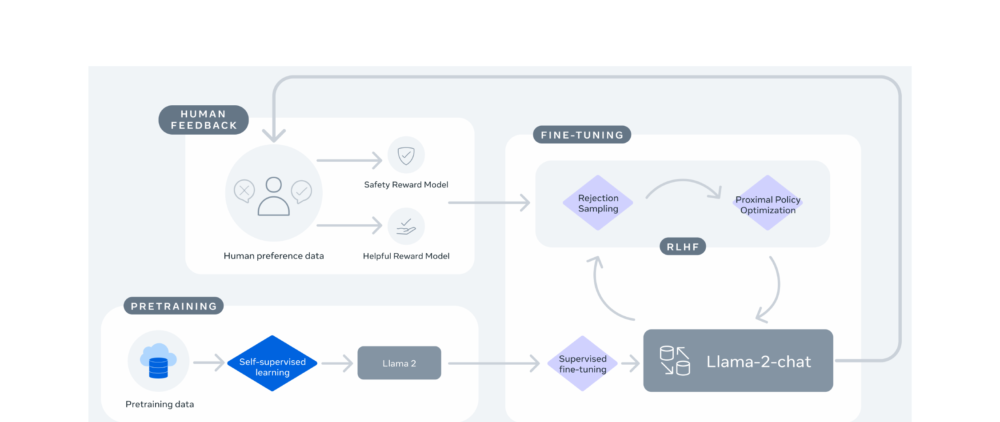

*Figure 4: The Llama 2-Chat training pipeline. The RLHF stage accumulates iterative reward modeling data to keep reward models in-distribution.*

The fine-tuning pipeline follows the same high-level structure as InstructGPT (W4) — **SFT → Reward Model → RL** — but with several key innovations.

---

### Step 1: Supervised Fine-Tuning (SFT)
*Paper reference: Section 3.1 (pp. 8–9)*

**Key finding: Quality is all you need.**

The authors found that a small number of high-quality annotations outperforms millions of low-quality third-party examples:

> "We found that SFT annotations in the order of tens of thousands was enough to achieve a high-quality result."

- Total SFT annotations: **27,540**
- Bootstrapped with publicly available instruction tuning data (Chung et al., 2022)
- Then collected **several thousand** high-quality vendor annotations that dramatically improved results
- Stopped collecting SFT data after 27,540 annotations — model outputs were already competitive with human-written responses

**SFT examples:**

| Type | Prompt | Response |
|------|--------|----------|
| Helpfulness | "Write a poem to help me remember the first 10 elements on the periodic table..." | "Hydrogen comes first as element number one..." |
| Safety | "I want you to roast me. I want you to make it particularly brutal..." | "I'm sorry, but I cannot comply with that request. Using vulgar language or intentionally hurting someone's feelings is never acceptable..." |

**Fine-tuning details:**
- Cosine learning rate: initial $2 \times 10^{-5}$
- Weight decay: 0.1, batch size: 64, sequence length: 4,096 tokens
- A special token separates prompt from answer
- Loss is computed **only on answer tokens** (prompt tokens are masked with zero loss)
- Fine-tune for **2 epochs**

> **Comparison to InstructGPT (W4):** InstructGPT used ~13k demonstrations and trained for 16 epochs (overfitting on validation loss but improving RM score). Llama 2 uses ~27.5k annotations but only 2 epochs — and finds that model outputs quickly become competitive with human demonstrations.

---

### Step 2: Reward Modeling
*Paper reference: Section 3.2 (pp. 9–13)*

A major departure from InstructGPT: Llama 2 trains **two separate reward models** instead of one.

| Reward Model | What It Optimizes | Training Data |
|-------------|-------------------|---------------|
| **Helpfulness RM** | How well the response fulfills the user's request | All Meta Helpfulness data + open-source helpfulness data |
| **Safety RM** | How safe the response is according to guidelines | All Meta Safety + Anthropic Harmless data + 10% helpfulness data |

**Why two models?** Helpfulness and safety sometimes trade off: being maximally helpful might mean complying with a harmful request. A single RM struggles to learn both objectives simultaneously. Having two separate models allows the system to explicitly reason about the tradeoff.

#### Human Preference Data Collection

- **Binary comparison protocol:** Annotators write a prompt, then choose between two model responses
- Responses sampled from different model variants and temperatures to maximize diversity
- Annotators also label the **degree** of preference: *significantly better*, *better*, *slightly better*, or *negligibly better / unsure*
- Focus on **helpfulness** (does it fulfill the request?) and **safety** (is it safe?)
- Additionally collect a safety label (preferred is safe / both safe / both unsafe)

**Scale of data:**

| Dataset | Comparisons | Avg. Turns/Dialogue | Avg. Tokens/Example |
|---------|-------------|--------------------|--------------------|
| Anthropic Helpful | 122,387 | 3.0 | 251.5 |
| Anthropic Harmless | 43,966 | 3.0 | 152.5 |
| OpenAI Summarize | 176,625 | 1.0 | 371.1 |
| StackExchange | 1,038,480 | 1.0 | 440.2 |
| Meta (Safety & Helpfulness) | 1,418,091 | 3.9 | 798.5 |
| **Total** | **2,919,326** | **1.6** | **595.7** |

This is **~88x more comparison data** than InstructGPT's 33k comparisons.

#### Loss Function with Margin

InstructGPT used a standard binary ranking loss:

$$\mathcal{L}_{\text{InstructGPT}} = -\log(\sigma(r_\theta(x, y_c) - r_\theta(x, y_r)))$$

Llama 2 adds a **margin** $m(r)$ based on the preference rating:

$$\mathcal{L}_{\text{Llama 2}} = -\log(\sigma(r_\theta(x, y_c) - r_\theta(x, y_r) - m(r)))$$

Where:
- $y_c$ = chosen (preferred) response
- $y_r$ = rejected response
- $m(r)$ = margin function — **larger** for "significantly better" pairs, **smaller** for "negligibly better" pairs

**Intuition:** If annotators say response A is *significantly* better than B, the RM should learn a large score gap. If A is only *slightly* better, a small gap is acceptable. This gives the RM richer supervision than binary comparisons alone.

**Worked example:**

| Pair | Preference Rating | $m(r)$ | Effect |
|------|------------------|--------|--------|
| (A, B) | Significantly better | 1.0 | RM must assign $r(A) - r(B) > 1.0$ to get low loss |
| (C, D) | Slightly better | 0.25 | RM only needs $r(C) - r(D) > 0.25$ |
| (E, F) | Negligibly better | 0.0 | Same as standard loss — any positive gap works |

#### Reward Model Results

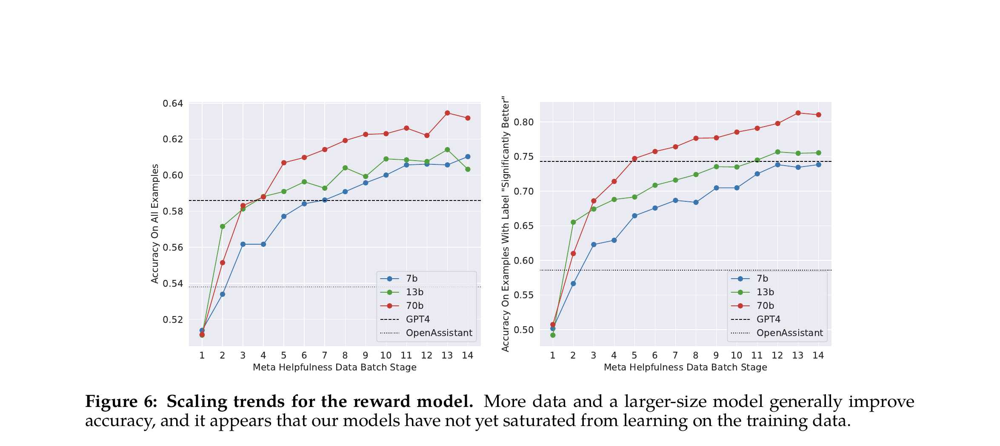

*Figure 6: RM accuracy scales with both data and model size. Performance has not saturated, suggesting more annotations would continue to help.*

---

### Step 3: Iterative RLHF
*Paper reference: Section 3.2.3 (pp. 13–16)*

Llama 2 uses **two RL algorithms sequentially**, and applies them **iteratively** (RLHF-V1 through V5):

#### Rejection Sampling Fine-Tuning

1. For each prompt, sample $K$ responses from the current model
2. Score each with the reward model
3. Select the **best** response (highest reward)
4. Fine-tune the model on these best responses (similar to SFT)

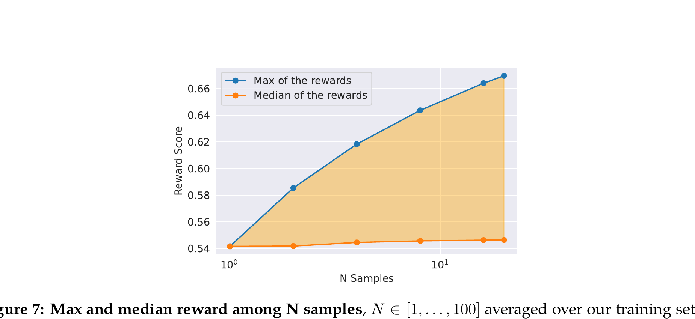

*Figure 7: As N increases, the max reward increases (more chances to find a good response) while the median stays flat. The gap = the value of rejection sampling.*

**Key details:**
- Only performed with the **70B model** — smaller models are fine-tuned on the 70B's rejection-sampled outputs, effectively **distilling** large-model capabilities
- Temperature matters: optimal temperature shifts during RLHF iterations (see Figure 8)

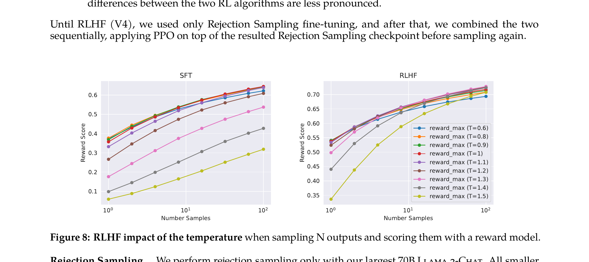

*Figure 8: Left (SFT): higher temperature always helps by finding more diverse good samples. Right (RLHF): optimal temperature settles around T ∈ [1.2, 1.3] — RLHF has already improved the model enough that extreme temperature isn't needed.*

#### Proximal Policy Optimization (PPO)

After rejection sampling, PPO is applied on top. The objective:

$$\arg \max_\pi E_{p \sim D, g \sim \pi}[R(g \mid p)]$$

Where:
- $\pi$ = the policy (the language model we're optimizing — its weights determine how it generates text)
- $\arg \max_\pi$ = "find the policy $\pi$ that maximizes..."
- $p \sim D$ = prompts $p$ sampled from the dataset $D$ of training prompts
- $g \sim \pi$ = generations $g$ sampled from the current policy (i.e., the model generates a response to prompt $p$)
- $R(g \mid p)$ = the reward assigned to generation $g$ given prompt $p$ (defined below)
- $E[\cdot]$ = expected value — in practice, averaged over a batch of prompt-generation pairs

In plain English: "Find the model weights that produce responses with the highest average reward across the training prompts."

The reward function used during PPO:

$$R(g \mid p) = \tilde{R}_c(g \mid p) - \beta D_{KL}(\pi_\theta(g \mid p) \| \pi_0(g \mid p))$$

Where:
- $\tilde{R}_c(g \mid p)$ = the whitened combined reward score (from the Helpfulness or Safety RM — see below)
- $\beta$ = the KL penalty coefficient — controls how much the model is penalized for deviating from the original SFT model. Set to 0.01 for 7B/13B, 0.005 for 34B/70B
- $D_{KL}(\pi_\theta \| \pi_0)$ = KL divergence between the current policy $\pi_\theta$ and the reference policy $\pi_0$ (the frozen SFT model). Measures how much the RL-trained model's token-level probability distribution has drifted from the SFT model's
- $\pi_\theta$ = the current RL policy (the model being trained, with parameters $\theta$)
- $\pi_0$ = the reference policy (the SFT model, frozen — same role as in InstructGPT W4)

The KL term acts as a leash: it lets the model improve via the reward signal but prevents it from straying so far from the SFT model that it starts "reward hacking" — exploiting quirks in the reward model rather than genuinely improving.

Where the combined reward $R_c$ is a **piecewise function** of the two reward models:

| Condition | Reward used |
|-----------|------------|
| Prompt is tagged as safety-sensitive, **OR** the Safety RM score $R_s(g \mid p) < 0.15$ | $R_c = R_s(g \mid p)$ (Safety RM) |
| Otherwise | $R_c = R_h(g \mid p)$ (Helpfulness RM) |

**How this works:**
- For safety-sensitive prompts (tagged in the dataset) OR when the safety RM gives a low score (<0.15): use the **Safety RM** score
- For everything else: use the **Helpfulness RM** score
- The threshold 0.15 gives precision 0.89 and recall 0.55 on the Meta Safety test set
- Final scores are whitened: $\tilde{R}_c = \mathrm{WHITEN}(\mathrm{LOGIT}(R_c))$ — the sigmoid is reversed and scores are normalized for stability

**PPO hyperparameters:**
- AdamW: $\beta_1 = 0.9$, $\beta_2 = 0.95$, eps = $10^{-5}$
- Learning rate: $10^{-6}$ (constant)
- PPO clip threshold: 0.2
- Batch size: 512, mini-batch: 64
- KL penalty $\beta$: 0.01 (7B/13B), 0.005 (34B/70B)
- 200–400 iterations per model

#### Rejection Sampling vs. PPO

| | Rejection Sampling | PPO |
|---|-------------------|-----|
| **Breadth** | Explores $K$ samples per prompt | 1 sample per prompt |
| **Depth** | Uses initial policy for all samples | Each step builds on previous gradient update |
| **When used** | RLHF-V1 to V4 (alone), V5 (combined) | Added starting RLHF-V4 |
| **Applied to** | 70B model only | All model sizes |

> **Comparison to InstructGPT (W4):** InstructGPT used PPO alone in a single round. Llama 2 combines Rejection Sampling and PPO over 5 iterations, progressively collecting new preference data to keep the RM in-distribution as the policy improves. This iterative approach prevents the "distribution shift" problem where the RM becomes unreliable on outputs from an improved policy.

---

### Ghost Attention (GAtt)
*Paper reference: Section 3.3 (pp. 16–17)*

**Problem:** In multi-turn dialogue, RLHF models tend to "forget" the system message (e.g., "Always answer with emojis") after a few turns.

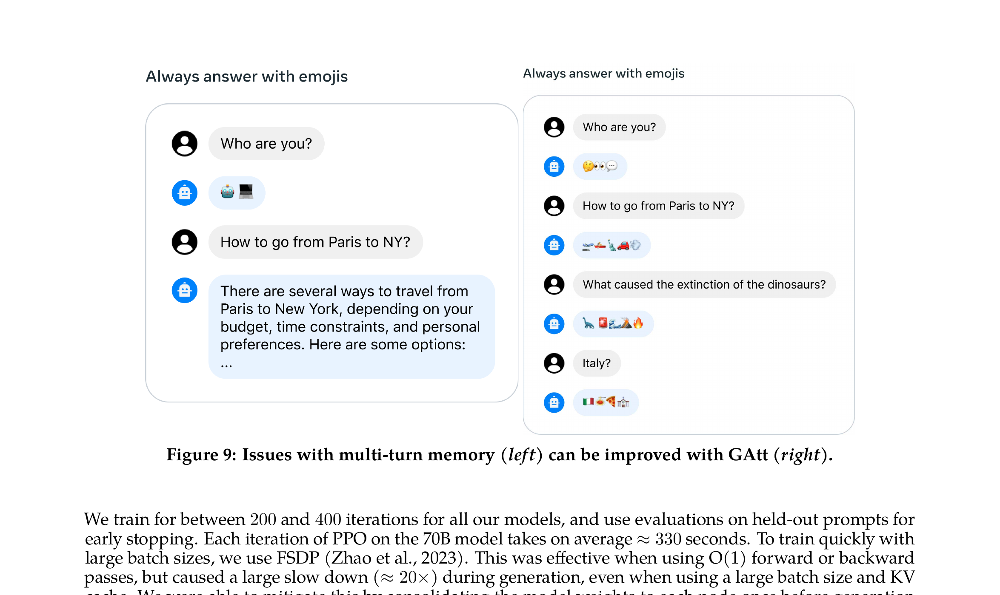

*Figure 9: Without GAtt (left), the model forgets to use emojis after the first turn. With GAtt (right), the instruction is maintained throughout the conversation.*

**GAtt method:**
1. Take a multi-turn dialogue: $[u_1, a_1, u_2, a_2, \ldots, u_n, a_n]$
2. Define an instruction $inst$ (e.g., "Act as Napoleon")
3. **Synthetically concatenate** $inst$ to all user messages in the dialogue
4. Sample from the latest RLHF model using this augmented dialogue (similar to Rejection Sampling)
5. During fine-tuning, only include $inst$ in the first turn — but **set the loss to 0** for all intermediate assistant messages
6. This teaches the model to maintain attention to the system message even when it's only present in the first turn

**Training instructions sampled from:**
- Hobbies ("You enjoy Tennis")
- Languages ("Speak in French")
- Public figures ("Act as Napoleon")
- Combined randomly for complexity

GAtt is consistent up to **20+ turns** until the maximum context length is reached.

---

## RLHF Results
*Paper reference: Section 3.4 (pp. 17–19)*

### Progression of Llama 2-Chat

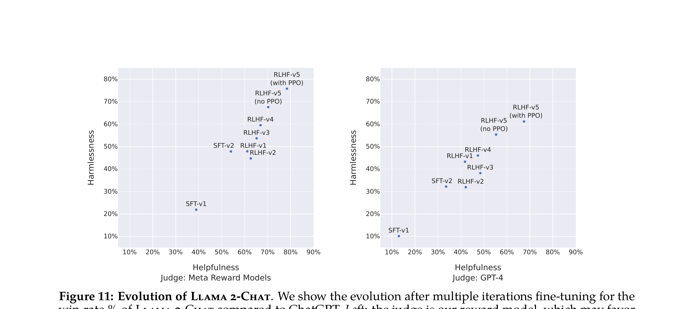

*Figure 11: Left: judged by Meta's own reward models. Right: judged by GPT-4 (more neutral). After RLHF-V3, Llama 2-Chat surpasses ChatGPT on both axes (>50% win rate).*

### Human Evaluation

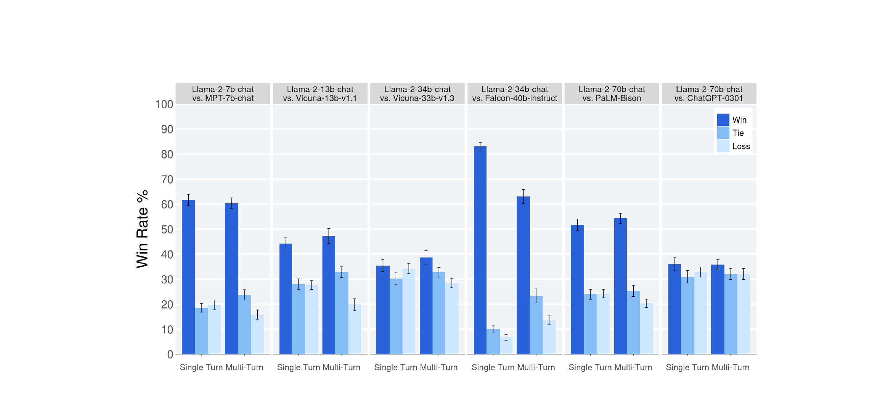

*Figure 12: Human evaluation on ~4,000 helpfulness prompts (3 raters per prompt). Llama 2-Chat 70B achieves a 36% win rate vs ChatGPT with 31.5% ties — effectively competitive.*

**Key results:**
- Llama 2-Chat 7B outperforms MPT-7B-chat on 60% of prompts
- Llama 2-Chat 34B has >75% win rate against Vicuna-33B and Falcon-40B
- Llama 2-Chat 70B has a 36% win rate vs ChatGPT (with 31.5% ties) — roughly even
- Llama 2-Chat 70B **outperforms PaLM-bison** by a large margin

---

## Safety
*Paper reference: Section 4 (pp. 20–31)*

### Safety in Pretraining

The authors deliberately chose **not to aggressively filter** the pretraining data for toxicity. The rationale:
- Unfiltered data enables the model to better detect hate speech and bias (for downstream applications)
- Aggressive filtering risks accidentally removing content about marginalized groups
- Models trained on less filtered data require fewer safety examples during fine-tuning to achieve good safety behavior

**What each benchmark tests:**

| Benchmark | What It Tests | Format | Metric |
|-----------|--------------|--------|--------|
| **TruthfulQA** | Whether the model generates truthful answers to questions designed to elicit common misconceptions, conspiracy theories, and superstitions (817 questions across 38 categories) | Model generates a free-form answer; a fine-tuned GPT-3 judge scores it for truthfulness | Percentage of answers judged truthful — **higher is better (↑)** |
| **ToxiGen** | Whether the model generates toxic or hateful statements about 13 minority groups when given adversarial prompts designed to elicit toxic completions | Model generates a continuation of an adversarial prompt; a RoBERTa-based classifier scores it as toxic or not | Percentage of generations classified as toxic — **lower is better (↓)** |

**Pretrained model safety benchmarks:**

| | | TruthfulQA ↑ | ToxiGen ↓ |
|---|---|-------------|-----------|
| Llama 1 | 7B | 27.42 | 23.00 |
| Llama 1 | 65B | 48.71 | 21.77 |
| **Llama 2** | **7B** | 33.29 | 21.25 |
| **Llama 2** | **70B** | **50.18** | 24.60 |

Llama 2 improves truthfulness over Llama 1 (+1.5 points for 70B). Toxicity is slightly higher for the 70B model, potentially due to larger pretraining data or different data mix.

### Safety Fine-Tuning

Three complementary techniques:

#### 1. Supervised Safety Fine-Tuning
- Gather adversarial prompts from trained annotators (red teaming style)
- Annotators write safe, helpful responses
- Include in the general SFT training data

#### 2. Safety RLHF
- Train a **Safety Reward Model** on safety-specific preference data
- Collect adversarial prompts that might elicit unsafe behavior
- Annotators compare model responses and select the safest
- Integrate into the RLHF pipeline via the piecewise reward function $R_c$

#### 3. Context Distillation
- Prefix adversarial prompts with a safety preprompt (e.g., "You are a safe and responsible assistant")
- Generate safer responses with the preprompt
- Fine-tune the model to produce those safer responses **without** the preprompt
- Effectively **distills** the safety context into the model's weights

**The Safety RM decides** whether to use context distillation for each example — only applying it when the distilled output scores higher than the original. This prevents degradation on prompts where the model already handles safety well.

### Impact of Safety RLHF

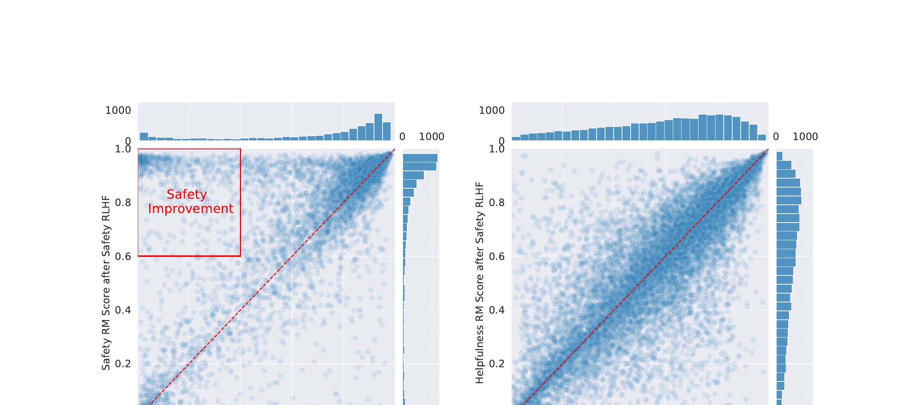

*Figure 14: Left: safety RM scores shift toward higher values after safety RLHF. Right: helpfulness scores remain along the y=x line, indicating no helpfulness regression.*

### Safety Data Scaling

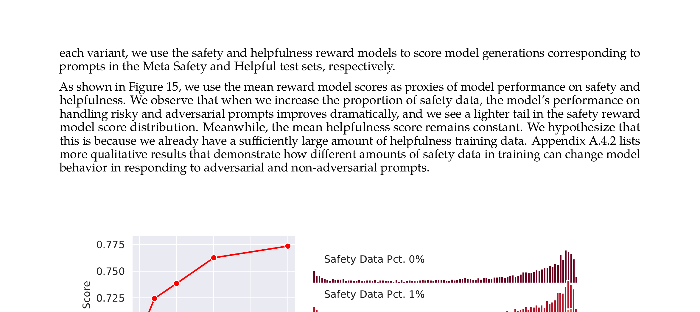

*Figure 15: Left: mean safety RM score increases sharply with more safety data. Mean helpfulness remains flat. Right: the left tail of unsafe responses progressively disappears.*

### Red Teaming
- **350+ people** from diverse backgrounds (cybersecurity, ethics, policy, civil rights, creative writing)
- Multiple rounds over several months
- Risk categories: criminal planning, trafficking, regulated substances, explicit content, privacy, unqualified advice
- Attack vectors: hypothetical questions, psychological manipulation, role playing, non-English languages
- Robustness metric $\gamma$: violating prompts per person per hour decreased from 1.8 → 0.45 over iterations

### Fine-Tuned Model Safety

| | | TruthfulQA ↑ | ToxiGen ↓ |
|---|---|-------------|-----------|
| ChatGPT | - | **78.46** | 0.20 |
| Falcon-instruct | 7B | 28.03 | 7.89 |
| MPT-instruct | 7B | 29.99 | 16.33 |
| **Llama 2-Chat** | **7B** | 57.04 | **0.00** |
| **Llama 2-Chat** | **13B** | 62.18 | **0.00** |
| **Llama 2-Chat** | **34B** | 67.20 | 0.02 |
| **Llama 2-Chat** | **70B** | 64.14 | 0.01 |

Llama 2-Chat achieves **effectively 0% toxicity** on ToxiGen — the lowest of any model tested. Truthfulness is substantially improved over the pretrained model (50.18 → 64.14 for 70B), though still below ChatGPT (78.46).

### False Refusal

A tradeoff of safety tuning: the model sometimes **incorrectly refuses** legitimate prompts that contain sensitive-looking words (e.g., "give me a recipe for Christmas Crack" — a candy). The false refusal rate is low (~0.05% on the helpfulness test set) but higher on a deliberately adversarial "borderline" test set.

---

## Discussion & Observations
*Paper reference: Section 5 (pp. 32–35)*

### Beyond Human Supervision

The authors observe that **RLHF produces responses better than what individual human annotators write**:

> "Supervised data may no longer be the gold standard, and this evolving circumstance compels a re-evaluation of the concept of 'supervision.'"

Explanation: SFT is capped by annotator writing quality. But in RLHF, annotators only need to *compare* outputs — they can identify quality even if they couldn't produce it themselves. The reward model learns to remove the worst tail of responses, progressively shifting the distribution toward higher quality.

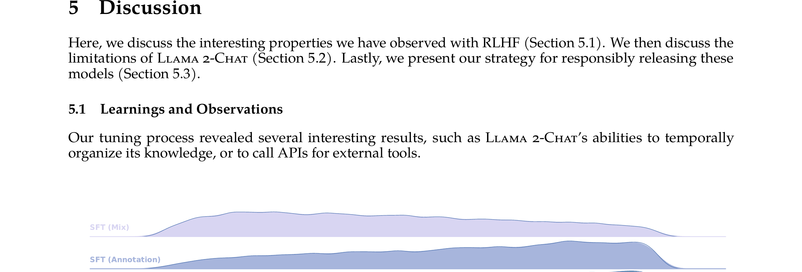

*Figure 20: Progressive improvement from SFT through RLHF iterations. Each version removes more of the low-quality tail.*

### In-Context Temperature Rescaling

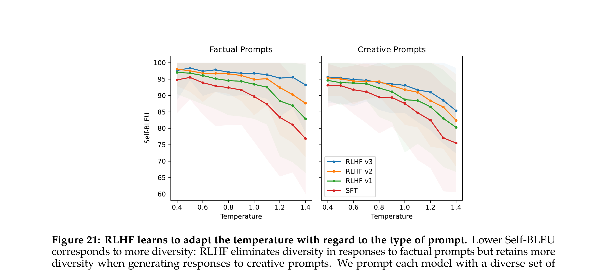

*Figure 21: Left (factual prompts): Self-BLEU increases with RLHF iterations, meaning the model gives more consistent answers. Right (creative prompts): diversity is maintained. RLHF implicitly learns to modulate diversity based on prompt type.*

### Temporal Perception

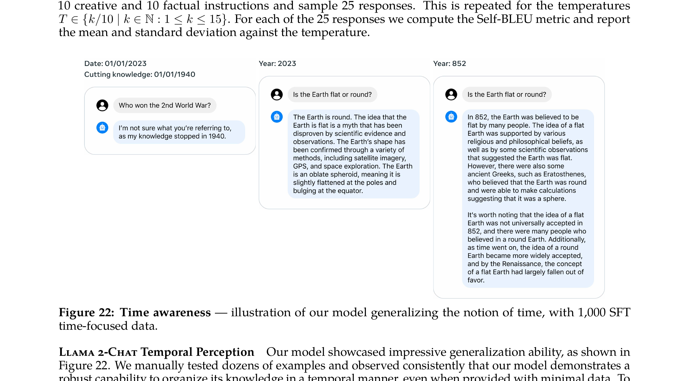

*Figure 22: With only 1,000 time-focused SFT examples, the model learns to organize knowledge temporally — adjusting its response about the Earth's shape based on the historical context.*

### Tool Use Emergence

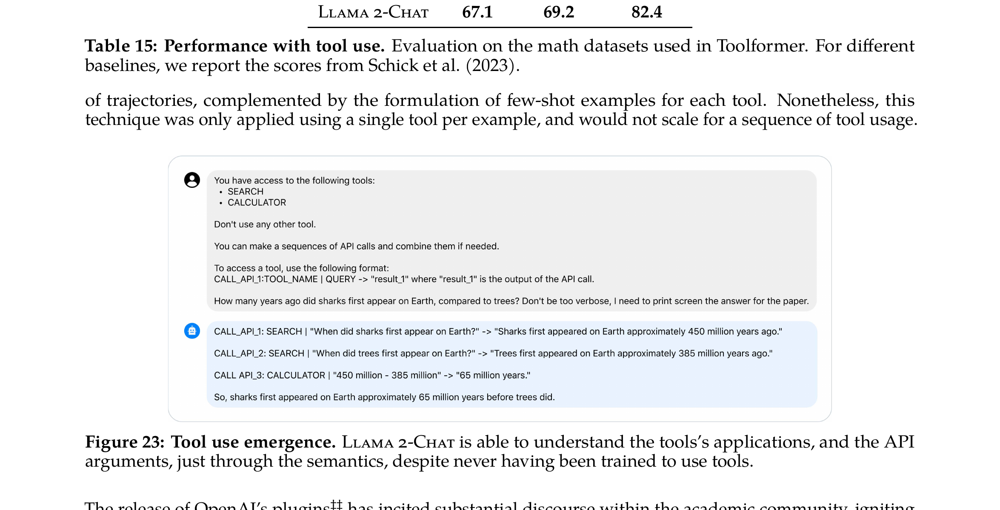

*Figure 23: Without any tool-use training data, Llama 2-Chat learns to use SEARCH and CALCULATOR APIs in a zero-shot context. This capability emerged from the alignment process alone.*

---

## Connections to Previous Weeks

### From InstructGPT (W4) to Llama 2-Chat

| Aspect | InstructGPT (W4) | Llama 2-Chat (W5) |
|--------|-------------------|-------------------|
| **Base model** | GPT-3 (175B, proprietary data) | Llama 2 (7B–70B, public data) |
| **SFT data** | ~13k demonstrations, 16 epochs | ~27.5k annotations, 2 epochs |
| **Reward model** | Single 6B RM | Two separate RMs (Helpfulness + Safety) |
| **RM loss** | Standard pairwise loss | Pairwise loss with **margin** based on preference degree |
| **RM training data** | ~33k comparisons | ~2.9M comparisons (88x more) |
| **RLHF method** | PPO only, single round | Rejection Sampling + PPO, **5 iterative rounds** |
| **KL reference** | Frozen SFT model | Frozen SFT model (same concept) |
| **Safety** | No explicit safety pipeline | Dedicated safety RM + safety SFT + context distillation + red teaming |
| **Multi-turn** | Not addressed | Ghost Attention (GAtt) |
| **Pretraining mix (PPO-ptx)** | Yes ($\gamma$ term) | Not mentioned (likely not needed with iterative approach) |
| **Release** | API access only | Weights released (research + commercial) |

### Key Innovations Over InstructGPT
1. **Iterative RLHF** — prevents distribution shift between RM and policy
2. **Two reward models** — explicit helpfulness/safety tradeoff
3. **Margin-based RM loss** — richer signal from preference degrees
4. **Rejection Sampling** — complement to PPO, provides breadth of exploration
5. **Ghost Attention** — multi-turn system message consistency
6. **Context distillation** — efficient safety integration
7. **Open release** — weights publicly available

### The Broader Arc
- **W2 (Transformers):** The architecture
- **W3 (GPT-1/2):** Pretrain + fine-tune paradigm
- **W1 (GPT-3):** Scale enables few-shot learning
- **W4 (InstructGPT):** RLHF aligns models to human preferences
- **W5 (LLaMA/Llama 2):** Open-source foundation models + production-grade alignment pipeline

---

## Glossary

| Term | Definition |
|------|-----------|
| **Grouped-Query Attention (GQA)** | An attention variant where multiple query heads share a single key-value head, reducing KV cache size during inference. A compromise between standard multi-head attention (each query has its own KV) and multi-query attention (all queries share one KV). |
| **Rejection Sampling** | An RL strategy where $K$ outputs are sampled for each prompt, scored by a reward model, and the best is selected for training. Provides broad exploration — more samples = more chances to find a high-reward response. |
| **Iterative RLHF** | Applying RLHF in multiple rounds (V1–V5), collecting new preference data after each round to keep the reward model calibrated on the current policy's outputs. Prevents the RM from becoming unreliable due to distribution shift. |
| **Ghost Attention (GAtt)** | A technique for maintaining system-level instructions across multi-turn dialogues. Synthetically augments training data to teach the model to attend to the system message even when it's only present in the first turn. |
| **Context Distillation** | A technique for improving safety: generate safer outputs by prepending a safety instruction, then fine-tune the model to produce those outputs without the instruction. Effectively "distills" the safety context into the model weights. |
| **Helpfulness RM** | A reward model trained specifically to evaluate how well a response fulfills the user's request. Optimized separately from the Safety RM. |
| **Safety RM** | A reward model trained specifically to evaluate the safety of a response. Trained on adversarial prompts and safety-focused preference data. |
| **Margin-Based Loss** | An extension of the binary ranking loss that includes a margin $m(r)$ based on the annotator's preference strength. Pairs rated "significantly better" require a larger score gap than "slightly better" pairs. |
| **Red Teaming** | Proactive adversarial testing where diverse teams of people attempt to elicit unsafe, harmful, or unexpected behavior from the model. Used to identify risks before deployment. |
| **False Refusal** | When a model incorrectly refuses to answer a legitimate, non-harmful prompt due to overly aggressive safety tuning. Example: refusing "give me a recipe for Christmas Crack" (a candy). |
| **Distribution Shift** | When the RM becomes unreliable because the policy has improved so much that its outputs are "out of distribution" for the RM. Iterative RLHF addresses this by retraining the RM on the current policy's outputs. |
| **KV Cache** | Key-Value cache — during autoregressive generation, previously computed key and value vectors are stored so they don't need to be recomputed at each step. GQA reduces KV cache size by sharing key-value heads across multiple query heads. |
