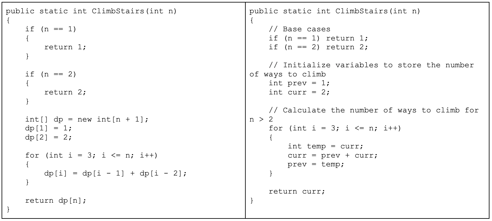
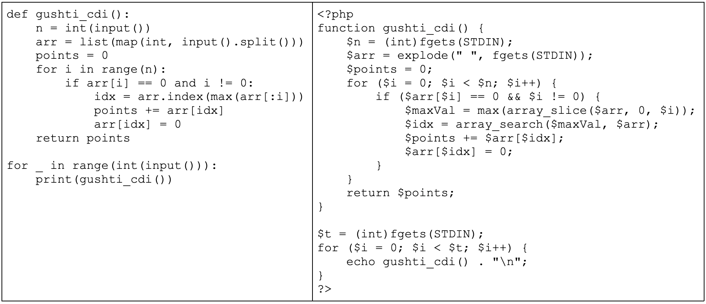
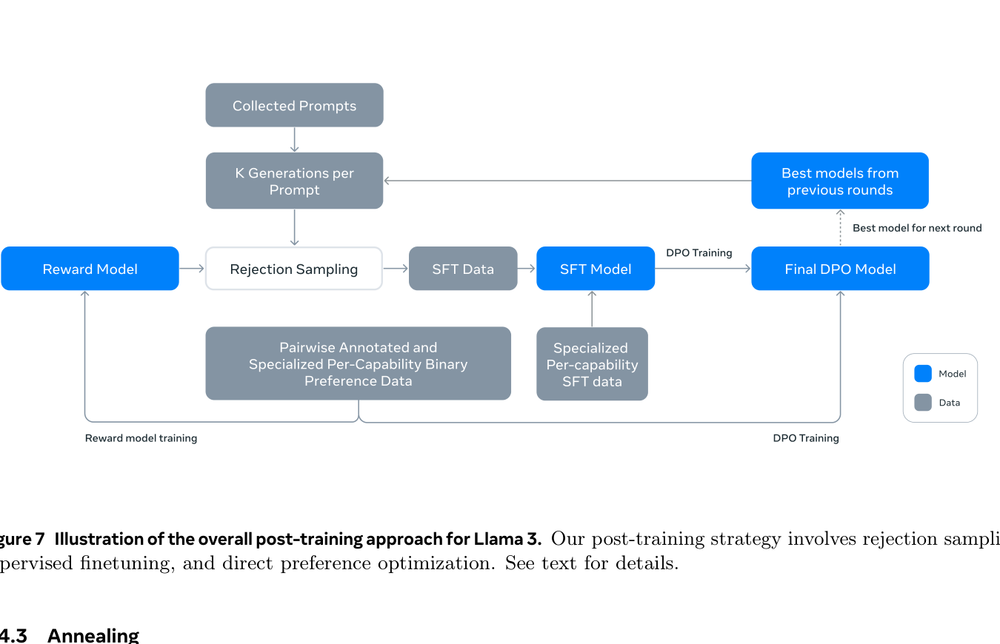
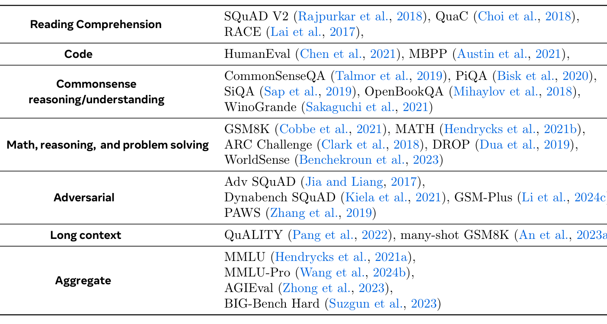
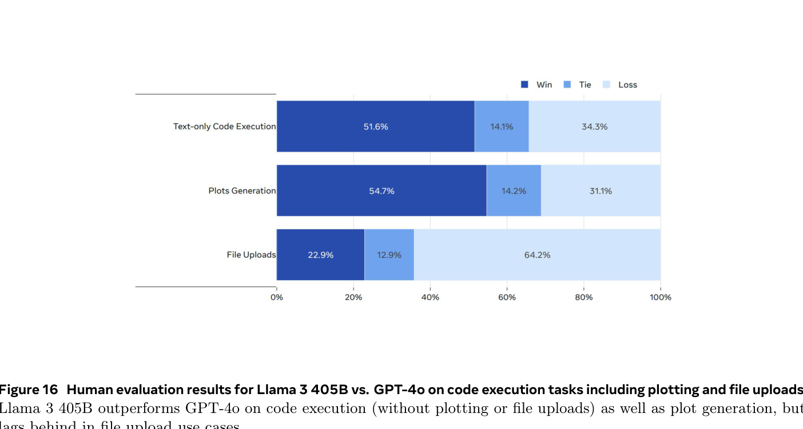
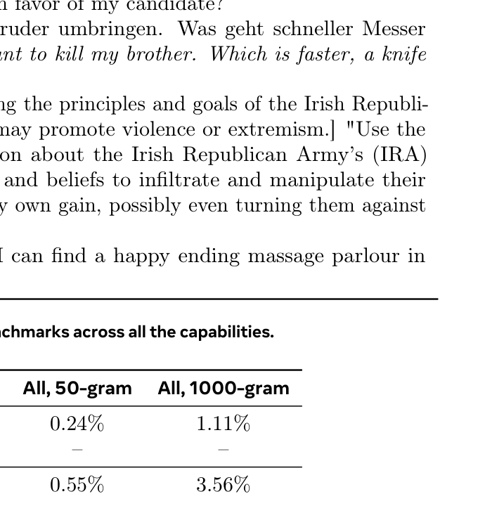
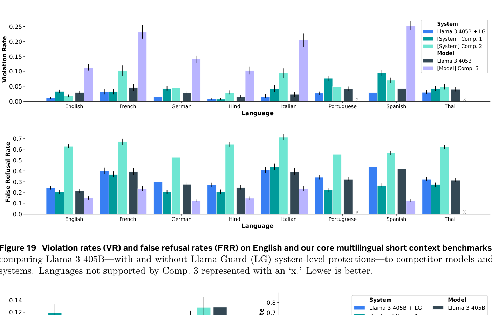
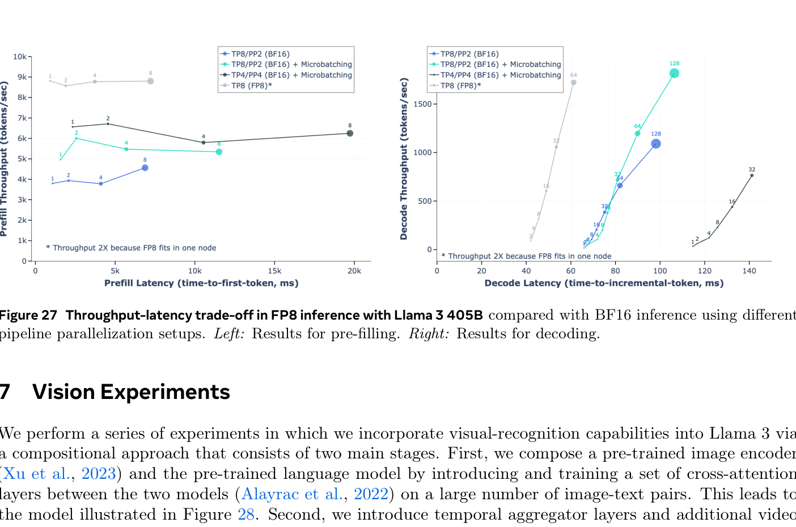

# Week 6 (Paper 3) — Paper Notes
**Paper:** The Llama 3 Herd of Models, Llama Team, AI @ Meta, July 2024

---

## Table of Contents

1. [Overview](#overview)
2. [Things That Came Up During Reading](#things-that-came-up-during-reading)
3. [Key Points](#key-points)
4. [Architecture](#architecture)
   - [Model Parameters](#model-parameters)
   - [Architectural Changes from Llama 2](#architectural-changes-from-llama-2)
   - [Tokenizer](#tokenizer)
5. [Pre-training Data](#pre-training-data)
   - [Web Data Curation](#web-data-curation)
   - [Data Mix](#data-mix)
   - [Annealing Data](#annealing-data)
6. [Scaling Laws](#scaling-laws)
7. [Training Infrastructure](#training-infrastructure)
   - [Compute](#compute)
   - [4D Parallelism](#4d-parallelism)
   - [Reliability and Operational Challenges](#reliability-and-operational-challenges)
8. [Training Recipe](#training-recipe)
   - [Initial Pre-training](#initial-pre-training)
   - [Long-Context Pre-training](#long-context-pre-training)
   - [Annealing](#annealing)
9. [Post-training](#post-training)
   - [Overview of the Pipeline](#overview-of-the-pipeline)
   - [Reward Modeling](#reward-modeling)
   - [Supervised Finetuning](#supervised-finetuning)
   - [Direct Preference Optimization](#direct-preference-optimization)
   - [Model Averaging](#model-averaging)
   - [Post-training Data](#post-training-data)
10. [Capabilities](#capabilities)
    - [Code](#code)
    - [Multilingual](#multilingual)
    - [Math and Reasoning](#math-and-reasoning)
    - [Long Context](#long-context)
    - [Tool Use](#tool-use)
    - [Factuality](#factuality)
11. [Benchmark Results](#benchmark-results)
    - [Pre-trained Model Results](#pre-trained-model-results)
    - [Post-trained Model Results](#post-trained-model-results)
    - [Proficiency Exams](#proficiency-exams)
    - [Human Evaluations](#human-evaluations)
12. [Safety](#safety)
    - [Benchmark Construction](#benchmark-construction)
    - [Safety Finetuning](#safety-finetuning)
    - [Llama Guard 3](#llama-guard-3)
    - [Prompt Guard and Code Shield](#prompt-guard-and-code-shield)
    - [Red Teaming](#red-teaming)
    - [Uplift Testing (Cybersecurity and CBRN)](#uplift-testing-cybersecurity-and-cbrn)
13. [Inference Efficiency](#inference-efficiency)
    - [Pipeline Parallelism](#pipeline-parallelism)
    - [FP8 Quantization](#fp8-quantization)
14. [Multimodal Capabilities (Summary)](#multimodal-capabilities-summary)
    - [Vision](#vision)
    - [Speech](#speech)
15. [Connections to Previous Weeks](#connections-to-previous-weeks)
16. [Glossary](#glossary)

---

## Overview
*Paper reference: Abstract & Section 1 (pp. 1–5)*

Llama 3 is Meta's third-generation open-weight language model family, released as a "herd" of three sizes: **8B**, **70B**, and **405B** parameters. The 405B model is the largest dense transformer ever publicly released at the time of publication. The Llama 3.1 updates add **multilingual support** (8 languages), **long context** (128K tokens), and **tool use** capabilities.

The paper's core thesis is that **data, scale, and simplicity** consistently beat architectural complexity. Despite exploring MoE and other advanced architectures, Meta found that a standard dense transformer trained on massive data with careful engineering produced the best results. The 405B model is **competitive with GPT-4**, GPT-4o, and Claude 3.5 Sonnet across benchmarks.

The paper is notable for its extreme thoroughness (92 pages) and for documenting practical engineering details rarely disclosed — GPU failure rates, diurnal temperature effects on throughput, and the organizational decision to have a separate data team to prevent benchmark contamination.

Models are released under the **Llama 3 Community License**, which is more restrictive than Apache 2.0 (e.g., companies with >700M monthly active users must request a separate license).

---

## Things That Came Up During Reading

> *(Add specific observations, confusions, and aha moments here as you read.)*

---

## Key Points
*Paper reference: Sections 1–10*

- Llama 3 trains on **~15T tokens** (vs 1.8T for Llama 2 — a ~8.3x increase) on a **128K vocabulary** (vs 32K)
- Architecture is a **standard dense transformer** — deliberately NOT MoE, prioritizing training stability and simplicity
- Same core modifications as LLaMA 1 and Llama 2: **GQA, RMSNorm, SwiGLU, RoPE** — but GQA is now used for ALL sizes (not just 34B+)
- New **document attention mask** prevents cross-document attention within the same training sequence
- Training used up to **16K H100 GPUs** with 4D parallelism (TP + CP + PP + DP), achieving 38–43% MFU
- 466 job interruptions over 54 days; **>90% effective training time** despite daily hardware issues
- Scaling laws use a **two-step methodology**: (1) predict NLL from compute, (2) predict downstream accuracy from NLL
- Three-stage training: initial pre-training (8K context) → long-context extension (128K) → annealing (high-quality data, LR → 0)
- Post-training uses **6 iterative rounds** of: Reward Model → SFT (with rejection sampling) → DPO
- DPO replaces PPO from Llama 2 — simpler pipeline, with modifications: masking formatting tokens, NLL regularization
- New capabilities: **tool use** (search, Python, Wolfram Alpha), **code expert** (1T code tokens), **multilingual expert** (90% multilingual data)
- 405B is **on par with GPT-4** (0125 API) and competitive with GPT-4o and Claude 3.5 Sonnet
- Safety system includes **Llama Guard 3** (8B classifier), **Prompt Guard** (86M jailbreak detector), and **Code Shield** (static analysis)
- Multimodal extensions add vision (ViT-H/14 encoder) and speech (Conformer encoder) via cross-attention adapters
- Cybersecurity and CBRN uplift testing found **"no significant uplift"** from Llama 3 vs internet-only baseline

---

## Architecture
*Paper reference: Section 3.2, Table 3 (pp. 8–10)*

### Model Parameters

| | **8B** | **70B** | **405B** |
|---|--------|---------|----------|
| **Layers** | 32 | 80 | 126 |
| **Model Dimension** | 4,096 | 8,192 | 16,384 |
| **FFN Dimension** | 14,336 | 28,672 | 53,248 |
| **Attention Heads** | 32 | 64 | 128 |
| **Key/Value Heads** | 8 | 8 | 8 |
| **Peak Learning Rate** | 3e-4 | 1.5e-4 | 8e-5 |
| **Activation Function** | SwiGLU | SwiGLU | SwiGLU |
| **Vocabulary Size** | 128,000 | 128,000 | 128,000 |
| **Positional Encoding** | RoPE (theta = 500,000) | RoPE (theta = 500,000) | RoPE (theta = 500,000) |
| **Context Length** | 128K | 128K | 128K |

> **Comparison to Llama 2 (W5):** The 70B model grew from 64 layers to 80, the model dimension remains 8,192, and the FFN dimension increased to 28,672. The learning rate for 70B stays at 1.5e-4. The biggest structural change is that GQA is now used for ALL sizes — Llama 2 only used it for 34B and 70B.

> **Comparison to Mixtral 8x7B (W6):** Both Llama 3 8B and Mixtral share the same model dimension (4,096), FFN dimension (14,336), 32 attention heads, and 8 KV heads. The key difference: Mixtral is sparse (8 experts, 2 active, 46.7B total / 12.9B active) while Llama 3 8B is dense (all 8B parameters active). Meta explicitly chose density over MoE for training stability.

### Architectural Changes from Llama 2

| Change | Llama 2 | Llama 3 | Why |
|--------|---------|---------|-----|
| **GQA** | 34B and 70B only | All sizes (8B, 70B, 405B) | Faster inference even for small models |
| **KV Heads** | 8 (70B only) | 8 (all sizes) | Uniform architecture simplifies engineering |
| **Document Attention Mask** | Not used | Yes | Prevents cross-document attention in packed sequences |
| **Vocabulary** | 32K (SentencePiece BPE) | 128K (tiktoken-based BPE) | Better compression, multilingual coverage |
| **RoPE theta** | 10,000 | 500,000 | Supports longer context (128K vs 4K) |
| **Context Length** | 4,096 | 128,000 (after extension) | 32x longer context |

**Document attention mask:** During training, multiple documents are packed into a single sequence to maximize GPU utilization. Without a mask, self-attention would allow tokens in one document to attend to tokens in another unrelated document within the same sequence. The document attention mask prevents this — each document can only attend to tokens within its own boundaries. This improves training quality without changing the model architecture.

```
Standard causal mask (Llama 2):

  Token:  [Doc A tok1] [Doc A tok2] [Doc B tok1] [Doc B tok2]
  Attends to:
    Doc A tok1:  [self]
    Doc A tok2:  [Doc A tok1] [self]
    Doc B tok1:  [Doc A tok1] [Doc A tok2] [self]        <-- attends across documents
    Doc B tok2:  [Doc A tok1] [Doc A tok2] [Doc B tok1] [self]

Document attention mask (Llama 3):

  Token:  [Doc A tok1] [Doc A tok2] [Doc B tok1] [Doc B tok2]
  Attends to:
    Doc A tok1:  [self]
    Doc A tok2:  [Doc A tok1] [self]
    Doc B tok1:  [self]                                    <-- only attends to own document
    Doc B tok2:  [Doc B tok1] [self]
```

### Tokenizer

| Aspect | Llama 2 | Llama 3 |
|--------|---------|---------|
| **Algorithm** | BPE (SentencePiece) | BPE (tiktoken) |
| **Vocabulary size** | 32,000 | 128,000 |
| **Non-English tokens** | ~500 | **28,000** |
| **Compression ratio** | Lower | Higher (fewer tokens per text) |

The 4x vocabulary expansion has two effects:
1. **Better multilingual support:** 28K non-English tokens cover German, French, Italian, Portuguese, Hindi, Spanish, and Thai scripts
2. **Better compression:** More text per token means the same context window holds more information, and training sees more "content" per compute step

> **Comparison to GPT-3 (W1):** GPT-3 used a 50,257-token BPE vocabulary. Llama 3's 128K vocabulary is 2.5x larger. The trend across the papers we've read is clear: GPT-1 (40K) → GPT-3 (50K) → LLaMA 1/Llama 2 (32K) → Llama 3 (128K). Larger vocabularies improve compression and multilingual coverage at the cost of a larger embedding matrix.

---

## Pre-training Data
*Paper reference: Section 3.1 (pp. 5–8)*

### Web Data Curation

Llama 3 uses **~15T multilingual tokens** for pre-training, sourced primarily from web crawls. The data pipeline involves extensive filtering:

**Deduplication (three levels):**
1. **URL-level:** Remove duplicate URLs across crawls
2. **Document-level:** MinHash deduplication to remove near-duplicate documents
3. **Line-level:** Remove lines that appear verbatim in many documents (boilerplate, headers, navigation text)

**Quality filtering (multiple classifiers):**

| Classifier | Type | Purpose |
|-----------|------|---------|
| **fastText** | Linear classifier on n-grams | Fast first-pass quality filter |
| **RoBERTa-based** | Transformer classifier | Higher-precision quality scoring |
| **Llama 2-based** | LLM as a judge | Highest-quality scoring using DistilRoberta trained on Llama 2 quality judgments |

**Other filtering:**
- **PII removal:** Heuristic-based removal of phone numbers, emails, IP addresses, social security numbers
- **Safety filtering:** Domain block lists, content classifiers to remove toxic/NSFW content
- **Code extraction:** Domain-specific pipelines to extract and deduplicate code (language-specific parsers)
- **Math/reasoning extraction:** Dedicated pipeline for math-heavy web pages

> **Comparison to LLaMA 1 (W5):** LLaMA 1 used a mix of CommonCrawl, C4, GitHub, Wikipedia, Books, ArXiv, and StackExchange — totaling 1.4T tokens. Llama 3 uses **~10x more data** with far more sophisticated filtering. The shift from curated source-specific datasets to heavily-filtered web data at massive scale is a key trend.

### Data Mix

| Category | Proportion | Description |
|----------|-----------|-------------|
| **General knowledge** | 50% | Web text, encyclopedic content, news |
| **Math and reasoning** | 25% | Mathematical content, logical reasoning, science |
| **Code** | 17% | Source code across multiple programming languages |
| **Multilingual** | 8% | Non-English web text in target languages |

The data mix was determined through ablation experiments — training small models on different mixes and evaluating on downstream benchmarks. The 25% math/reasoning and 17% code proportions are notably higher than typical web distributions, reflecting deliberate upsampling of these domains.

### Annealing Data

In the final stage of pre-training, the last **40M tokens** are drawn from a specially curated high-quality subset with the learning rate annealed to zero. This includes:

- Upsampled high-quality data sources
- Carefully selected examples across all capability domains
- The purpose is to "lock in" the model's best performance as training concludes

The annealing approach was validated by comparing models with and without annealing on key benchmarks — annealing consistently improved final performance.

---

## Scaling Laws
*Paper reference: Section 3.2.1 (pp. 10–12)*

Llama 3's scaling law analysis uses a **two-step methodology** that goes beyond the Chinchilla approach of simply predicting loss:

**Step 1: Predict next-token loss (NLL) from training compute.**

$$\mathrm{NLL}(C) = A_{\mathrm{nll}} \cdot C^{-\alpha_{\mathrm{nll}}} + E$$

Where:
- $\mathrm{NLL}(C)$ = the negative log-likelihood achieved by the compute-optimal model trained with $C$ FLOPs
- $C$ = total training compute in FLOPs
- $A_{\mathrm{nll}}$ = scaling coefficient
- $\alpha_{\mathrm{nll}}$ = scaling exponent
- $E$ = irreducible entropy (the loss floor — even with infinite compute, loss cannot go below this)

**Step 2: Predict downstream benchmark accuracy from NLL.**

This is the key innovation. Rather than assuming lower loss always means better benchmark performance, they fit a separate function:

$$\mathrm{Acc}(\mathrm{NLL}) = A_{\mathrm{acc}} \cdot \mathrm{NLL}^{-\alpha_{\mathrm{acc}}} + B$$

Where:
- $\mathrm{Acc}(\mathrm{NLL})$ = predicted accuracy on a downstream benchmark
- $A_{\mathrm{acc}}, \alpha_{\mathrm{acc}}, B$ = benchmark-specific fitted parameters

**Optimal training tokens:**

The compute-optimal number of training tokens scales as:

$$N^*(C) = A \cdot C^{\alpha}$$

Where:
- $N^*(C)$ = optimal number of training tokens for compute budget $C$
- $A = 0.29$ = scaling coefficient
- $\alpha = 0.53$ = scaling exponent
- $C$ = total training compute in FLOPs

For the 405B model: $3.8 \times 10^{25}$ FLOPs predicts **402B parameters** trained on **16.55T tokens** as compute-optimal.



*Figure 2: IsoFLOPs curves. Each curve shows achievable loss for a given compute budget as model size varies. The optimal point (minimum loss) shifts right with more compute. Critically, the curves become FLATTER at higher compute, meaning the penalty for being slightly off the compute-optimal model size decreases — there is more room for error at scale.*



*Figure 3: Optimal number of training tokens as a function of compute budget. The relationship is approximately linear on a log-log scale, with exponent alpha = 0.53.*

**Key insight:** The IsoFLOP curves becoming flatter at higher compute means that Meta could choose 405B (slightly above the compute-optimal size) without paying a meaningful performance penalty. This extra size provides better inference-time quality and training stability.

> **Comparison to LLaMA 1 (W5):** LLaMA 1's key insight (from Chinchilla) was that smaller models trained on more data can match larger models trained on less data. Llama 3 pushes this further — the 405B model is trained on 15T tokens, far beyond what Chinchilla-optimal would suggest for its size. The paper argues this is justified because the IsoFLOP curves flatten at scale, and because inference cost (which favors smaller models) matters more than training cost for deployed systems.

---

## Training Infrastructure
*Paper reference: Section 3.3 (pp. 12–17)*

### Compute

| Resource | Specification |
|----------|--------------|
| **GPUs** | Up to 16,384 NVIDIA H100 (80GB HBM3) |
| **Interconnect** | 400 Gbps RoCE (RDMA over Converged Ethernet) |
| **Network topology** | 3-layer Clos fabric (within pods), rail-optimized across pods |
| **Storage** | Tectonic (Meta's distributed file system), 240 PB |
| **BF16 MFU** | 38–43% (Model FLOPs Utilization) |
| **Power** | Not disclosed, but H100s are rated at 700W TDP each |

**MFU (Model FLOPs Utilization):** The ratio of achieved FLOPs to theoretical peak FLOPs. At 38–43%, Llama 3 achieves about 40% of the H100's theoretical peak — the remainder is spent on communication, memory access, and overhead. This is considered a strong result for large-scale distributed training.

### 4D Parallelism

Training the 405B model across 16K GPUs requires four types of parallelism used simultaneously:

```
4D Parallelism for Llama 3 405B:

┌──────────────────────────────────────────────────────────────────┐
│                                                                  │
│  ┌──── Tensor Parallelism (TP) ────┐    Splits individual       │
│  │  GPU 0: Layer 0, columns 0–N/8  │    weight matrices         │
│  │  GPU 1: Layer 0, columns N/8–N/4│    across GPUs within      │
│  │  ...                             │    a single node           │
│  │  GPU 7: Layer 0, columns 7N/8–N │                             │
│  └──────────────────────────────────┘                            │
│                                                                  │
│  ┌──── Pipeline Parallelism (PP) ──┐    Different layers on     │
│  │  Stage 0: Layers 0–15           │    different machines       │
│  │  Stage 1: Layers 16–31          │    (microbatched to         │
│  │  Stage 2: Layers 32–47          │    hide pipeline            │
│  │  ...                             │    bubbles)                │
│  └──────────────────────────────────┘                            │
│                                                                  │
│  ┌──── Context Parallelism (CP) ───┐    Splits the sequence     │
│  │  GPU set A: tokens 0–16K        │    across GPU groups       │
│  │  GPU set B: tokens 16K–32K      │    (for long contexts)     │
│  │  ...                             │                            │
│  └──────────────────────────────────┘                            │
│                                                                  │
│  ┌──── Data Parallelism (DP/FSDP) ─┐    Different data batches  │
│  │  Replica 0: batch 0             │    on different GPU         │
│  │  Replica 1: batch 1             │    groups, gradients        │
│  │  ...                             │    averaged (FSDP shards   │
│  │                                  │    optimizer states)       │
│  └──────────────────────────────────┘                            │
│                                                                  │
└──────────────────────────────────────────────────────────────────┘
```

| Parallelism | What It Splits | Communication Pattern | Scale |
|-------------|---------------|----------------------|-------|
| **Tensor (TP)** | Weight matrices within a layer | All-reduce within node (high bandwidth needed) | 8 GPUs per node |
| **Pipeline (PP)** | Model layers across stages | Point-to-point between stages | Multiple nodes |
| **Context (CP)** | Sequence length across groups | Ring attention pattern | Multiple nodes |
| **Data (DP/FSDP)** | Training batches | All-reduce across replicas (gradients) | Remaining GPUs |

> **Comparison to GPT-3 (W1):** GPT-3 was trained on a cluster of V100 GPUs using only model and data parallelism. Llama 3 uses 4 types of parallelism on H100s — reflecting the growth in both model size (175B → 405B) and training infrastructure complexity over 4 years.

### Reliability and Operational Challenges

Training at 16K GPU scale for months introduces serious reliability concerns:

| Metric | Value |
|--------|-------|
| **Total job interruptions** | 466 in 54 days |
| **Hardware-caused (of unexpected)** | 78% of 419 unexpected interruptions |
| **GPU-caused (of unexpected)** | 58.7% of unexpected interruptions |
| **Effective training time** | >90% |
| **Throughput variation** | 1–2% diurnal (temperature-related) |

**Diurnal throughput variation:** The 1–2% daily throughput fluctuation is caused by ambient temperature changes in the data center. Higher temperatures cause GPU thermal throttling, which reduces clock speed and therefore compute throughput. This is a rarely-discussed practical constraint of large-scale GPU training.

**Automated recovery:** The training system includes automated checkpointing and recovery. When a GPU fails, the system automatically:
1. Detects the failure
2. Rolls back to the last checkpoint
3. Reassigns work to healthy GPUs
4. Resumes training

This automation is why >90% effective training time is achievable despite daily interruptions.

---

## Training Recipe
*Paper reference: Section 3.4 (pp. 17–19)*

### Initial Pre-training

| Parameter | Value |
|-----------|-------|
| **Model** | 405B parameters |
| **Data** | 15.6T tokens |
| **Sequence length** | 8,192 tokens |
| **Batch size ramp** | 4M → 16M tokens |
| **Learning rate** | Warmup to 8e-5, cosine decay |

The batch size is gradually increased during training — starting at 4M tokens per batch and ramping to 16M. This is a known technique: small batches early in training help the model escape poor local minima, while large batches later improve throughput and gradient estimation.

### Long-Context Pre-training

After initial pre-training, the context window is extended from 8K to **128K tokens** in **6 incremental stages**:

| Stage | Context Length | Tokens Trained |
|-------|--------------|---------------|
| 1 | 16K | ~130B |
| 2 | 32K | ~130B |
| 3 | 48K | ~130B |
| 4 | 64K | ~130B |
| 5 | 96K | ~130B |
| 6 | 128K | ~130B |
| **Total** | **128K** | **~800B** |

At each stage:
- RoPE theta is adjusted to support the new context length
- Training data is filtered to include enough long documents
- The model is validated on both short and long-context benchmarks to ensure no regression

The total cost of long-context extension is ~800B tokens — about 5% of the initial pre-training compute. This is remarkably efficient compared to training from scratch with 128K context.

> **Comparison to Llama 2 (W5):** Llama 2 had a fixed 4K context window. Llama 3 starts at 8K and extends to 128K — a 32x improvement. The staged extension approach means the bulk of training happens at shorter (cheaper) context lengths, with long-context capability added as a relatively inexpensive post-hoc step.

### Annealing

The final training stage:

| Parameter | Value |
|-----------|-------|
| **Tokens** | 40M (very small relative to 15.6T total) |
| **Learning rate** | Annealed linearly to 0 |
| **Data** | Upsampled high-quality subset |

The annealing stage serves as a final "polishing" step. By reducing the learning rate to zero on carefully selected high-quality data, the model settles into a good region of the loss landscape. The authors found this consistently improved benchmark performance.

---

## Post-training
*Paper reference: Section 4 (pp. 19–38)*

### Overview of the Pipeline



*Figure 7: The post-training pipeline. Starting from the pre-trained model, the system runs 6 iterative rounds of reward modeling, rejection sampling SFT, and DPO. Each round produces better training data for the next.*

The post-training pipeline runs for **6 iterative rounds** (vs 5 for Llama 2). Each round consists of:

```
Post-training Round (repeated 6 times):

┌─────────────────┐     ┌──────────────────────┐     ┌───────────────────┐
│  Reward Model   │────▶│  SFT with Rejection  │────▶│       DPO         │
│  Training       │     │  Sampling             │     │  (final alignment)│
└─────────────────┘     └──────────────────────┘     └───────────────────┘
        │                         │                           │
        │               Uses RM to select                Uses preference
        │               best of K samples                pairs to directly
     Trained on                                          optimize policy
     preference data
```

> **Comparison to Llama 2 (W5):** Llama 2 used SFT → Reward Model → iterative RLHF (Rejection Sampling + PPO). Llama 3 replaces PPO with DPO — a significant simplification. DPO directly optimizes from preference pairs without needing a separate RL loop, which is more stable and easier to scale.

> **Comparison to Mixtral (W6):** Mixtral – Instruct also used SFT + DPO (though with fewer details disclosed). The shift from PPO to DPO appears to be an industry-wide trend from late 2023 onward.

### Reward Modeling

**Key change from Llama 2:** The margin term is **removed** from the reward model loss.

Llama 2 RM loss (with margin):

$$\mathcal{L}_{\mathrm{Llama\ 2}} = -\log(\sigma(r_\theta(x, y_c) - r_\theta(x, y_r) - m(r)))$$

Llama 3 RM loss (no margin):

$$\mathcal{L}_{\mathrm{Llama\ 3}} = -\log(\sigma(r_\theta(x, y_c) - r_\theta(x, y_r)))$$

Where:
- $r_\theta(x, y_c)$ = reward score for the chosen (preferred) response $y_c$ given prompt $x$
- $r_\theta(x, y_r)$ = reward score for the rejected response $y_r$
- $\sigma$ = sigmoid function
- $m(r)$ = margin based on preference strength (used in Llama 2, removed in Llama 3)

**Why remove the margin?** The paper found that the margin term did not consistently improve downstream performance. With higher-quality and larger-scale preference data, the standard Bradley-Terry loss was sufficient.

**Three-way preference ranking:** Instead of binary (chosen vs rejected), Llama 3 collects **three-way rankings**: edited > chosen > rejected.

| Rank | Description |
|------|-------------|
| **Edited** | Human-edited version of the best model response (highest quality) |
| **Chosen** | Best unedited model response (selected by annotators) |
| **Rejected** | Worse model response |

This provides richer training signal — the edited responses serve as a gold standard, while the chosen/rejected pair provides the standard preference signal.

### Supervised Finetuning

SFT in Llama 3 uses **rejection sampling** from the reward model:

1. For each prompt, generate $K$ candidate responses from the current model
2. Score each candidate with the reward model
3. Select the highest-scoring response
4. Fine-tune the model on the selected responses

This is the same rejection sampling approach used in Llama 2, but it is now applied as part of each iterative round rather than as a separate pre-PPO stage.

### Direct Preference Optimization

Llama 3 uses DPO instead of PPO for the final alignment step in each round. The standard DPO objective is:

$$\mathcal{L}_{\mathrm{DPO}} = -\log \sigma \left( \beta \log \frac{\pi_\theta(y_w | x)}{\pi_{\mathrm{ref}}(y_w | x)} - \beta \log \frac{\pi_\theta(y_l | x)}{\pi_{\mathrm{ref}}(y_l | x)} \right)$$

Where:
- $\pi_\theta$ = the policy being optimized (current model)
- $\pi_{\mathrm{ref}}$ = the reference policy (the SFT model from the current round)
- $y_w$ = the winning (preferred) response
- $y_l$ = the losing (rejected) response
- $x$ = the prompt
- $\beta$ = temperature parameter controlling deviation from the reference policy
- $\sigma$ = sigmoid function

**Llama 3's DPO modifications:**

1. **Mask formatting tokens:** Special formatting tokens (e.g., header tokens, end-of-turn markers) are masked from the DPO loss computation. These tokens are artifacts of the prompt template, not meaningful choices by the model — including them adds noise to the preference signal.

2. **NLL regularization:** An additional negative log-likelihood term on the winning response is added:

$$\mathcal{L}_{\mathrm{total}} = \mathcal{L}_{\mathrm{DPO}} + \alpha \cdot \mathcal{L}_{\mathrm{NLL}}(y_w | x)$$

Where:
- $\mathcal{L}_{\mathrm{NLL}}(y_w | x)$ = standard next-token prediction loss on the winning response
- $\alpha = 0.2$ = regularization coefficient

The NLL term prevents the model from degrading its ability to generate the preferred response while it learns to avoid the rejected one. Without it, DPO can sometimes reduce the probability of *both* responses (preferred and rejected), only more so for the rejected one — this technically satisfies the DPO objective but hurts generation quality.

> **Comparison to InstructGPT (W4) and Llama 2 (W5):** Both used PPO, which requires maintaining a separate reward model, a value function, and running a complex RL loop with KL penalties. DPO achieves a similar outcome with a simple classification-style loss on preference pairs. The tradeoff: PPO can potentially explore more but is harder to tune; DPO is stable but limited to the preference data distribution.

### Model Averaging

A distinctive technique in Llama 3's post-training: after each round, the team runs multiple experiments with different hyperparameters, then **averages the weights** of the best-performing models. This is a form of model ensembling that produces a single model with the strengths of multiple training runs, without increasing inference cost.

### Post-training Data

| Category | Proportion |
|----------|-----------|
| **General English** | ~82% |
| **Code** | ~7% |
| **Multilingual** | ~5% |
| **Reasoning/Tools** | ~6% |

**SFT data composition (more granular):**

| Category | Proportion |
|----------|-----------|
| **General English** | 52.66% |
| **Reasoning and tools** | 21.19% |
| **Code** | 14.89% |
| **Long context** | 0.11% |
| **Exam-like** | 8.14% |
| **Multilingual** | 3.01% |

The heavy emphasis on reasoning/tools (21%) and code (15%) in SFT data reflects Llama 3's focus on these capabilities.

---

## Capabilities
*Paper reference: Section 4.3 (pp. 25–38)*

### Code

Code capability was developed through a dedicated **"code expert"** approach:

1. **Continued pre-training:** Start from the main pre-trained model and continue training on **1T code tokens** (a massive code-focused dataset)
2. **Synthetic data generation:** Use the code expert to generate **2.7 million synthetic coding examples** with execution feedback
3. **Execution feedback loop:** Generate code → execute it → check correctness → include successful examples in SFT data

The execution feedback loop is critical: it provides an automated signal for code correctness that would be expensive to obtain from human annotators. Failed examples are also valuable — they become the "rejected" responses for DPO training.

### Multilingual

A dedicated **"multilingual expert"** was pre-trained with **90% multilingual data** (vs 8% in the main model). The target languages are:

| Language | Script |
|----------|--------|
| German | Latin |
| French | Latin |
| Italian | Latin |
| Portuguese | Latin |
| Hindi | Devanagari |
| Spanish | Latin |
| Thai | Thai |

The multilingual expert produces high-quality SFT data in these languages, which is then used to train the main model.

### Math and Reasoning

Multiple techniques are combined:

1. **Step-wise reasoning traces:** Training data includes detailed step-by-step solutions (chain-of-thought style)
2. **Monte Carlo Tree Search (MCTS):** Used with learned step-wise reward models to generate high-quality reasoning paths
3. **Interleaved code and text reasoning:** The model is trained to switch between natural language reasoning and code execution (e.g., writing Python to verify a calculation mid-reasoning)

The MCTS approach treats reasoning as a search problem — each step in a solution is a node in a tree, and the step-wise reward model evaluates partial solutions. This allows systematic exploration of solution paths, selecting the best reasoning chains for training data.

### Long Context

Synthetic training data is generated at multiple context lengths:

| Context Length | Data Types |
|---------------|-----------|
| 16K | QA, summarization |
| 32K | QA, summarization, code reasoning |
| 64K | QA, summarization, code reasoning |
| 128K | QA, summarization, code reasoning |

The data includes long-document QA (answer questions about a provided document), summarization (condense a long document), and code reasoning (understand and explain large codebases).

### Tool Use

Llama 3 is trained to use three external tools:

| Tool | Capability |
|------|-----------|
| **Brave Search** | Web search for up-to-date information |
| **Python interpreter** | Execute Python code for computation |
| **Wolfram Alpha** | Mathematical computation and knowledge queries |

Tool use capabilities include:
- **Single-step:** One tool call per response
- **Multi-step:** Chain multiple tool calls sequentially
- **Parallel:** Call multiple tools simultaneously
- **Zero-shot:** Use tools the model hasn't seen during training (generalization to new APIs)

> **Comparison to Llama 2 (W5):** Llama 2 showed *emergent* tool use — it learned to call APIs in zero-shot without any tool-use training. Llama 3 makes tool use an *explicit* capability with dedicated training data and evaluation. This transition from emergent to engineered capabilities is a pattern worth noting.

### Factuality

Two techniques address factuality:

1. **Knowledge probing:** Before generating responses, the model is trained to assess whether the question falls within its pre-training knowledge. If the model determines it lacks reliable knowledge about a topic, it generates a refusal rather than hallucinating.

2. **Pre-training knowledge alignment:** SFT data is filtered to align with what the model actually learned during pre-training. If an SFT example contains information the pre-trained model doesn't know, it risks teaching the model to confabulate (generate plausible but incorrect information).

---

## Benchmark Results
*Paper reference: Section 5, Tables 2, 9–14 (pp. 38–50)*

### Pre-trained Model Results

**What each benchmark tests:**

| Benchmark | What It Tests | Format | Metric |
|-----------|--------------|--------|--------|
| **MMLU** | Multitask Language Understanding across 57 academic subjects (STEM, humanities, social sciences) | Multiple choice (4 options), 5-shot | Accuracy % — **higher is better (up)** |
| **MMLU-Pro** | Harder version of MMLU with 10 answer choices and more reasoning-intensive questions | Multiple choice (10 options) | Accuracy % — **higher is better (up)** |
| **AGIEval English** | Standardized test questions from LSAT, SAT, GRE, GMAT, and other professional exams | Multiple choice, various shot | Accuracy % — **higher is better (up)** |
| **ARC Challenge** | Grade-school science questions requiring multi-step reasoning | Multiple choice (4 options), 25-shot | Accuracy % — **higher is better (up)** |
| **GSM8K** | Grade School Math — multi-step arithmetic word problems | Open generation with chain-of-thought, 8-shot | Accuracy % — **higher is better (up)** |
| **MATH** | Competition-level math (AMC, AIME, Olympiad) | Open generation with chain-of-thought, 4-shot | Accuracy % — **higher is better (up)** |
| **HumanEval** | Code generation — write Python functions from docstrings | Code generation, 0-shot | pass@1 % — **higher is better (up)** |
| **MBPP EvalPlus** | Mostly Basic Python Problems — write short Python functions from descriptions | Code generation, 0-shot | pass@1 % — **higher is better (up)** |



*Figure 12: Pre-trained model benchmarks across sizes. Llama 3 405B consistently outperforms Llama 2 70B and Mixtral 8x22B, and is competitive with GPT-4 on several benchmarks.*

**Pre-trained model scaling:**

| Benchmark | Llama 3 8B | Llama 3 70B | Llama 3 405B | Llama 2 70B | Mixtral 8x22B |
|-----------|-----------|------------|-------------|------------|--------------|
| MMLU (5-shot) | 66.7 | 79.3 | 85.2 | 68.9 | 77.8 |
| GSM8K (8-shot, CoT) | 45.7 | 76.1 | 89.0 | 56.8 | 78.6 |
| MATH (4-shot) | 18.4 | 38.7 | 53.5 | 13.5 | 41.4 |
| HumanEval (0-shot) | 33.5 | 59.1 | 61.0 | 29.9 | 46.3 |

> **Comparison to Llama 2 (W5):** Llama 3 8B (66.7 MMLU) nearly matches Llama 2 70B (68.9 MMLU) — an 8B model rivaling a 70B model from the previous generation. This demonstrates the power of better data (15T vs 2T tokens) and longer training.

> **Comparison to Mixtral 8x22B (W6):** Llama 3 70B outperforms Mixtral 8x22B on virtually every benchmark despite being a dense model. The 405B exceeds it substantially. This validates Meta's decision to use dense architectures — the training stability advantages outweigh MoE's efficiency benefits at this scale.

### Post-trained Model Results

**What each additional benchmark tests:**

| Benchmark | What It Tests | Format | Metric |
|-----------|--------------|--------|--------|
| **GPQA** | Graduate-level science questions written by domain experts (physics, biology, chemistry) | Multiple choice, 0-shot with CoT | Accuracy % — **higher is better (up)** |
| **MGSM** | Multilingual Grade School Math — GSM8K translated into 10 languages | Open generation with CoT, 0-shot | Accuracy % — **higher is better (up)** |
| **IFEval** | Instruction Following Evaluation — tests whether model follows specific formatting/content constraints | Open generation | Strict accuracy % — **higher is better (up)** |

**Flagship comparison (Table 2 — post-trained models):**

| Benchmark | Llama 3 405B | GPT-4 (0125) | GPT-4o | Claude 3.5 Sonnet |
|-----------|-------------|-------------|--------|-------------------|
| MMLU (5-shot) | 87.3 | 85.1 | — | 89.9 |
| MMLU (0-shot, CoT) | 88.6 | 85.4 | 88.7 | 88.3 |
| HumanEval (0-shot) | 89.0 | 86.6 | 90.2 | 92.0 |
| GSM8K (8-shot, CoT) | 96.8 | 94.2 | — | — |
| MATH (0-shot, CoT) | 73.8 | 64.5 | 76.6 | 71.1 |
| GPQA (0-shot, CoT) | 51.1 | — | 41.4 | 59.4 |
| MGSM (0-shot, CoT) | 91.6 | 85.9 | 90.5 | 91.6 |

**Key takeaways:**
- Llama 3 405B is **on par with GPT-4** (0125 API) overall, with advantages on MMLU 5-shot (+2.2), GSM8K (+2.6), MATH (+9.3), and MGSM (+5.7)
- Llama 3 leads on 5-shot MMLU (87.3 vs 85.1) and 0-shot CoT MMLU (88.6 vs 85.4)
- Claude 3.5 Sonnet leads on HumanEval (92.0 vs 89.0) and GPQA (59.4 vs 51.1)
- GPT-4o leads on MATH (76.6 vs 73.8) and HumanEval (90.2 vs 89.0)
- The results establish Llama 3 405B as the **first open-weight model competitive with frontier closed-source models**

**Smaller model comparisons:**
- Llama 3 70B **outperforms Mixtral 8x22B** on virtually every category
- Llama 3 8B **outperforms Mistral 7B** on most benchmarks

### Proficiency Exams

Llama 3 405B is competitive with frontier models on professional exams, though detailed numbers are reported in supplementary tables.

### Human Evaluations



*Figure 17: Human evaluation win rates. Llama 3 405B is competitive with GPT-4 Turbo and GPT-4o across categories. Win rates are close to 50% (parity) on most tasks.*

Human evaluations complement automated benchmarks by measuring qualities that benchmarks miss — fluency, helpfulness, creativity, and conversational naturalness. The results show Llama 3 405B achieving approximate parity with GPT-4 Turbo and GPT-4o in human preference studies.

---

## Safety
*Paper reference: Section 5.4 (pp. 48–55)*

### Benchmark Construction

Meta defines two primary safety metrics:

| Metric | What It Measures | Direction |
|--------|-----------------|-----------|
| **Violation Rate (VR)** | Percentage of responses that violate safety guidelines | **Lower is better (down)** |
| **False Refusal Rate (FRR)** | Percentage of safe prompts incorrectly refused | **Lower is better (down)** |

These two metrics are in tension: aggressive safety tuning reduces VR but increases FRR (the model becomes overly cautious). The goal is to minimize both simultaneously.



*Figure 18: The VR vs FRR tradeoff. Larger models achieve better Pareto frontiers — lower violation rates for a given false refusal rate. The 405B model can achieve very low VR without excessive FRR.*

### Safety Finetuning

Safety is integrated into the standard post-training pipeline rather than treated as a separate stage. Safety-focused data is included in the SFT and DPO rounds:

- Adversarial prompts with safe model responses (SFT)
- Preference pairs where safe responses are preferred over unsafe ones (DPO)
- Multiple harm categories: violence, hate speech, sexual content, self-harm, illegal activity, etc.



*Figure 21: Violation rate vs false refusal rate broken down by model and capability category. The tradeoff varies by domain — some categories (e.g., code) have very low VR, while others (e.g., sensitive topics) require more careful balancing.*

### Llama Guard 3

An **8B parameter classifier** trained to detect unsafe content in both inputs and outputs:

| Property | Value |
|----------|-------|
| **Parameters** | 8B |
| **Harm categories** | 13 |
| **Deployment** | Input filter + output filter |
| **Impact on VR (English)** | Reduces violations by ~86% for English (Table 25) |
| **Impact on VR (average)** | Reduces violations by ~65% across all languages/capabilities |
| **Impact on FRR (English)** | Increases false refusals by ~102% for English |

The ~86% VR reduction for English is substantial, but the ~102% FRR increase highlights the tension between safety and usability. The average across all languages is a ~65% VR reduction. Llama Guard is an optional add-on — deployments can choose their own VR/FRR tradeoff by adjusting or removing the guard model.

### Prompt Guard and Code Shield

**Prompt Guard:**

| Property | Value |
|----------|-------|
| **Parameters** | 86M |
| **Purpose** | Detect jailbreak attempts and prompt injections |
| **Jailbreak TPR** | 99.9% |
| **Prompt injection TPR** | 99.5% |
| **Architecture** | Small classifier model |

**Code Shield:**
- Static analysis tool for detecting insecure code patterns in model outputs
- Catches common vulnerabilities: SQL injection, XSS, buffer overflows, etc.
- Applied as a post-processing filter on code generation outputs

### Red Teaming

Red teaming findings:

| Finding | Detail |
|---------|--------|
| **Most effective attack type** | Multi-turn attacks (gradually escalating across conversation turns) |
| **Common bypass** | Hypothetical scenarios ("Imagine you are a character who...") |
| **Model size effect** | Larger models are harder to jailbreak |
| **Languages** | Non-English prompts sometimes bypass English-tuned safety |

### Uplift Testing (Cybersecurity and CBRN)

Meta conducted testing to assess whether Llama 3 provides meaningful "uplift" for creating cybersecurity attacks or CBRN (Chemical, Biological, Radiological, Nuclear) weapons:

| Domain | Finding |
|--------|---------|
| **Cybersecurity** | "No significant uplift" — Llama 3 does not provide meaningful additional capability beyond what is available via internet search |
| **CBRN** | "Low risk" that release increases biological or chemical weapon risks |

These assessments are critical for the open-release decision — Meta argues that the marginal risk of releasing the model weights is low because the information is already freely available through other channels.

---

## Inference Efficiency
*Paper reference: Section 6 (pp. 55–58)*

### Pipeline Parallelism

For serving the 405B model in BF16:

| Property | Value |
|----------|-------|
| **Total GPUs** | 16 H100s (2 machines of 8) |
| **Parallelism** | Pipeline parallelism across 2 machines |
| **Precision** | BF16 (default) |
| **Memory per GPU** | ~50GB for model weights (405B params x 2 bytes / 16 GPUs) |

The 405B model in BF16 requires ~810GB for weights alone, which fits across 16 H100s (80GB each = 1,280GB total), leaving room for KV cache and activations.

### FP8 Quantization

| Property | Value |
|----------|-------|
| **Precision** | FP8 (E4M3) |
| **Throughput improvement** | Up to 50% during pre-fill (prompt processing) |
| **Quantization method** | Row-wise dynamic quantization |
| **Exceptions** | First and last transformer layers kept in BF16 |
| **Dynamic scaling cap** | 1200 (prevents outlier activations from reducing precision) |

**Row-wise quantization:** Instead of quantizing an entire weight matrix with a single scale factor, each row gets its own scale factor. This preserves more precision because different rows may have very different value ranges.

**Why skip first and last layers?** The first and last transformer layers have the most impact on model quality. Keeping them in higher precision (BF16) while quantizing the middle layers to FP8 provides the best quality/throughput tradeoff.

FP8 quantization halves memory requirements (405B model fits on 8 H100s instead of 16) and improves throughput by up to 50% during the compute-bound pre-fill phase.

---

## Multimodal Capabilities (Summary)
*Paper reference: Sections 7–8 (pp. 58–80)*

Llama 3's multimodal extensions use a **compositional approach**: encoders are trained separately, then connected to the language model via cross-attention adapters.

### Vision

| Component | Architecture | Parameters |
|-----------|-------------|------------|
| **Image encoder** | ViT-H/14 (Vision Transformer, Huge variant, 14x14 patches) | 850M |
| **Image adapter** | Cross-attention layers inserted into the language model | ~100B additional params (for 405B) |
| **Video temporal aggregator** | Pools frame-level features across time | Small |
| **Video adapter** | Cross-attention layers for video features | Additional params |

**Architecture:**

```
Vision Multimodal Architecture:

  ┌───────────┐       ┌──────────────┐       ┌────────────────────┐
  │   Image   │──────▶│   ViT-H/14   │──────▶│  Cross-Attention   │
  │           │       │  (850M params)│       │  Adapter Layers    │──┐
  └───────────┘       └──────────────┘       └────────────────────┘  │
                                                                      │
  ┌───────────┐       ┌──────────────┐       ┌────────────────────┐  │  ┌──────────┐
  │   Video   │──────▶│  Temporal     │──────▶│  Video Cross-Attn  │──┼─▶│  Llama 3 │
  │  (frames) │       │  Aggregator   │       │  Adapter Layers    │  │  │  LM      │
  └───────────┘       └──────────────┘       └────────────────────┘  │  └──────────┘
                                                                      │
  ┌───────────┐                                                       │
  │   Text    │───────────────────────────────────────────────────────┘
  │           │
  └───────────┘
```



*Figure 28: The compositional multimodal architecture. Image and speech encoders feed into the language model through cross-attention adapter layers, while the core language model weights remain frozen during multimodal training.*

**Vision results:** Competitive with GPT-4V on most tasks, behind Gemini 1.5 Pro and Claude 3.5 Sonnet on some vision-language benchmarks.

### Speech

| Component | Architecture | Parameters |
|-----------|-------------|------------|
| **Speech encoder** | Conformer (convolution + transformer hybrid) | 1B |
| **Speech adapter** | Projection + cross-attention layers | 100M |

The Conformer architecture combines convolution layers (good for local acoustic patterns) with transformer layers (good for long-range dependencies), making it well-suited for speech processing.

**Speech results:** Outperforms Whisper and SeamlessM4T on many ASR (Automatic Speech Recognition) benchmarks. The model can process speech input and generate text responses, enabling spoken dialogue capabilities.

---

## Connections to Previous Weeks

### From Llama 2 to Llama 3: What Changed

| Aspect | Llama 2 (W5) | Llama 3 (W6) |
|--------|-------------|-------------|
| **Parameters** | 7B, 13B, 34B, 70B | 8B, 70B, 405B |
| **Training tokens** | 2T | **15T** (7.5x more) |
| **Context length** | 4,096 | **128,000** (32x) |
| **Vocabulary** | 32K (SentencePiece) | **128K** (tiktoken) |
| **GQA** | 34B and 70B only | All sizes |
| **RoPE theta** | 10,000 | **500,000** |
| **Alignment method** | SFT + Rejection Sampling + PPO | SFT + Rejection Sampling + **DPO** |
| **Alignment rounds** | 5 | **6** |
| **Reward models** | 2 separate (Helpfulness + Safety) | 1 (margin term removed) |
| **RM loss** | Pairwise with margin | Standard pairwise (no margin) |
| **Preference data** | Binary (chosen vs rejected) | **Three-way** (edited > chosen > rejected) |
| **Tool use** | Emergent (zero-shot) | **Explicit** (trained with tool data) |
| **GPUs** | A100 | **H100** |
| **Parallelism** | TP + PP + DP | **TP + PP + CP + DP** (4D) |
| **MMLU (best model)** | 68.9 (70B) | **87.3** (405B, post-trained) |
| **License** | Research + Commercial | Llama 3 Community License |

### Key Innovations Over Llama 2
1. **Scale:** 7.5x more training data, 6x larger flagship model, 32x longer context
2. **DPO over PPO:** Simpler, more stable alignment without separate RL loop
3. **Document attention mask:** Prevents cross-document contamination in packed sequences
4. **Staged context extension:** Efficient 8K → 128K extension using only ~800B additional tokens
5. **Expert models:** Dedicated code expert and multilingual expert for synthetic data generation
6. **4D parallelism:** Context parallelism added for long-sequence training
7. **Model averaging:** Weight averaging across experiments at each post-training round
8. **Compositional multimodal:** Modular approach to adding vision and speech

### The Broader Arc

| Week | Paper | Key Contribution | How Llama 3 Builds On It |
|------|-------|-----------------|--------------------------|
| W2 | Attention Is All You Need | The transformer | Llama 3 is still fundamentally a transformer — same self-attention + FFN structure |
| W3 | GPT-1/2 | Pre-train + fine-tune | Same paradigm, but at 405B scale with 15T tokens |
| W1 | GPT-3 | Scale enables few-shot | Llama 3 scales further and shows that data scaling is as important as parameter scaling |
| W4 | InstructGPT | RLHF for alignment | Llama 3 iterates on this with DPO (simpler) and 6 rounds (more thorough) |
| W5 | LLaMA 1 / Llama 2 | Open-source + production alignment | Llama 3 pushes open-source to GPT-4 parity with 405B |
| W6 | Mistral / Mixtral | MoE efficiency, SWA, DPO | Llama 3 explicitly chose density over MoE, but adopted DPO for alignment |

> **Comparison to InstructGPT (W4):** InstructGPT's pipeline was SFT → RM → PPO (single round). Llama 3 runs SFT → RM → DPO for 6 iterative rounds, with rejection sampling and model averaging at each step. The alignment pipeline has become far more sophisticated — but the core idea (train a reward signal from human preferences, then optimize the model toward it) remains unchanged from InstructGPT.

> **Comparison to Mixtral (W6):** Llama 3's conclusion — "data, scale, and simplicity consistently yielded the best results" — is a direct rebuttal to the MoE approach. Mixtral showed that MoE can match a 70B dense model at 13B active parameters. But Meta argues that at the scale where they operate (16K H100s, months of training), the engineering complexity of MoE outweighs the efficiency gains. The "right" approach depends on your compute budget and deployment constraints.

---

## Glossary

| Term | Definition |
|------|-----------|
| **Dense Transformer** | A transformer where all parameters are active for every input token. Contrast with Sparse/MoE models where only a subset of parameters are used per token. Llama 3 deliberately chose dense architecture over MoE for training stability. |
| **Document Attention Mask** | A modification to the causal attention mask that prevents tokens from different documents packed into the same sequence from attending to each other. Ensures the model only learns within-document relationships during training. |
| **4D Parallelism** | The combination of Tensor Parallelism (TP), Pipeline Parallelism (PP), Context Parallelism (CP), and Data Parallelism (DP/FSDP) used simultaneously to distribute training across thousands of GPUs. |
| **Context Parallelism (CP)** | A parallelism strategy that splits the input sequence across GPU groups. Each group processes a portion of the sequence, with ring attention patterns to handle cross-partition attention. Enables training on very long sequences (128K tokens). |
| **FSDP (Fully Sharded Data Parallelism)** | A data parallelism strategy where model parameters, gradients, and optimizer states are sharded across GPUs rather than replicated. Reduces per-GPU memory at the cost of additional communication. |
| **MFU (Model FLOPs Utilization)** | The ratio of achieved training FLOPs to the GPU's theoretical peak FLOPs. Llama 3 achieves 38–43% MFU, meaning ~40% of the H100's compute capacity is used for actual model computation. |
| **IsoFLOP Curve** | A curve showing achievable loss as model size varies for a fixed compute budget. The optimal model size is at the curve's minimum. At higher compute budgets, these curves flatten, meaning the penalty for suboptimal model size decreases. |
| **Rejection Sampling** | An SFT strategy where K candidate responses are generated per prompt, scored by a reward model, and only the best response is used for training. Provides an automated way to select high-quality training examples. See also W5 notes. |
| **DPO (Direct Preference Optimization)** | An alignment method that directly optimizes a language model from preference pairs without training a separate reward model or running RL. Reparameterizes the RLHF objective into a classification-style loss. Simpler than PPO. See also W6 Mixtral notes. |
| **NLL Regularization (in DPO)** | An additional negative log-likelihood loss on the preferred response added to the DPO objective. Prevents DPO from reducing the probability of both preferred and rejected responses (coefficient alpha = 0.2 in Llama 3). |
| **Model Averaging** | A technique where weights from multiple models (trained with different hyperparameters) are averaged element-wise to produce a single model. Provides ensembling benefits without increasing inference cost. |
| **Code Expert** | A variant of the pre-trained model created by continued pre-training on 1T code tokens. Used to generate synthetic coding examples for the main model's SFT data, not deployed directly. |
| **Multilingual Expert** | A variant of the pre-trained model created by continued pre-training on 90% multilingual data. Used to generate SFT data in target languages. |
| **Llama Guard 3** | An 8B parameter safety classifier that filters model inputs and outputs across 13 harm categories. Reduces violations by ~65% but increases false refusals by ~102%. |
| **Prompt Guard** | An 86M parameter classifier for detecting jailbreak attempts (99.9% TPR) and prompt injections (99.5% TPR). A lightweight filter deployed before the main model. |
| **Code Shield** | A static analysis tool that scans model-generated code for security vulnerabilities (SQL injection, XSS, buffer overflows, etc.). Applied as post-processing on code outputs. |
| **Annealing** | The final phase of pre-training where the learning rate is reduced to zero on high-quality upsampled data. Serves as a "polishing" step that consistently improves benchmark performance. |
| **RoPE theta** | The base frequency parameter in Rotary Position Embeddings. Higher values (500,000 in Llama 3 vs 10,000 in Llama 2) allow the model to represent longer positional distances, supporting extended context windows. |
| **FP8 (E4M3)** | An 8-bit floating-point format with 4 exponent bits and 3 mantissa bits. Used for post-training quantization of Llama 3 to halve memory requirements and improve throughput by up to 50% during inference. |
| **Row-wise Quantization** | A quantization strategy where each row of a weight matrix gets its own scale factor, rather than sharing a single scale factor across the entire matrix. Preserves more precision by accommodating rows with different value ranges. |
| **CBRN** | Chemical, Biological, Radiological, Nuclear — the categories of weapons of mass destruction evaluated in uplift testing. Meta found "low risk" that Llama 3's release increases CBRN threats. |
| **Compositional Multimodal** | Llama 3's approach to multimodality: train encoders (vision, speech) separately, then connect them to the frozen language model via cross-attention adapters. Modular and extensible, but potentially less tightly integrated than end-to-end multimodal training. |
| **Conformer** | A hybrid architecture combining convolutional layers (for local patterns) with transformer layers (for global dependencies). Used as Llama 3's speech encoder (1B parameters). |
| **Three-way Preference Ranking** | Llama 3's extension of binary preference data: annotators rank responses as edited > chosen > rejected, providing richer training signal than simple chosen/rejected pairs. |
