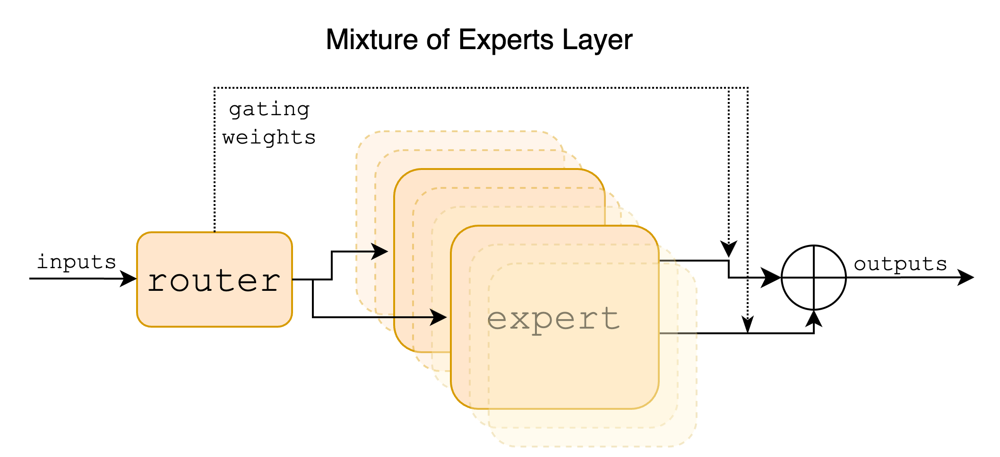
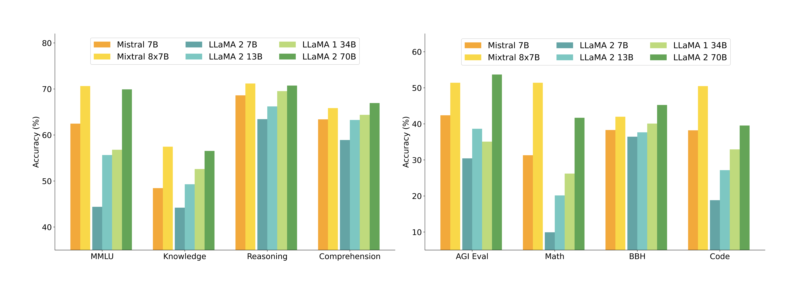
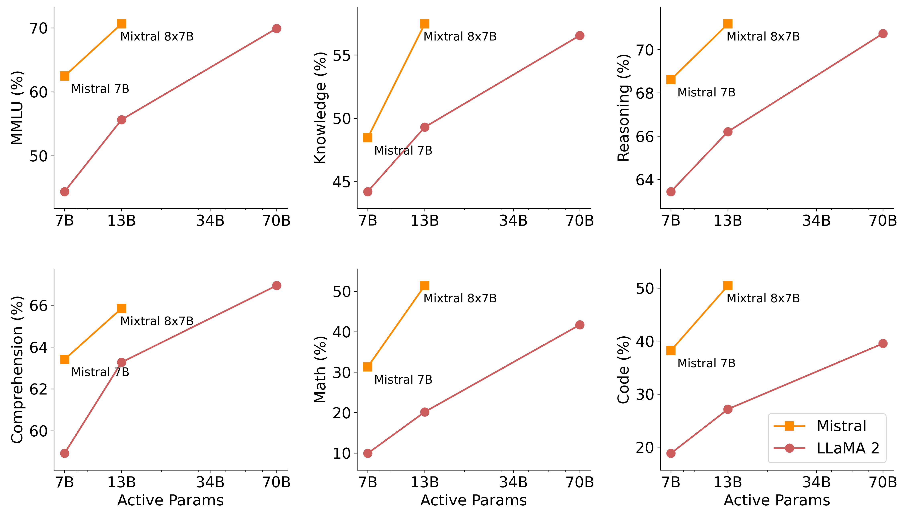
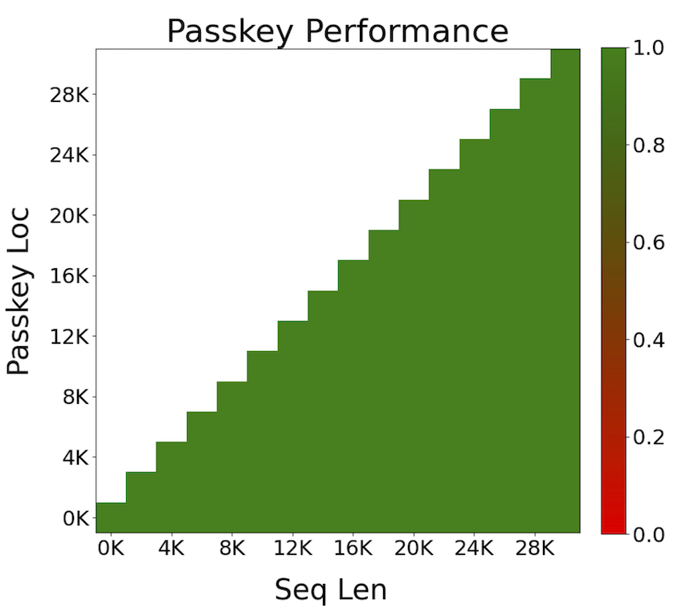
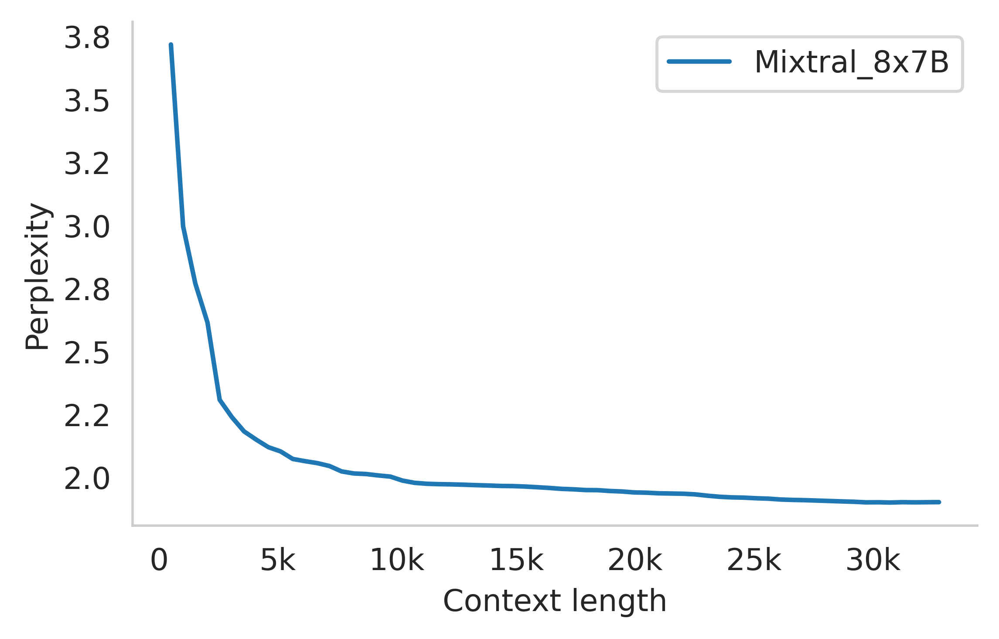
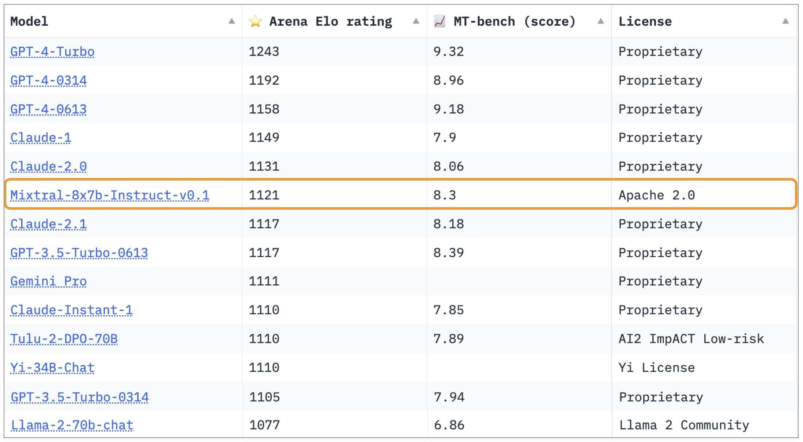
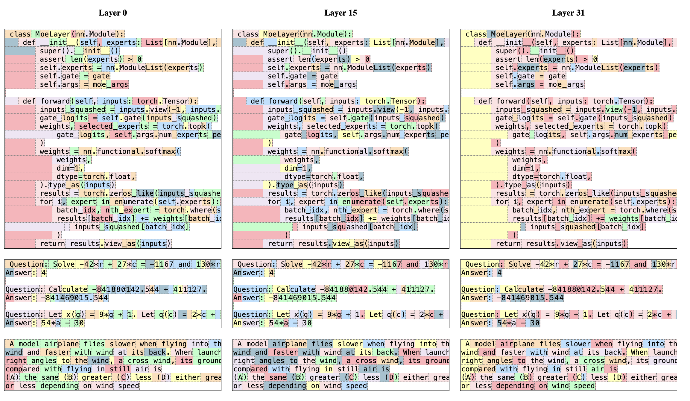

# Week 6 (Paper 2) — Paper Notes
**Paper:** Mixtral of Experts, Jiang et al. 2024 (Mistral AI)

---

## Table of Contents

1. [Overview](#overview)
2. [Things That Came Up During Reading](#things-that-came-up-during-reading)
3. [Key Points](#key-points)
4. [Architecture](#architecture)
   - [Model Parameters](#model-parameters)
   - [Sparse Mixture of Experts](#sparse-mixture-of-experts)
5. [Benchmark Results](#benchmark-results)
   - [Comparison with LLaMA Family](#comparison-with-llama-family)
   - [Comparison with LLaMA 2 70B and GPT-3.5](#comparison-with-llama-2-70b-and-gpt-35)
   - [Size and Efficiency](#size-and-efficiency)
6. [Multilingual Benchmarks](#multilingual-benchmarks)
7. [Long Range Performance](#long-range-performance)
8. [Bias Benchmarks](#bias-benchmarks)
9. [Instruction Fine-tuning](#instruction-fine-tuning)
10. [Routing Analysis](#routing-analysis)
11. [Connections to Previous Weeks](#connections-to-previous-weeks)
12. [Glossary](#glossary)

---

## Overview
*Paper reference: Abstract & Section 1 (pp. 1–2)*

Mixtral 8x7B is a **Sparse Mixture of Experts (SMoE)** language model from Mistral AI. It uses the same base architecture as Mistral 7B (a dense transformer) but replaces every feed-forward network (FFN) block with a Mixture of Experts layer containing **8 expert FFNs**. For each token at each layer, a learned router selects the **top 2 experts** — so only 2 of the 8 experts are active per token per layer.

The result: Mixtral has **46.7B total parameters** but only **12.9B active parameters per token** (~28% of the total). This means it processes tokens at roughly the same cost as a 13B dense model, while accessing a much larger parameter space. It **matches or outperforms LLaMA 2 70B** and **GPT-3.5** on most benchmarks, despite using ~6x less compute per token than a 70B dense model.

The model uses a 32k token context window, is released under the **Apache 2.0 license**, and an instruction-tuned variant (Mixtral 8x7B – Instruct) achieves an MT-Bench score of 8.30, making it the strongest open-weights chat model at the time of release (December 2023).

---

## Things That Came Up During Reading

> *(Add specific observations, confusions, and aha moments here as you read.)*

---

## Key Points
*Paper reference: Sections 1–5*

- Mixtral uses the **same transformer backbone as Mistral 7B** (RMSNorm, SwiGLU, RoPE, GQA) — the only change is replacing all FFN layers with MoE layers
- Each MoE layer has **8 expert networks**, each identical to a standard SwiGLU FFN
- A **router network** (linear layer + softmax) selects the **top 2 experts** per token per layer
- Total parameters: **46.7B**, active per token: **12.9B** — only ~28% of parameters are used per forward pass
- Matches or beats **LLaMA 2 70B** on most benchmarks while using **6x fewer active parameters**
- Matches or beats **GPT-3.5** on MMLU (70.6% vs 70.0%), math (GSM8K: 58.4% vs 57.1%), and code (MBPP: 60.7% vs 52.2%)
- Significantly **outperforms LLaMA 2 70B on multilingual tasks** (French, German, Spanish, Italian)
- **100% accuracy** on passkey retrieval across the full 32k context window
- Routing analysis reveals experts do **NOT specialize by domain** (ArXiv vs GitHub vs Wikipedia) — instead they exhibit **syntactic specialization** (specific tokens like "self", punctuation, indentation consistently routed to the same expert)
- Instruction-tuned variant achieves **MT-Bench 8.30** and **Arena Elo 1121**, outperforming Claude-2.1, GPT-3.5-Turbo, and Gemini Pro on the LMSys leaderboard
- Released under **Apache 2.0 license**

---

## Architecture
*Paper reference: Section 2 (pp. 2–4)*

### Model Parameters

| Parameter | Value |
|-----------|-------|
| dim | 4096 |
| n_layers | 32 |
| head_dim | 128 |
| hidden_dim | 14336 |
| n_heads | 32 |
| n_kv_heads | 8 (GQA: 4 query heads per KV head) |
| context_len | 32768 |
| vocab_size | 32000 |
| num_experts | 8 |
| top_k_experts | 2 |
| **Total parameters** | **~47B** (the paper rounds to 47B; the community-computed figure is 46.7B) |
| **Active parameters per token** | **~13B** (the paper rounds to 13B; the community-computed figure is 12.9B) |

The base transformer uses the same modifications as Mistral 7B: **RMSNorm** pre-normalization, **SwiGLU** activation in FFN layers, **Rotary Positional Embeddings (RoPE)**, and **Grouped-Query Attention (GQA)** with 8 KV heads for 32 query heads. Unlike Mistral 7B, Mixtral supports a **fully dense context length of 32k tokens** (the paper does not mention using Sliding Window Attention). The key architectural change is replacing all 32 FFN blocks with MoE layers.

> **Comparison to Mistral 7B (W6 Paper 1):** Mixtral shares the exact same transformer skeleton. The difference is purely in the FFN layers: Mistral 7B has 1 SwiGLU FFN per layer, Mixtral has 8 SwiGLU FFNs (experts) per layer with a router that selects 2. The attention layers, normalization, and positional encoding are unchanged.

> **Comparison to LLaMA 2 70B (W5):** LLaMA 2 70B is a dense model — all 70B parameters are active for every token. Mixtral achieves similar performance with only 12.9B active parameters, meaning each forward pass does ~5.4x less computation. The tradeoff is higher total memory (46.7B parameters must be stored), but inference FLOPS are dramatically lower.

### Sparse Mixture of Experts
*Paper reference: Section 2.1 (pp. 2–3)*

In a standard transformer, each layer has one FFN that processes every token. In Mixtral, this FFN is replaced by an **MoE layer** containing $n = 8$ expert networks and a **gating network (router)**.

```
                        ┌──────────────┐
                        │   Token x    │
                        └──────┬───────┘
                               │
                        ┌──────▼───────┐
                        │   Router     │
                        │  (x · W_g)   │
                        └──────┬───────┘
                               │
                    ┌──── Top-2 Selection ────┐
                    │     + Softmax weights    │
                    │                          │
              ┌─────▼─────┐            ┌──────▼─────┐        ┌──────────┐
              │ Expert_i  │            │ Expert_j   │   ...  │ Expert_7 │
              │ (SwiGLU)  │            │ (SwiGLU)   │        │ (idle)   │
              └─────┬─────┘            └──────┬─────┘        └──────────┘
                    │                          │
                    │    G(x)_i · E_i(x)       │   G(x)_j · E_j(x)
                    │                          │
                    └───────────┬──────────────┘
                                │
                         ┌──────▼───────┐
                         │   Weighted   │
                         │     Sum      │
                         └──────┬───────┘
                                │
                         ┌──────▼───────┐
                         │   Output y   │
                         └──────────────┘
```

**MoE output formula:**

$$y = \sum_{i=0}^{n-1} G(x)_i \cdot E_i(x)$$

Where:
- $y$ = the output of the MoE layer for input token $x$
- $n = 8$ = the number of expert networks
- $G(x)_i$ = the gating weight assigned to expert $i$ for token $x$ (zero for non-selected experts)
- $E_i(x)$ = the output of expert $i$ applied to token $x$

**Gating function (router):**

$$G(x) := \mathrm{Softmax}(\mathrm{TopK}(x \cdot W_g))$$

Where:
- $x$ = the input token representation (a vector of dimension 4096)
- $W_g$ = the learned gating weight matrix (dimensions $4096 \times 8$), one column per expert
- $x \cdot W_g$ = the raw router logits, a vector of 8 scores (one per expert)
- $\mathrm{TopK}(\ell)_i = \ell_i$ if $\ell_i$ is among the top-$K$ values, else $-\infty$ — this masks out all but the top $K$ experts by setting their logits to negative infinity, so after softmax they become zero
- $\mathrm{Softmax}$ = normalizes the remaining $K$ logits into weights that sum to 1

**Full formulation combining MoE with SwiGLU (the actual expert architecture):**

$$y = \sum_{i=0}^{n-1} \mathrm{Softmax}(\mathrm{Top2}(x \cdot W_g))_i \cdot \mathrm{SwiGLU}_i(x)$$

Where:
- $\mathrm{Top2}$ = the TopK function with $K = 2$, selecting exactly 2 experts per token
- $\mathrm{SwiGLU}_i(x)$ = the SwiGLU feed-forward network of expert $i$, applied to token $x$
- Each $\mathrm{SwiGLU}_i$ has its own independent weights (hidden_dim = 14336)

**Key properties of this design:**

1. **Decoupled capacity and compute:** Increasing the number of experts $n$ adds more parameters (capacity) without increasing per-token compute, because only $K$ experts run per token regardless of $n$
2. **Sparse activation:** Of the 46.7B total parameters, only 12.9B are active per token — the 2 selected expert FFNs plus the shared attention layers
3. **No mention of load balancing loss:** Earlier MoE work (e.g., GShard, Switch Transformer) used an auxiliary loss term during training to penalize uneven expert utilization — preventing "expert collapse" where the router sends most tokens to a small subset of experts. The Mixtral paper does **not mention** using such a loss. This could mean they omitted it (and the router learns balanced routing naturally), or it simply wasn't discussed. The routing analysis in Section 5 shows relatively uniform expert utilization across domains (Figure 7), suggesting balanced routing was achieved regardless
4. **All FFN blocks replaced:** Earlier work like GShard replaced every *other* FFN with an MoE layer. Mixtral replaces **all 32** FFN blocks

**Expert Parallelism:** In distributed training/inference, MoE layers are parallelized by assigning each expert to a different GPU. Tokens are routed to the GPU hosting the selected expert, processed, then the results are sent back. This is orthogonal to standard tensor or pipeline parallelism.



*Figure 1: The Mixture of Experts layer. The router network assigns weights to each expert for a given token. Only the top-2 experts are selected (non-zero weights); the remaining 6 experts are inactive for that token.*

---

## Benchmark Results
*Paper reference: Section 3 (pp. 4–6)*

### Comparison with LLaMA Family

**What each benchmark tests:**

| Benchmark | What It Tests | Format | Metric |
|-----------|--------------|--------|--------|
| **MMLU** | Multitask Language Understanding across 57 academic subjects (STEM, humanities, social sciences, etc.) | Multiple choice (4 options), 5-shot | Accuracy % — **higher is better (↑)** |
| **HellaSwag** | Commonsense reasoning about everyday physical situations — select the most plausible continuation | Multiple choice (4 options), 10-shot | Accuracy % — **higher is better (↑)** |
| **WinoGrande** | Commonsense pronoun resolution — fill in a blank with the correct option | Binary choice, 5-shot | Accuracy % — **higher is better (↑)** |
| **PIQA** | Physical Intuition QA — commonsense reasoning about physical interactions between objects | Binary choice, 0-shot | Accuracy % — **higher is better (↑)** |
| **Arc-e / Arc-c** | AI2 Reasoning Challenge (Easy / Challenge) — grade-school science questions requiring reasoning | Multiple choice, 25-shot | Accuracy % — **higher is better (↑)** |
| **NQ (Natural Questions)** | Open-domain QA — answer real Google search questions using world knowledge | Open-ended generation, 5-shot | Exact match % — **higher is better (↑)** |
| **TriviaQA** | Open-domain trivia questions requiring broad factual knowledge | Open-ended generation, 5-shot | Exact match % — **higher is better (↑)** |
| **HumanEval** | Code generation — write Python functions from docstrings | Code generation, 0-shot | pass@1 % — **higher is better (↑)** |
| **MBPP** | Mostly Basic Python Problems — write short Python functions from descriptions | Code generation, 3-shot | pass@1 % — **higher is better (↑)** |
| **Math** | Competition-level math problems (AMC, AIME, etc.) | Open-ended generation, 4-shot | Accuracy % — **higher is better (↑)** |
| **GSM8K** | Grade School Math — multi-step arithmetic word problems | Open-ended generation, 5-shot (with chain-of-thought) | Accuracy % — **higher is better (↑)** |

**Results (Table 2):**

| Model | Active Params | MMLU | HellaS | WinoG | PIQA | Arc-e | Arc-c | NQ | TriQA | HumanE | MBPP | Math | GSM8K |
|-------|--------------|------|--------|-------|------|-------|-------|----|-------|---------|------|------|-------|
| LLaMA 2 7B | 7B | 44.4 | 77.1 | 69.5 | 77.9 | 68.7 | 43.2 | 17.5 | 56.6 | 11.6 | 26.1 | 3.9 | 16.0 |
| LLaMA 2 13B | 13B | 55.6 | 80.7 | 72.9 | 80.8 | 75.2 | 48.8 | 16.7 | 64.0 | 18.9 | 35.4 | 6.0 | 34.3 |
| LLaMA 1 33B | 33B | 56.8 | 83.7 | 76.2 | 82.2 | 79.6 | 54.4 | 24.1 | 68.5 | 25.0 | 40.9 | 8.4 | 44.1 |
| LLaMA 2 70B | 70B | 69.9 | 85.4 | 80.4 | 82.6 | 79.9 | 56.5 | 25.4 | 73.0 | 29.3 | 49.8 | 13.8 | 69.6 |
| Mistral 7B | 7B | 62.5 | 81.0 | 74.2 | 82.2 | 80.5 | 54.9 | 23.2 | 62.5 | 26.2 | 50.2 | 12.7 | 50.0 |
| **Mixtral 8x7B** | **13B** | **70.6** | **84.4** | 77.2 | **83.6** | **83.1** | **59.7** | **30.6** | 71.5 | **40.2** | **60.7** | **28.4** | **74.4** |

**Key takeaways:**
- Mixtral with 13B active parameters **outperforms LLaMA 2 70B** (70B active) on MMLU (70.6 vs 69.9), code (HumanEval 40.2 vs 29.3, MBPP 60.7 vs 49.8), math (28.4 vs 13.8, GSM8K 74.4 vs 69.6), and most reasoning benchmarks
- The gap is largest on **code and math**: HumanEval +10.9, MBPP +10.9, Math +14.6, GSM8K +4.8
- Mixtral also vastly outperforms its dense counterpart Mistral 7B across the board, showing the benefit of the MoE architecture
- LLaMA 2 70B still leads on HellaSwag (85.4 vs 84.4) and WinoGrande (80.4 vs 77.2)



*Figure 2: Mixtral 8x7B compared to LLaMA 2 models across benchmarks. Despite having only 13B active parameters, Mixtral consistently matches or exceeds the 70B dense model.*

### Comparison with LLaMA 2 70B and GPT-3.5

**What each additional benchmark tests:**

| Benchmark | What It Tests | Format | Metric |
|-----------|--------------|--------|--------|
| **MT-Bench** | Multi-turn conversational quality across 8 categories (writing, roleplay, reasoning, math, coding, extraction, STEM, humanities) — judged by GPT-4 | 2-turn conversations, GPT-4 scores 1–10 | Average score — **higher is better (↑)** |

**Results (Table 3):**

| Benchmark | LLaMA 2 70B | GPT-3.5 | Mixtral 8x7B |
|-----------|-------------|---------|--------------|
| MMLU (MCQ, 57 subjects) | 69.9 | 70.0 | **70.6** |
| HellaSwag (10-shot) | **87.1** | 85.5 | 86.7 |
| ARC Challenge (25-shot) | 85.1 | 85.2 | **85.8** |
| WinoGrande (5-shot) | **83.2** | 81.6 | 81.2 |
| MBPP (pass@1) | 49.8 | 52.2 | **60.7** |
| GSM-8K (5-shot) | 53.6 | 57.1 | **58.4** |
| MT-Bench (Instruct models) | 6.86 | **8.32** | 8.30 |

**Key takeaways:**
- Mixtral **matches GPT-3.5** on MMLU (70.6 vs 70.0) and **MT-Bench** (8.30 vs 8.32 — effectively tied)
- Mixtral **significantly outperforms GPT-3.5** on code (MBPP: 60.7 vs 52.2, a +8.5 gap)
- GPT-3.5 still leads on WinoGrande (81.6 vs 81.2) and HellaSwag is led by LLaMA 2 70B (87.1)
- The MT-Bench comparison uses the **Instruct variants** (Mixtral 8x7B – Instruct vs Llama 2-Chat 70B vs GPT-3.5-Turbo)

### Size and Efficiency

The central claim of the MoE approach is that you can get dense-model quality with sparse-model cost:

| Model | Total Params | Active Params | MMLU | GSM8K | Relative Compute |
|-------|-------------|--------------|------|-------|-----------------|
| Mistral 7B | 7B | 7B | 62.5 | 50.0 | 1x |
| LLaMA 2 13B | 13B | 13B | 55.6 | 34.3 | ~1.9x |
| Mixtral 8x7B | 46.7B | 12.9B | 70.6 | 74.4 | ~1.8x |
| LLaMA 2 70B | 70B | 70B | 69.9 | 69.6 | ~10x |

Mixtral achieves LLaMA 2 70B-level performance at ~1.8x the compute of Mistral 7B, instead of the ~10x required by the dense 70B model. The cost is higher memory (46.7B parameters must be stored), but inference throughput is comparable to a 13B dense model.



*Figure 3: Performance vs. active parameters on multiple benchmarks. Mixtral (red) sits far above the dense scaling curve (blue points), demonstrating the efficiency advantage of sparse MoE — more performance per FLOP.*

---

## Multilingual Benchmarks
*Paper reference: Section 3.1 (pp. 5–6)*

Mixtral was trained with **significantly upsampled multilingual data** compared to Mistral 7B, covering French, German, Spanish, and Italian alongside English.

**What each benchmark tests (multilingual versions):**

| Benchmark | What It Tests | Format | Metric |
|-----------|--------------|--------|--------|
| **Arc-c (translated)** | AI2 Reasoning Challenge in target language — grade-school science reasoning | Multiple choice, 25-shot | Accuracy % — **higher is better (↑)** |
| **HellaSwag (translated)** | Commonsense reasoning about everyday situations in target language | Multiple choice, 10-shot | Accuracy % — **higher is better (↑)** |
| **MMLU (translated)** | Multitask language understanding across 57 subjects in target language | Multiple choice, 5-shot | Accuracy % — **higher is better (↑)** |

**Results (Table 4):**

| Model | Active Params | French Arc-c/HellaS/MMLU | German Arc-c/HellaS/MMLU | Spanish Arc-c/HellaS/MMLU | Italian Arc-c/HellaS/MMLU |
|-------|-------------|--------------------------|--------------------------|---------------------------|---------------------------|
| LLaMA 1 33B | 33B | 39.3 / 68.1 / 49.9 | 41.1 / 63.3 / 48.7 | 45.7 / 69.8 / 52.3 | 42.9 / 65.4 / 49.0 |
| LLaMA 2 70B | 70B | 49.9 / 72.5 / 64.3 | 47.3 / 68.7 / 64.2 | 50.5 / 74.5 / 66.0 | 49.4 / 70.9 / 65.1 |
| **Mixtral 8x7B** | **13B** | **58.2 / 77.4 / 70.9** | **54.3 / 73.0 / 71.5** | **55.4 / 77.6 / 72.5** | **52.8 / 75.1 / 70.9** |

**Key takeaways:**
- Mixtral **dominates all four languages** across all three benchmarks, despite using only 13B active parameters vs LLaMA 2 70B's 70B
- The gap is especially large on **MMLU**: +6.6 in French, +7.3 in German, +6.5 in Spanish, +5.8 in Italian over LLaMA 2 70B
- Arc-c shows even larger gains: +8.3 in French, +7.0 in German, +4.9 in Spanish, +3.4 in Italian
- This suggests the multilingual data upsampling was very effective, and the MoE architecture may help with multilingual capacity by allowing different experts to specialize in different linguistic patterns

---

## Long Range Performance
*Paper reference: Section 3.2 (pp. 6–7)*

Mixtral supports a **32,768-token context window** using fully dense attention. Unlike Mistral 7B which uses Sliding Window Attention, the Mixtral paper explicitly states it supports "a fully dense context length of 32k tokens."

**Passkey Retrieval:**



*Figure 4: Passkey retrieval accuracy as a function of context length (x-axis) and passkey position within the context (y-axis). Mixtral achieves 100% accuracy across all positions and all context lengths up to 32k tokens — the model can locate and retrieve a randomly inserted passkey regardless of where it appears in a long document.*

**Perplexity vs. Context Length:**



*Figure 5: Perplexity on the proof-pile dataset decreases monotonically as context length increases, confirming that Mixtral effectively uses long-range context — additional context always helps, with no degradation.*

---

## Bias Benchmarks
*Paper reference: Section 3.3 (pp. 7–8)*

**What each benchmark tests:**

| Benchmark | What It Tests | Format | Metric |
|-----------|--------------|--------|--------|
| **BBQ (Bias Benchmark for QA)** | Whether the model relies on social biases (age, gender, race, religion, etc.) when answering ambiguous questions — tests 9 bias categories | Multiple choice QA with ambiguous and disambiguated contexts | Accuracy % — **higher is better (↑)** (higher = less reliance on stereotypes) |
| **BOLD (Bias in Open-Ended Language Generation)** | Whether the model generates text with differential sentiment across demographic groups (gender, profession, religion, politics, race) | Open-ended text generation from demographic-associated prompts; scored by a sentiment classifier | Average sentiment score (0–1 range) with standard deviation — **values closer to neutral and lower variance indicate less bias** |

**Results (Figure 5 / comparison with LLaMA 2 70B):**

| Metric | LLaMA 2 70B | Mixtral 8x7B |
|--------|-------------|--------------|
| BBQ accuracy ↑ | 51.5% | **56.0%** |
| BOLD sentiment — gender | 0.293 ± 0.073 | 0.323 ± 0.045 |
| BOLD sentiment — profession | 0.218 ± 0.073 | 0.243 ± 0.087 |
| BOLD sentiment — religious ideology | 0.188 ± 0.133 | 0.144 ± 0.089 |
| BOLD sentiment — political ideology | 0.149 ± 0.140 | 0.186 ± 0.146 |
| BOLD sentiment — race | 0.232 ± 0.049 | 0.232 ± 0.052 |

**Key takeaways:**
- Mixtral scores **higher on BBQ** (56.0% vs 51.5%), meaning it relies less on social stereotypes in ambiguous QA
- BOLD sentiment results are mixed — Mixtral shows slightly higher average sentiment for gender and profession categories, but **lower variance for gender** (0.045 vs 0.073), suggesting more consistent treatment
- Religious ideology sentiment is **lower** for Mixtral (0.144 vs 0.188), which may indicate more neutral/less positive generation about religion
- Race sentiment is essentially **identical** between the two models (0.232)
- Overall, Mixtral shows a modest improvement in bias behavior compared to LLaMA 2 70B, particularly on the structured BBQ benchmark

---

## Instruction Fine-tuning
*Paper reference: Section 4 (pp. 8–9)*

Mixtral 8x7B – Instruct was fine-tuned using **Supervised Fine-Tuning (SFT)** followed by **Direct Preference Optimization (DPO)** on a paired feedback dataset. The paper provides limited details about the fine-tuning data or process.

> **Comparison to Llama 2-Chat (W5):** Llama 2-Chat used SFT + iterative RLHF (Rejection Sampling + PPO over 5 rounds) with two separate reward models. Mixtral – Instruct uses SFT + DPO, which is a simpler pipeline — DPO directly optimizes the policy from preference pairs without training a separate reward model or running PPO. This represents a shift in the field toward simpler alignment methods.

**What the evaluation benchmarks test:**

| Benchmark | What It Tests | Format | Metric |
|-----------|--------------|--------|--------|
| **MT-Bench** | Multi-turn conversational quality across 8 categories, judged by GPT-4 | 2-turn conversations, GPT-4 scores 1–10 | Average score — **higher is better (↑)** |
| **Arena Elo** | Head-to-head human preference ranking on LMSys Chatbot Arena — users vote on which model response they prefer in blind comparisons | Open-ended chat, human preference votes | Elo rating — **higher is better (↑)** |

**Results:**

| Model | MT-Bench | Arena Elo (Dec 2023) |
|-------|----------|---------------------|
| GPT-4-Turbo | 9.32 | 1243 |
| GPT-4-0314 | — | 1192 |
| **Mixtral 8x7B – Instruct** | **8.30** | **1121** |
| Claude-2.1 | — | 1117 |
| GPT-3.5-Turbo-0613 | 8.32 | 1117 |
| Gemini Pro | — | 1111 |
| Llama-2-70b-chat | 6.86 | 1077 |



*Figure 6: LMSys Chatbot Arena leaderboard (December 2023). Mixtral 8x7B – Instruct ranks above Claude-2.1, GPT-3.5-Turbo, and Gemini Pro in human preference voting.*

**Key takeaways:**
- MT-Bench score of **8.30** is essentially tied with GPT-3.5-Turbo (8.32) — within rounding error
- Arena Elo of **1121** places Mixtral above Claude-2.1 (1117), GPT-3.5-Turbo (1117), and Gemini Pro (1111)
- Still a significant gap to GPT-4-0314 (1192) and GPT-4-Turbo (1243)
- This makes Mixtral – Instruct the **best open-weights model** at time of release
- The model is released under **Apache 2.0**, allowing unrestricted commercial use — a significant differentiator from LLaMA 2's more restrictive license

---

## Routing Analysis
*Paper reference: Section 5 (pp. 9–11)*

This section investigates **what the router learns** — do experts specialize by topic/domain, or by something else? The authors analyze expert selection patterns on The Pile validation set across different data domains.

### Domain Specialization (or Lack Thereof)

The authors measured the distribution of expert selections across different domains (ArXiv papers, GitHub code, PubMed medical literature, Wikipedia, etc.) at layers 0, 15, and 31 (first, middle, last).

**Finding: experts do NOT specialize by domain.** The proportion of tokens assigned to each expert is remarkably similar across ArXiv, GitHub, PubMed, Wikipedia, and other subsets. For example, if Expert 3 processes 14% of tokens in Wikipedia, it also processes roughly 14% of tokens in ArXiv and GitHub.

**Exception:** DM Mathematics (a synthetic dataset) shows a slightly different distribution, likely because its token distribution is very different from natural language (heavy on digits and math symbols).

### Syntactic Specialization

Instead of domain specialization, the router exhibits **syntactic behavior**:

- Specific tokens are consistently routed to the same expert(s) regardless of context or domain
- Python's `self` keyword, English words like "Question", punctuation marks, and indentation tokens each have a preferred expert
- This means the router learns a **token-type-to-expert mapping** rather than a topic-to-expert mapping



*Figure 7: Text colored by assigned expert. Consecutive tokens and tokens of the same syntactic type (e.g., punctuation, indentation, keywords) tend to be assigned to the same expert, showing syntactic rather than semantic specialization.*

### Consecutive Token Locality

The authors measured how often consecutive tokens are assigned to the same expert — if routing were random, the first-choice expert would match the previous token's first choice 12.5% of the time (1 in 8 experts).

**Results (Table 5):**

| Domain | First choice matches (L0 / L15 / L31) | First or second matches (L0 / L15 / L31) |
|--------|---------------------------------------|------------------------------------------|
| ArXiv | 14.0 / 27.9 / 22.7 | 46.5 / 62.3 / 52.9 |
| GitHub | 14.9 / 28.1 / 19.7 | 49.9 / 66.9 / 49.2 |
| Wikipedia | 14.4 / 23.6 / 25.3 | 49.8 / 62.1 / 51.8 |
| *Random baseline* | *12.5* | *~46.0* |

**Key takeaways:**
- First-choice repetition rates are **above the 12.5% random baseline** at all layers, especially at layer 15 (middle of the network) where rates reach ~28% — more than 2x the random rate
- When considering first *or* second choice matching, the rates reach **62–67% at layer 15**, far above the ~46% random baseline
- This means the router has a strong **positional locality bias** — consecutive tokens tend to go to the same expert
- Layer 15 (middle) shows the strongest locality, while layer 0 (first) is closest to random
- This pattern is consistent across domains (ArXiv, GitHub, Wikipedia), further confirming that routing is driven by local token patterns rather than global document topics

### Interpretation

The routing analysis reveals that MoE experts in Mixtral function more like **specialized processing units for different token types and local contexts** rather than domain-specific sub-models. This is a somewhat surprising finding — one might expect an "ArXiv expert" and a "code expert" to emerge, but instead the specialization is at the syntactic level (punctuation expert, keyword expert, indentation expert, etc.).

---

## Connections to Previous Weeks

### From Dense to Sparse: The MoE Paradigm Shift

| Aspect | Dense Models (W1–W5) | Mixtral MoE (W6) |
|--------|---------------------|-------------------|
| **Parameter usage** | All parameters active for every token | Only ~28% active per token (top-2 of 8 experts) |
| **Scaling approach** | Increase all parameters (more compute per token) | Increase experts (more parameters, same compute per token) |
| **FFN structure** | Single FFN per layer | 8 expert FFNs per layer + router |
| **Compute cost** | Proportional to total parameters | Proportional to active parameters only |
| **Memory cost** | Same as compute model size | Higher than compute cost (all experts must be stored) |
| **Inference throughput** | Bounded by model size | Comparable to a dense model of the active parameter size |

### Comparison with Llama 2 70B (W5)

| Aspect | LLaMA 2 70B | Mixtral 8x7B |
|--------|-------------|--------------|
| **Total parameters** | 70B | 46.7B |
| **Active parameters** | 70B (all) | 12.9B (~28%) |
| **MMLU** | 69.9 | **70.6** |
| **GSM8K** | 69.6 | **74.4** |
| **HumanEval** | 29.3 | **40.2** |
| **Inference cost** | ~5.4x Mixtral | 1x |
| **Context length** | 4,096 | **32,768** (8x) |
| **Architecture** | Dense transformer, GQA | MoE transformer, GQA, fully dense 32k context |
| **Alignment** | SFT + iterative RLHF (RS + PPO) | SFT + DPO (simpler pipeline) |
| **License** | Research + Commercial (with restrictions) | **Apache 2.0** (unrestricted) |

### The Broader Arc

- **W2 (Attention Is All You Need):** The transformer architecture — self-attention + FFN blocks. Mixtral keeps the attention blocks identical but revolutionizes the FFN blocks with MoE
- **W3 (GPT-1/2):** Pretrain + fine-tune paradigm established. Mixtral follows the same paradigm but with a fundamentally different model structure
- **W1 (GPT-3):** Scale enables emergent capabilities. Mixtral shows you can achieve scale's benefits (large parameter count) while keeping compute manageable (sparse activation)
- **W4 (InstructGPT):** RLHF for alignment. Mixtral – Instruct uses DPO instead — a simpler alternative that skips the reward model and PPO entirely
- **W5 (LLaMA 1/Llama 2):** Open-source dense models with RLHF alignment. Mixtral builds on this open-source tradition, using the same architectural components (RMSNorm, SwiGLU, RoPE, GQA) but adding the MoE innovation, achieving comparable quality at a fraction of the compute

> **Comparison to InstructGPT (W4):** InstructGPT and Llama 2-Chat both use PPO-based RLHF, which requires training a separate reward model and running a complex RL loop. Mixtral – Instruct uses DPO, which reparameterizes the RLHF objective to directly optimize from preference pairs. This reflects a broader trend in the field from late 2023 onward: DPO is simpler to implement, more stable to train, and produces competitive results.

---

## Glossary

| Term | Definition |
|------|-----------|
| **Mixture of Experts (MoE)** | An architecture where multiple "expert" sub-networks exist within a single layer, and a gating mechanism selects a subset of them for each input. This creates a sparse model — total parameters are large but per-input compute is small. |
| **Expert** | One of the $n$ independent sub-networks within an MoE layer. In Mixtral, each expert is a standard SwiGLU FFN with hidden_dim = 14336. There are 8 experts per layer, 32 layers, for a total of 256 expert FFNs. |
| **Router / Gating Network** | A learned linear layer ($W_g$) that takes a token representation and outputs a score for each expert. After TopK masking and softmax, these scores become the weights used to combine selected expert outputs. |
| **TopK Selection** | The mechanism that selects the $K$ highest-scoring experts and masks all others to $-\infty$ before softmax. In Mixtral, $K = 2$, so exactly 2 experts are active per token per layer. |
| **Sparse Model** | A model where only a fraction of parameters are active for any given input. Mixtral is "sparse" because only 12.9B of its 46.7B parameters are used per token. Contrast with "dense" models like LLaMA where all parameters are always active. |
| **Active Parameters** | The number of parameters involved in processing a single token. For Mixtral: the shared attention layers + 2 selected expert FFNs = ~12.9B. This determines actual compute cost. |
| **Expert Parallelism (EP)** | A distributed computing strategy for MoE models where different experts are placed on different GPUs. Tokens are routed to the GPU hosting their selected expert, processed, and results are returned. Orthogonal to tensor parallelism or pipeline parallelism. |
| **SwiGLU** | Swish-Gated Linear Unit — the activation function used in each expert FFN. Combines a gated linear unit with the Swish activation: $\mathrm{SwiGLU}(x) = \mathrm{Swish}(xW_1) \odot (xW_2)$. More expressive than standard ReLU. First used in PaLM, adopted by LLaMA 1 (W5). |
| **Direct Preference Optimization (DPO)** | An alignment method that directly optimizes a language model from human preference pairs without training a separate reward model. It reparameterizes the RLHF objective so the policy can be optimized with a simple classification-style loss on (preferred, rejected) response pairs. Used for Mixtral – Instruct instead of PPO. |
| **Load Balancing Loss** | An auxiliary loss term used in some MoE architectures (e.g., GShard, Switch Transformer) to penalize uneven expert utilization and prevent "expert collapse." It encourages the router to distribute tokens evenly across experts. The Mixtral paper does not mention using one, though balanced routing is observed in practice (Section 5, Figure 7). |
| **Sliding Window Attention (SWA)** | An attention mechanism where each token only attends to a fixed window of nearby tokens (e.g., 4096) rather than the full sequence. Reduces the quadratic cost of attention. Used in Mistral 7B but notably NOT mentioned in the Mixtral paper — Mixtral instead supports "a fully dense context length of 32k tokens." |
| **Grouped-Query Attention (GQA)** | An attention variant where multiple query heads share a single key-value head, reducing KV cache memory during inference. Mixtral uses 32 query heads with 8 KV heads (4:1 ratio). See W5 notes for detailed explanation. |
| **Arena Elo** | A rating system from the LMSys Chatbot Arena where models are ranked based on human preference votes in blind head-to-head comparisons. Higher Elo means humans preferred that model's responses more often. |
| **MT-Bench** | A multi-turn benchmark consisting of 80 two-turn conversations across 8 categories, scored by GPT-4 on a 1–10 scale. Tests both single-turn quality and the ability to follow up coherently. |
| **Passkey Retrieval** | A synthetic benchmark that inserts a random number (passkey) at a random position in a long document and asks the model to retrieve it. Tests whether the model can effectively attend to any position in its context window. |
