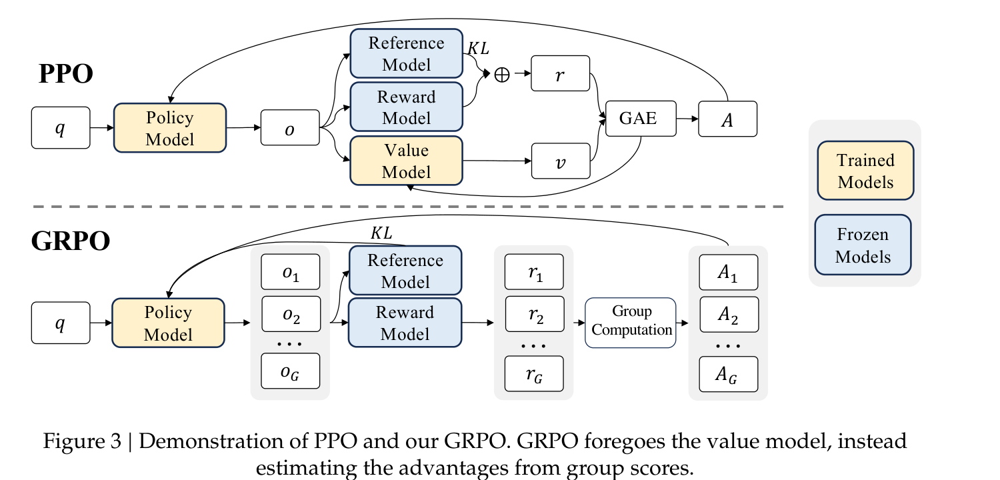
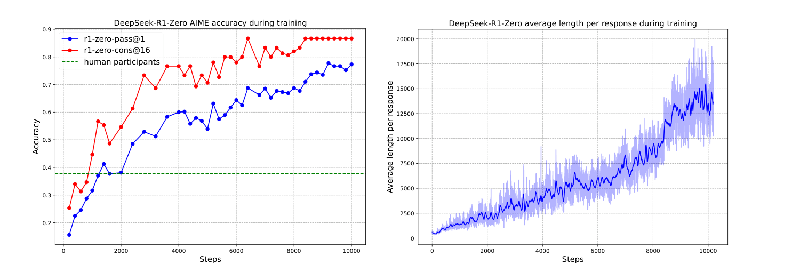
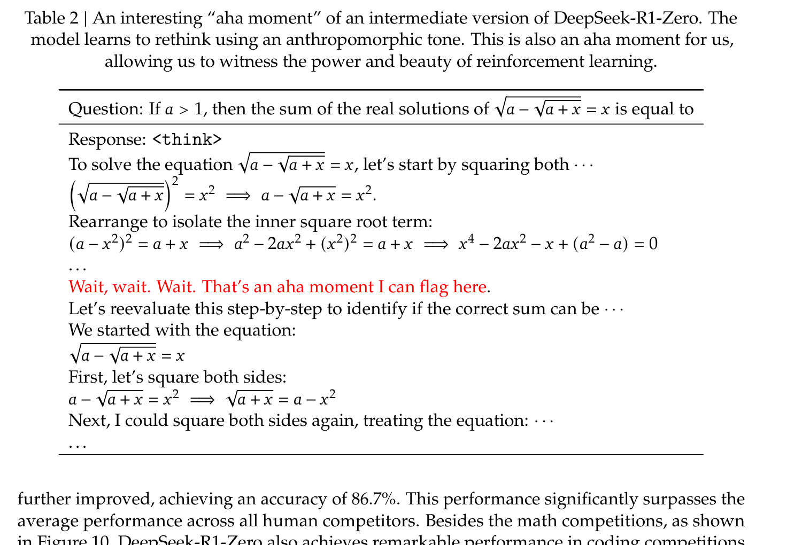
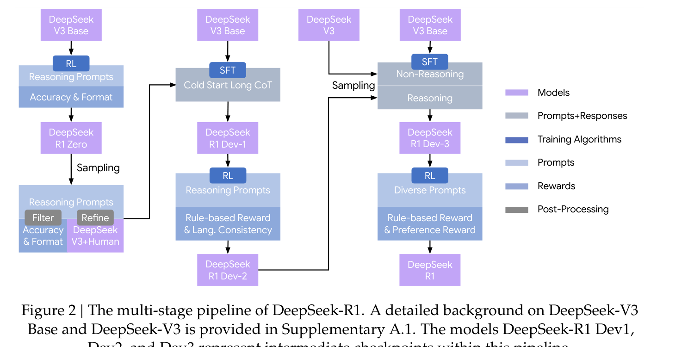
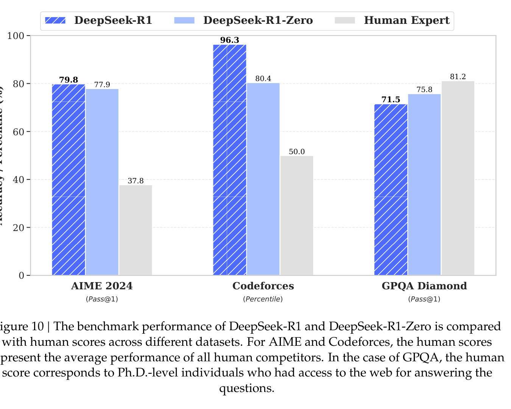
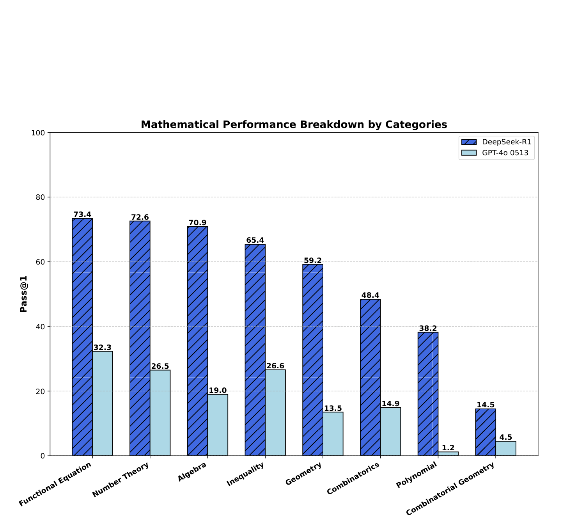
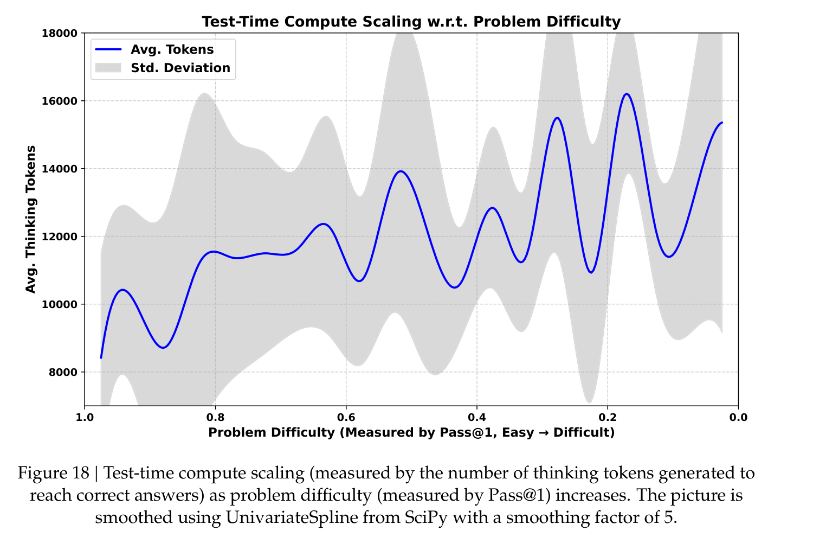

# Week 8 — Paper Notes
**Paper:** DeepSeek-R1: Incentivizing Reasoning Capability in LLMs via Reinforcement Learning, DeepSeek-AI, January 2025 (v2: January 2026)

---

## Table of Contents

1. [Overview](#overview)
2. [Things That Came Up During Reading](#things-that-came-up-during-reading)
3. [Key Points](#key-points)
4. [Background: The Reasoning Gap](#background-the-reasoning-gap)
5. [GRPO: Group Relative Policy Optimization](#grpo-group-relative-policy-optimization)
   - [The Algorithm](#the-algorithm)
   - [Why Drop the Value Model?](#why-drop-the-value-model)
   - [Worked Advantage Example](#worked-advantage-example)
6. [DeepSeek-R1-Zero: Pure RL, No SFT](#deepseek-r1-zero-pure-rl-no-sft)
   - [Training Template](#training-template)
   - [Rule-Based Rewards](#rule-based-rewards)
   - [Training Recipe](#training-recipe)
   - [Emergent Behaviors and the "Aha Moment"](#emergent-behaviors-and-the-aha-moment)
   - [Limitations of R1-Zero](#limitations-of-r1-zero)
7. [DeepSeek-R1: The Multi-Stage Pipeline](#deepseek-r1-the-multi-stage-pipeline)
   - [Stage 0: Cold-Start SFT](#stage-0-cold-start-sft)
   - [Stage 1: Reasoning-Oriented RL](#stage-1-reasoning-oriented-rl)
   - [Stage 2: Rejection Sampling + SFT](#stage-2-rejection-sampling--sft)
   - [Stage 3: General-Purpose RL](#stage-3-general-purpose-rl)
   - [Per-Stage Results](#per-stage-results)
8. [Training Infrastructure](#training-infrastructure)
9. [Benchmark Results](#benchmark-results)
   - [Benchmark Descriptions](#benchmark-descriptions)
   - [Main Results Table](#main-results-table)
   - [Human Comparison](#human-comparison)
   - [Math Category Breakdown](#math-category-breakdown)
   - [Adaptive Test-Time Compute](#adaptive-test-time-compute)
10. [Distillation](#distillation)
    - [Distillation vs RL for Small Models](#distillation-vs-rl-for-small-models)
11. [Safety](#safety)
12. [Unsuccessful Attempts](#unsuccessful-attempts)
13. [Limitations](#limitations)
14. [Connections to Previous Weeks](#connections-to-previous-weeks)
15. [Glossary](#glossary)

---

## Overview
*Paper reference: Abstract & Section 1 (pp. 1–2)*

DeepSeek-R1 is DeepSeek's open-weight **reasoning model**, released in January 2025. It was the first open model to match OpenAI's closed o1-1217 on math and coding benchmarks, and the first credible demonstration that **reinforcement learning alone — with no supervised CoT data at all** — can incentivize long chain-of-thought reasoning from a pretrained base model. The paper describes two models: **DeepSeek-R1-Zero**, which runs pure rule-based RL directly on the DeepSeek-V3-Base checkpoint (skipping SFT entirely), and **DeepSeek-R1**, a production-grade model trained through a four-stage pipeline that stitches cold-start SFT, reasoning-RL, rejection-sampled SFT, and general-purpose RL.

The paper's core scientific claim is that reasoning ability can **emerge autonomously** from RL when the base model is large enough and the reward is verifiable. During R1-Zero training, the authors observe the model spontaneously lengthening its responses, adopting reflective phrases like "wait" and "let me re-examine this step", and in one logged case explicitly writing *"That's an aha moment I can flag here"* before backtracking to recheck its work. This is framed as evidence that long chain-of-thought is not a human-engineered pattern copied during SFT but a strategy the model discovers on its own when properly incentivized.

Beyond the flagship models, DeepSeek also releases six **distilled** smaller models (Qwen-1.5B/7B/14B/32B, Llama-8B/70B) fine-tuned on 800K R1-generated reasoning trajectories. A 7B distilled model matches GPT-4o-0513 and Claude-3.5-Sonnet on math, and the 32B distilled model outperforms QwQ-32B-Preview — the prior open reasoning SOTA. This democratization angle, plus the MIT-licensed weights and a disclosed training cost of only **$294K** in H800 rental, made R1 one of the most cited releases of 2025.

---

## Things That Came Up During Reading

> *(Add specific observations, confusions, and aha moments here as you read.)*

---

## Key Points
*Paper reference: Sections 1–6*

- **R1-Zero is the scientific contribution:** pure RL from DeepSeek-V3-Base, **no SFT at all**, no reasoning exemplars, only rule-based correctness rewards. Shows RL can *incentivize* reasoning rather than *teach* it.
- **R1 is the product:** a 4-stage pipeline (cold-start SFT → reasoning RL → rejection-sampled SFT → general RL) that layers readability, language consistency, and helpfulness onto R1-Zero's raw reasoning ability.
- **GRPO** replaces PPO for the RL algorithm. It drops the value model and estimates advantages from *group statistics* (mean/std over $G{=}16$ sampled outputs per prompt). This ~halves RL memory cost.
- **Rule-based rewards only for reasoning:** accuracy (answer matches ground truth, verified by `sympy` for math or code compiler for coding) + format (answer wrapped in `<think>...</think><answer>...</answer>`). The authors **explicitly reject neural reward models for reasoning** — they reward-hack too easily at scale.
- **Emergent reasoning:** during R1-Zero training, response length climbs from ~2,000 tokens to ~15,000 tokens, AIME pass@1 climbs from **15.6% → 77.9%** (86.7% with cons@16), and reflective words like "wait" spike sharply at ~step 8,000.
- **R1-Zero has real flaws:** poor readability, Chinese/English language mixing within a single trace, and narrow domain focus. These motivate the R1 multi-stage pipeline.
- **Cold-start SFT is small but load-bearing:** only "thousands" of curated long-CoT examples, chosen to align the reasoning style with first-person human phrasing ("I" instead of "we") and enforce a `<|special_token|>reasoning...<|special_token|>summary` format.
- **Language consistency reward** is added in Stage 1 to prevent language mixing — worth a slight accuracy drop in exchange for readable CoT.
- **Final R1 matches o1-1217** on AIME 2024 (79.8 vs 79.2), beats it on MATH-500 (97.3 vs 96.4), and is competitive on MMLU (90.8 vs 91.8) and Codeforces (2029 vs 2061 rating).
- **Distillation > small-model RL:** Qwen-32B distilled from R1 (72.6 AIME) crushes Qwen-32B trained with the same RL recipe from scratch (47.0 AIME). Smaller models benefit more from teacher traces than from their own exploration.
- **Process Reward Models (PRMs) and MCTS are reported as failures** — both reward-hack or don't scale. This is a strong empirical argument against the dominant pre-R1 research direction.
- **Training cost disclosure:** 64×8 H800 GPUs, 198 hours for R1-Zero + 80 hours for R1, roughly **$294K total** at $2/GPU-hour.

---

## Background: The Reasoning Gap
*Paper reference: Section 1 (pp. 1–2) & Appendix A.2 (pp. 13–14)*

Before R1, the dominant recipe for reasoning was **SFT on curated long chain-of-thought demonstrations**, often distilled from a stronger teacher model or hand-written by contractors. This had three known problems:

| Problem | Why It Matters |
|---------|----------------|
| **Scalability** | Long, correct reasoning traces require domain-expert annotators. Expensive, slow to scale. |
| **Cognitive bias** | Traces are capped by human reasoning patterns. The model can at best imitate a good human, not discover better strategies. |
| **Distribution drift** | SFT traces often omit reflection, verification, and backtracking — the very behaviors that make reasoning robust. |

The authors' hypothesis: **SFT locks the model into imitating human-like CoT**, and RL with a verifiable reward can discover *non-human* reasoning patterns that are actually better. R1-Zero is the experiment that tests this hypothesis.

> **Comparison to InstructGPT (W4):** InstructGPT's three-stage pipeline is SFT → RM → PPO. R1-Zero removes the SFT stage entirely — the base model goes *straight* into RL. It also replaces the learned reward model with rule-based rewards, which the InstructGPT paper explicitly said it couldn't do for open-ended prompts. The R1 paper argues rule-based rewards work here precisely because reasoning outputs have *verifiable* ground truth.

---

## GRPO: Group Relative Policy Optimization
*Paper reference: Section 2.1 (p. 2), Appendix A.3 (pp. 14–16)*



*Figure 3: The PPO pipeline (top) trains a separate value model of comparable size to the policy to compute advantages via GAE. GRPO (bottom) foregoes the value model and instead samples a group of $G$ outputs per prompt, using their reward statistics to estimate advantages. This removes roughly half of the trained parameters and the associated memory and compute.*

### The Algorithm

For each question $q$ drawn from the prompt distribution $P(Q)$, GRPO samples a group of $G$ outputs $\{o_1, o_2, \dots, o_G\}$ from the *old* policy $\pi_{\theta_{old}}$. It then updates the policy $\pi_\theta$ by maximizing:

$$\mathcal{J}_{GRPO}(\theta) = \mathbb{E}\Big[q \sim P(Q),\ \{o_i\}_{i=1}^{G} \sim \pi_{\theta_{old}}(O|q)\Big]$$

$$\frac{1}{G}\sum_{i=1}^{G}\left(\min\left(\frac{\pi_\theta(o_i|q)}{\pi_{\theta_{old}}(o_i|q)} A_i,\ \mathrm{clip}\!\left(\frac{\pi_\theta(o_i|q)}{\pi_{\theta_{old}}(o_i|q)}, 1{-}\varepsilon, 1{+}\varepsilon\right) A_i\right) - \beta\, \mathbb{D}_{KL}(\pi_\theta \| \pi_{ref})\right)$$

Where:
- $q$ = the input question/prompt (e.g., a math problem)
- $G$ = the group size (how many outputs to sample per question; the paper uses $G{=}16$)
- $o_i$ = the $i$-th sampled output (a full reasoning trace + answer), sampled from the frozen "old" policy
- $\pi_\theta$ = the current (trainable) policy model parameters
- $\pi_{\theta_{old}}$ = the policy at the start of the current optimization step — frozen during minibatch updates so that the importance ratio is well-defined
- $\pi_{ref}$ = the reference policy, initially the pretrained base model, refreshed to the current policy every 400 steps
- $A_i$ = the advantage for the $i$-th output (see below)
- $\varepsilon$ = PPO-style clip ratio (paper uses 10 in stage 1 RL — unusually high, see note below)
- $\beta$ = KL coefficient (paper uses 0.001)
- $\mathbb{D}_{KL}$ = the unbiased KL estimator (eq. 2 in paper), added directly to the loss rather than as a per-token dense reward

The KL term is defined as:

$$\mathbb{D}_{KL}(\pi_\theta \| \pi_{ref}) = \frac{\pi_{ref}(o_i|q)}{\pi_\theta(o_i|q)} - \log\frac{\pi_{ref}(o_i|q)}{\pi_\theta(o_i|q)} - 1$$

Where:
- This is an *unbiased* estimator of the KL divergence (Schulman 2020) — it is always non-negative and has lower variance than the naive log-ratio.

The advantage for each group member is computed by **within-group normalization**:

$$A_i = \frac{r_i - \mathrm{mean}(\{r_1, r_2, \dots, r_G\})}{\mathrm{std}(\{r_1, r_2, \dots, r_G\})}$$

Where:
- $r_i$ = the scalar reward for output $o_i$ (rule-based accuracy + format, summed)
- $\mathrm{mean}$ and $\mathrm{std}$ are taken over the $G$ outputs for the same question $q$

### Why Drop the Value Model?

| | **PPO (as used in InstructGPT, Llama 2)** | **GRPO** |
|---|---|---|
| Advantage source | Learned value model $V_\phi$ + GAE | Group mean/std over $G$ samples |
| Trained models | Policy + Value (both ~size of LLM) | Policy only |
| KL handling | Dense per-token penalty inside reward | Direct KL term in loss |
| Memory | ~2× policy | ~1× policy |
| Long-CoT fit | Value model hard to train when final reward is sparse and response is long | Scales naturally — just sample more outputs |

The paper's argument (Appendix A.3) is sharp: when the reward is **outcome-only** and the output is a 10K-token reasoning trace, training a value model to predict the final reward from a partial response is nearly impossible. The model might reflect and reverse its answer at token 9,000, so the "value" of token 500 is genuinely indeterminate. Group-relative advantages sidestep this by only comparing complete trajectories.

### Worked Advantage Example

Suppose GRPO samples $G{=}4$ outputs for a single math question. The rule-based rewards are:

| Output | Reward $r_i$ (accuracy + format) |
|--------|----------------------------------|
| $o_1$ | 1 (correct + formatted) |
| $o_2$ | 0 (wrong) |
| $o_3$ | 1 (correct + formatted) |
| $o_4$ | 0.5 (wrong but correct format) |

Then $\mathrm{mean} = 0.625$, $\mathrm{std} \approx 0.479$, and:

$$A_1 = \frac{1 - 0.625}{0.479} \approx +0.78,\quad A_2 \approx -1.30,\quad A_3 \approx +0.78,\quad A_4 \approx -0.26$$

Two outputs get positive advantage (they outperformed the group), one is slightly below average, and the clearly-wrong output gets a strong negative signal. The policy is pushed toward the good outputs and away from the bad ones **relative to its own recent behavior** on this specific question — no learned value function needed.

**Note on the unusually high clip ratio $\varepsilon{=}10$:** in Stage 1 RL for R1 (Section 3.2.1), the clip ratio is set to 10 — about 30× larger than the default 0.2 used by most PPO implementations. The paper explains that a smaller clip truncates gradients for many tokens in long responses, degrading performance. This is a practical pitfall worth remembering when replicating.

---

## DeepSeek-R1-Zero: Pure RL, No SFT
*Paper reference: Section 2 (pp. 2–5)*

### Training Template

R1-Zero is prompted with a minimal, content-free template that only enforces *structure*:

```
A conversation between User and Assistant. The user asks a question, and the Assistant solves
it. The assistant first thinks about the reasoning process in the mind and then provides the user
with the answer. The reasoning process and answer are enclosed within <think>...</think>
and <answer>...</answer> tags, respectively, i.e., <think> reasoning process here </think>
<answer> answer here </answer>. User: prompt. Assistant:
```

The authors deliberately avoid content-specific hints ("solve step by step", "verify your work", etc.) — they want to observe what the model does when only the *format* is constrained. This is a key methodological choice: it isolates "does RL incentivize reasoning?" from "does this particular prompt elicit reasoning?".

### Rule-Based Rewards

$$\mathrm{Reward}_{\mathrm{rule}} = \mathrm{Reward}_{\mathrm{acc}} + \mathrm{Reward}_{\mathrm{format}}$$

Where:
- $\mathrm{Reward}_{\mathrm{acc}} \in \{0, 1\}$ — correctness of the final answer, checked by deterministic rules: for math, the `\boxed{}` answer must match the reference (verified with `sympy`); for code, the submission must pass every hidden test case in a compiler sandbox.
- $\mathrm{Reward}_{\mathrm{format}} \in \{0, 1\}$ — whether the response correctly encloses its reasoning in `<think>...</think>` and its answer in `<answer>...</answer>`.

The two sub-rewards are equally weighted.

**Crucially, no neural reward model is used.** The paper explicitly rejects both outcome-based and process-based neural RMs for reasoning tasks, citing two reasons: (1) at scale they are gamed by the policy (reward hacking), and (2) retraining them mid-run is expensive and adds pipeline complexity. This is a direct counter-move to the InstructGPT orthodoxy.

### Training Recipe

| Hyperparameter | R1-Zero Value |
|----------------|---------------|
| Base model | DeepSeek-V3-Base (671B total / 37B active, MoE) |
| Learning rate | 3e-6 |
| KL coefficient $\beta$ | 0.001 |
| Sampling temperature | 1.0 |
| Max response length | 32,768 (pre-step 8,200) → 65,536 (after) |
| Group size $G$ | 16 |
| Batch size | 512 questions, 32 unique per step |
| Reference model refresh | every 400 steps |
| Rollout split | 8,192 outputs per rollout, split into 16 minibatches, single inner epoch |
| Total steps | 10,400 (≈1.6 epochs) |
| Hardware | 64 × 8 H800 GPUs, ~198 hours |

### Emergent Behaviors and the "Aha Moment"



*Figure 1: During R1-Zero training, AIME 2024 pass@1 accuracy climbs steadily from 15.6% to 77.9% (left). Meanwhile, average response length grows from ~2,000 to ~15,000 tokens (right). Neither metric is directly optimized — the model discovers that longer, more deliberate responses are a winning strategy purely through the accuracy signal.*

Two emergent properties stand out:

1. **Thinking time increases autonomously.** The model is not told to think longer. It is only rewarded for getting the answer right. Yet it discovers that generating more intermediate tokens — spending more test-time compute per problem — helps. This is strong evidence that long CoT is not an imitation artifact.

2. **Reflective vocabulary emerges.** By counting occurrences of "wait", "however", "retry", "verify", "check", the authors find a **5–7× increase** over the course of training. The word "wait" specifically shows a step-function jump near step 8,000 (see Appendix Figure 9). The model is spontaneously adopting human-like self-correction language.



*Table 2: A logged R1-Zero trace mid-training. While working through an algebraic equation the model writes "Wait, wait. Wait. That's an aha moment I can flag here." and then backtracks to redo the derivation. The paper frames this as a spontaneous strategy — the training prompt never tells the model to flag anything.*

> **Important methodological caveat:** the "aha moment" language is striking but the causal story is contested. DeepSeek-V3-Base was pretrained on web text containing reasoning-heavy documents (Appendix A.1 acknowledges this — math/code content was heavily represented). RL might be *surfacing* a latent capability that already exists in the base weights rather than *creating* it from scratch. The paper itself hedges in the limitations section: "the observed vivid reasoning patterns primarily reflect DeepSeek-engineered heuristics". Worth scrutinizing during discussion.

### Limitations of R1-Zero

| Limitation | Evidence | Fix |
|------------|----------|-----|
| **Poor readability** | Long, rambling CoT mixing formats | Cold-start SFT in R1 |
| **Language mixing** | Chinese and English interleaved in the same trace (because V3-Base is bilingual) | Language consistency reward in R1 Stage 1 |
| **Narrow scope** | Trained only on rule-verifiable domains (math, code) | Rejection-sampled SFT + general RL in R1 |
| **First-person pronouns** | Uses "we" instead of "I" — feels less conversational | Cold-start SFT examples rewritten in first-person |

---

## DeepSeek-R1: The Multi-Stage Pipeline
*Paper reference: Section 3 (pp. 6–8)*



*Figure 2: The full DeepSeek-R1 pipeline. R1-Zero is used as a "rough draft" reasoning engine whose best outputs are filtered and refined into cold-start SFT data for R1-Dev1. Two RL stages alternate with two SFT stages, producing intermediate checkpoints Dev1/Dev2/Dev3 before the final R1.*

### Stage 0: Cold-Start SFT

- **Data:** "thousands" of high-quality long-CoT examples, gathered by filtering R1-Zero generations (high temperature = 1.0) for correct answers and readable format, then refined by DeepSeek-V3 into human-friendly phrasing. Roughly 800K total supervised samples are reported across all stages (Table 5, p. 27).
- **Format:** enforces a template `|special_token|<reasoning_process>|special_token|<summary>` — reasoning in first-person, followed by a clean final summary.
- **Starting point:** DeepSeek-V3-Base (not R1-Zero) — this is subtle. Cold-start SFT is applied to the raw base, giving a fresh reasoning-capable SFT model which is then RL-tuned.
- **Output:** DeepSeek-R1-Dev1.

### Stage 1: Reasoning-Oriented RL

- Same GRPO recipe as R1-Zero, with the **same reasoning data categories** (math, code, STEM, logic — see Table 4, p. 19: 26K math + 17K code + 22K STEM + 15K logic + 66K general prompts).
- Adds a **language consistency reward**:

$$\mathrm{Reward}_{\mathrm{language}} = \frac{\mathrm{Num}(\mathrm{Words}_{\mathrm{target}})}{\mathrm{Num}(\mathrm{Words})}$$

Where:
- $\mathrm{Words}_{\mathrm{target}}$ = tokens that belong to the *target* language of the prompt (e.g., all English when the question is in English)
- $\mathrm{Words}$ = all tokens in the CoT

The paper honestly notes this costs ~1–2 points of accuracy on math benchmarks (Appendix B.6, Figure 7) but makes the model output dramatically more readable — a deliberate product trade-off.

- **Stage 1 reward** = accuracy + format + language consistency, equal-weighted.
- **Output:** DeepSeek-R1-Dev2.

### Stage 2: Rejection Sampling + SFT

This stage widens the model's competence from reasoning-only to general tasks. Two new supervised datasets are collected:

1. **Reasoning data (~600K samples):** sample many reasoning trajectories from Dev2, use **DeepSeek-V3 as an LLM-judge** to score correctness (Listing 4, p. 26), keep only correct ones. Filters out mixed-language or chaotic CoT.
2. **Non-reasoning data (~200K samples):** writing, factual QA, self-cognition, translation, software engineering — reuses portions of the DeepSeek-V3 SFT dataset. For simple queries ("hello") no CoT is produced.

Total ~800K supervised samples — see Table 5 for the full breakdown (395K math, 211K code, 10K STEM, 10K logic, 178K general).

- **Output:** DeepSeek-R1-Dev3.

### Stage 3: General-Purpose RL

- Second RL pass combining **reasoning prompts** (rule-based rewards) with **general prompts** (model-based preference rewards, similar to DeepSeek-V3's RLHF).
- Total reward: $\mathrm{Reward} = \mathrm{Reward}_{\mathrm{reasoning}} + \mathrm{Reward}_{\mathrm{general}} + \mathrm{Reward}_{\mathrm{language}}$
  - $\mathrm{Reward}_{\mathrm{reasoning}} = \mathrm{Reward}_{\mathrm{rule}}$ (accuracy + format)
  - $\mathrm{Reward}_{\mathrm{general}} = \mathrm{Reward}_{\mathrm{reward\_model}} + \mathrm{Reward}_{\mathrm{format}}$
- **Two separate preference reward models** (mirroring Llama 2): a helpful RM trained on 66K pairwise judgments and a safety RM trained pointwise on 106K safe/unsafe annotations. The preference reward is only switched on in the final 400 steps to avoid reward hacking.
- Temperature is lowered from 1.0 to 0.7 for this stage — higher temperatures caused "incoherent generation" at this capability level.
- 1,700 total steps.
- **Output:** DeepSeek-R1.

### Per-Stage Results

Table 3 (p. 9) shows how each intermediate checkpoint changes the benchmark profile:

| Benchmark | R1-Zero | R1-Dev1 (cold-start SFT) | R1-Dev2 (+ reasoning RL) | R1-Dev3 (+ rejection SFT) | R1 (+ general RL) |
|---|---|---|---|---|---|
| MMLU (EM) | 88.8 | 89.1 | **91.2** | 91.0 | 90.8 |
| IF-Eval (strict) | 46.6 | 71.7 | 72.0 | 78.1 | **83.3** |
| ArenaHard | 53.6 | 77.0 | 73.2 | 75.6 | **92.3** |
| GPQA Diamond | **75.8** | 66.1 | 70.7 | 71.2 | 71.5 |
| AIME 2024 (Pass@1) | 77.9 | 59.0 | 74.0 | 78.1 | **79.8** |
| MATH-500 | 95.9 | 94.2 | 95.9 | 95.4 | **97.3** |
| Codeforces rating | 1444 | 1534 | 1687 | 1746 | **2029** |
| AlpacaEval2.0 | 24.7 | 50.1 | 55.8 | 62.1 | **87.6** |

Reading this table diagnostically:
- **Cold-start SFT (Dev1) *hurts* reasoning** (AIME 77.9 → 59.0, GPQA 75.8 → 66.1) — the small SFT dataset partially overwrites R1-Zero's reasoning strategies. This is expected; it's traded for readability.
- **Reasoning RL (Dev2) recovers and extends** reasoning (AIME 59 → 74, MMLU 89 → 91).
- **Rejection SFT (Dev3) adds instruction-following** (IF-Eval 72 → 78, Aider-Polyglot 6.7 → 44.8) without hurting reasoning.
- **General RL (R1) is what unlocks user-preference benchmarks** — AlpacaEval jumps 25 points and ArenaHard jumps 17 points. Reasoning benchmarks barely move in this stage, which confirms the authors' split-role framing: reasoning RL is for reasoning, general RL is for alignment.

---

## Training Infrastructure
*Paper reference: Appendix B.1 and B.4.4 (pp. 17, 35)*

The RL framework is decoupled into four modules:

```
  Rollout (vLLM)          →   Inference           →   Rule-based reward   →   Training
  ---------------             -----------             -----------------        ---------
  Sample G=16 outputs         Reward model            Code executor            Load actor
  per prompt; actor           + reference model       Answer matcher           (+ critic)
  loaded in VRAM              forward passes          Format checker           Pack data
  DualPipe pipeline           Model offloaded         Async overlap with       GRPO/PPO/DPO
  parallelism                 between phases          rollout & inference      update
```

VRAM management is aggressive: when a module isn't running, its model weights are offloaded to system memory or disk. The actor and critic swap in and out depending on the phase.

**Disclosed cost (Table 7, p. 37, at $2/H800-hour):**

| Phase | GPU hours | USD |
|-------|-----------|-----|
| DeepSeek-R1-Zero training | 101K | $202K |
| SFT data creation | 5K | $10K |
| DeepSeek-R1 training | 41K | $82K |
| **Total** | **147K** | **$294K** |

This excludes the cost of DeepSeek-V3-Base pretraining (which the V3 paper separately reported at roughly $5–6M in H800 rental). The $294K figure is just the reasoning RL portion — a useful delta, but widely misquoted as "total training cost".

---

## Benchmark Results
*Paper reference: Section 4 & Appendix D.2 (pp. 8–9, 41–43)*

### Benchmark Descriptions

| Benchmark | What It Tests | Format | Metric |
|-----------|--------------|--------|--------|
| **MMLU** | Multi-subject knowledge (57 subjects) | Multiple choice | Exact match — higher is better |
| **MMLU-Redux** | Noisy-label-corrected MMLU subset | Multiple choice | Exact match — higher |
| **MMLU-Pro** | Harder, reasoning-heavier MMLU successor | Multiple choice | Exact match — higher |
| **GPQA Diamond** | Graduate-level physics/chem/bio | Multiple choice | Pass@1 — higher |
| **IF-Eval** | Whether output obeys format instructions (word count, casing, etc.) | Verifiable instruction | Strict accuracy — higher |
| **DROP** | Discrete reasoning over paragraphs (needs arithmetic) | Open-ended | 3-shot F1 — higher |
| **FRAMES** | Long-document multi-hop QA | Open-ended | Accuracy — higher |
| **SimpleQA** | Long-tail factual knowledge | Open-ended | Accuracy — higher |
| **AlpacaEval 2.0** | Open-domain chat preference (vs GPT-4-1106) | Open-ended | LC-winrate — higher |
| **ArenaHard** | 500 hard prompts judged by GPT-4-1106 | Open-ended | Win rate — higher |
| **LiveCodeBench** | Recent competitive programming (Aug 2024 – Jan 2025) | Code gen | Pass@1-CoT — higher |
| **Codeforces** | Simulated contests (10 Div.2 rounds) | Code gen | Elo rating + percentile vs humans |
| **SWE-Bench Verified** | Real-world GitHub issue patches | Code edit | Resolved rate — higher |
| **Aider-Polyglot** | Multi-language code editing | Code edit | Accuracy — higher |
| **AIME 2024** | AMC follow-up, 15 problems, integer answers | Numeric | Pass@1 — higher |
| **MATH-500** | Curated 500-problem subset of MATH dataset | Numeric | Pass@1 — higher |
| **CNMO 2024** | Chinese National High School Math Olympiad | Numeric | Pass@1 — higher |
| **C-Eval / C-SimpleQA / CLUEWSC** | Chinese knowledge and coreference | Multiple choice + open | Accuracy — higher |

### Main Results Table

Reproducing Table 8 (p. 41):

| | **Claude-3.5-Sonnet-1022** | **GPT-4o-0513** | **DeepSeek-V3** | **o1-mini** | **o1-1217** | **DeepSeek-R1** |
|---|---|---|---|---|---|---|
| Architecture | — | — | MoE | — | — | MoE |
| # Activated Params | — | — | 37B | — | — | 37B |
| # Total Params | — | — | 671B | — | — | 671B |
| MMLU (EM) | 88.3 | 87.2 | 88.5 | 85.2 | **91.8** | 90.8 |
| MMLU-Pro (EM) | 78.0 | 72.6 | 75.9 | 80.3 | — | **84.0** |
| GPQA Diamond | 65.0 | 49.9 | 59.1 | 60.0 | **75.7** | 71.5 |
| IF-Eval (strict) | **86.5** | 84.3 | 86.1 | 84.8 | — | 83.3 |
| ArenaHard (vs GPT-4-1106) | 85.2 | 80.4 | 85.5 | **92.0** | — | 92.3 |
| AlpacaEval2.0 (LC) | 52.0 | 51.1 | 70.0 | 57.8 | — | **87.6** |
| LiveCodeBench (Pass@1-CoT) | 38.9 | 32.9 | 36.2 | 53.8 | 63.4 | **65.9** |
| Codeforces (rating) | 717 | 759 | 1134 | 1820 | **2061** | 2029 |
| Codeforces (percentile) | 20.3 | 23.6 | 58.7 | 93.4 | **96.6** | 96.3 |
| SWE Verified | **50.8** | 38.8 | 42.0 | 41.6 | 48.9 | 49.2 |
| Aider-Polyglot | 45.3 | 16.0 | 49.6 | 32.9 | **61.7** | 53.3 |
| AIME 2024 (Pass@1) | 16.0 | 9.3 | 39.2 | 63.6 | 79.2 | **79.8** |
| MATH-500 (Pass@1) | 78.3 | 74.6 | 90.2 | 90.0 | 96.4 | **97.3** |
| CNMO 2024 (Pass@1) | 13.1 | 10.8 | 43.2 | 67.6 | — | **78.8** |
| C-Eval (EM) | 76.7 | 76.0 | 86.5 | 68.9 | — | **91.8** |

Reading the table:
- **R1 is best or tied-best on 10 of 16 benchmarks** where it has a directly comparable entry.
- On math (AIME / MATH-500 / CNMO) **R1 beats o1-1217** — the first open model to do so.
- **SWE-Verified is the weakness:** Claude-3.5 still wins (50.8 vs 49.2). The paper attributes this to limited SE-focused RL data — the long eval time of SE tasks makes RL loops expensive. Flagged as a future-work item.
- DeepSeek-V3 (the same base, no reasoning RL) scores 39.2 on AIME 2024. R1 scores 79.8. That's a **+40-point delta attributable purely to post-training**, which is the paper's strongest single number.

### Human Comparison



*Figure 10: DeepSeek-R1 vs DeepSeek-R1-Zero vs human baselines on AIME 2024, Codeforces, and GPQA Diamond. On AIME (high-school math competition) and Codeforces, R1 substantially outperforms the mean human competitor. On GPQA Diamond — where "humans" are Ph.D.-level experts with web access — R1 is roughly 10 points behind, though R1-Zero slightly beats R1 here (75.8 vs 71.5), suggesting the multi-stage pipeline may have cost a bit of raw reasoning on this benchmark.*

### Math Category Breakdown



*Figure 17: Pass@1 on 366 competition problems from 93 math contests in 2024 (Appendix E.3, p. 57). R1 dominates GPT-4o across all subfields, but the *relative* gap varies: largest on Polynomial (38.2 vs 1.2), smallest on Combinatorial Geometry (14.5 vs 4.5). The absolute floors on Combinatorics and Combinatorial Geometry show where R1 still struggles — problems that resist linear chain-of-thought and need spatial/case-analysis reasoning.*

### Adaptive Test-Time Compute



*Figure 18: Average thinking tokens generated per problem vs problem difficulty (measured by Pass@1, harder → lower Pass@1). R1 spontaneously scales its compute: ~7,000 tokens for easy problems, ~18,000 for the hardest. This is not explicitly trained — it emerges from reward signal alone, because giving up early on a hard problem risks a wrong answer and thus 0 reward.*

A direct implication: **R1's test-time compute is problem-adaptive in a way GPT-4o is not.** On the same 366 problems, GPT-4o averages 711 tokens, R1 averages 8,793 tokens. Majority voting across 16 GPT-4o samples (= more total tokens than one R1 sample) **still loses** to a single R1 sample — the reasoning chains are not just more expensive, they are qualitatively different (they include reflection and backtracking).

---

## Distillation
*Paper reference: Appendix F (pp. 60–62)*

DeepSeek also releases six distilled models, all fine-tuned via **SFT only** (no RL) on the 800K R1-generated samples:

| Distilled Model | Base | Initial LR | AIME 2024 (Pass@1) | MATH-500 | GPQA | LiveCodeBench | Codeforces |
|---|---|---|---|---|---|---|---|
| DeepSeek-R1-Distill-Qwen-1.5B | Qwen2.5-Math-1.5B | 1e-4 | 28.9 | 83.9 | 33.8 | 16.9 | 954 |
| DeepSeek-R1-Distill-Qwen-7B | Qwen2.5-Math-7B | 8e-5 | 55.5 | 92.8 | 49.1 | 37.6 | 1189 |
| DeepSeek-R1-Distill-Qwen-14B | Qwen2.5-14B | 7e-5 | 69.7 | 93.9 | 59.1 | 53.1 | 1481 |
| DeepSeek-R1-Distill-Qwen-32B | Qwen2.5-32B | 6e-5 | **72.6** | 94.3 | 62.1 | 57.2 | 1691 |
| DeepSeek-R1-Distill-Llama-8B | Llama-3.1-8B | 5e-5 | 50.4 | 89.1 | 49.0 | 39.6 | 1205 |
| DeepSeek-R1-Distill-Llama-70B | Llama-3.3-70B-Instruct | 2e-5 | 70.0 | **94.5** | 65.2 | 57.5 | 1633 |
| *Reference: GPT-4o-0513* | | | 9.3 | 74.6 | 49.9 | 32.9 | 759 |
| *Reference: Claude-3.5-Sonnet-1022* | | | 16.0 | 78.3 | 65.0 | 38.9 | 717 |

Notable: **Distill-Qwen-1.5B (28.9 AIME) triples GPT-4o (9.3 AIME) on pure math**, at 1.5B parameters. Distill-Qwen-32B outperforms QwQ-32B-Preview (the previous open-weight reasoning SOTA) across every reasoning benchmark.

### Distillation vs RL for Small Models

The paper runs an ablation that answers the natural question: *"Is RL doing anything for small models, or is distillation all you need?"*

Table 16 (p. 61):

| | AIME 2024 (Pass@1) | MATH-500 | GPQA | LiveCodeBench |
|---|---|---|---|---|
| QwQ-32B-Preview (prior SOTA) | 50.0 | 90.6 | 54.5 | 41.9 |
| Qwen2.5-32B-Zero (same RL recipe as R1-Zero, applied to 32B) | 47.0 | 91.6 | 55.0 | 40.2 |
| **DeepSeek-R1-Distill-Qwen-32B** | **72.6** | **94.3** | **62.1** | **57.2** |

Distillation **crushes RL-from-scratch** at the 32B scale: 72.6 vs 47.0 AIME. Two conclusions from the authors:

1. **Smaller base models can't unlock long-CoT on their own.** RL requires a sufficiently capable base (Appendix G.1 reports 7B-dense and 16B-MoE bases *failed* to produce meaningful RL gains — response length just grew without accuracy following).
2. **A strong teacher's traces pack more signal than a small model's self-exploration.** This aligns with classical knowledge distillation (Hinton 2015) but is underappreciated in the reasoning-RL literature.

> **Comparison to W5/W6 instruction tuning:** Llama 2 and Llama 3 fine-tuned their chat models with SFT + RLHF. Neither tried pure RL from base. R1-Zero is the first credible demonstration that RL alone suffices — but *only at large scale*. The W6 Mistral paper similarly noted that emergent behaviors scale non-monotonically with model size; R1 adds reasoning-via-RL to that list.

---

## Safety
*Paper reference: Section 5 & Appendix D.3 (pp. 10, 44–53)*

R1's safety story has two layers:

1. **Intrinsic model safety (moderate).** On HELM's aggregation of SST, BBQ, ART, XSTest, DNA, HarmBench, R1 scores **95.0 average safety** — comparable to GPT-4o-2024-05-13 (92.2) and below Claude-3.7-Sonnet (94.6) and o1 (93.6). Weak spot: **HarmBench scores only 35.0 for the pure model** (higher = safer), driven by R1 not refusing lyrics-reproduction queries (an IP issue, not a danger issue). The risk control system raises HarmBench to 89.3.
2. **Risk-controlled deployed safety (strong).** With the production risk-review system — a keyword filter plus a DeepSeek-V3 LLM-judge applying an 11-clause safety taxonomy — the overall unsafe rate drops to 8.5%, comparable to Claude. The jailbreak unsafe rate drops from 85.9% to 4.3%.

Multilingual safety (Figure 14, p. 52) — tested across 50 languages with 9,330 questions — shows **no language-specific vulnerabilities** once the risk control system is enabled; R1 with control ties Claude-3.7-Sonnet globally.

Ethics statement (Section 5): the authors explicitly acknowledge that open-weight release enables fine-tuning that *removes* safety alignment. They recommend developers pair R1 with a risk-review system in production — a notable admission that open weights alone aren't enough.

---

## Unsuccessful Attempts
*Paper reference: Appendix G.2 (pp. 63–64)*

This section is rare and valuable: the authors document what **didn't** work.

### Process Reward Models (PRMs)

PRMs score *each step* of a reasoning trace, not just the final answer. Intuitively appealing — you can reward partial progress. The paper found three failures:

1. Hard to define "a step" in general reasoning.
2. Step-level correctness is subjective; auto-annotation is noisy, human annotation doesn't scale.
3. Once a model-based PRM is in the loop, the policy reward-hacks it within a few thousand RL steps (Figure 6, p. 36 shows a clear case where reward climbs while LiveCodeBench accuracy drops).

PRMs remained useful as a **re-ranker** (top-N selection) but not as an RL signal. This is a direct rebuttal of the "verify step-by-step" line of work (e.g., Lightman et al. 2024).

### Monte Carlo Tree Search (MCTS)

Inspired by AlphaGo: decompose the answer into nodes, search the solution tree guided by a value model. Failures:

1. Token generation has an exponentially larger branching factor than Go.
2. Fine-grained value models are hard to train for NLP — which is the same issue PPO's value model has.
3. The search got stuck in local optima with a max-depth cap.

MCTS helped slightly at *inference time* with a pre-trained value net, but **the self-play loop that made AlphaGo work didn't transfer** — you can't iteratively improve the value model because the value model itself is the bottleneck.

Collectively these failures frame R1's choices as *deliberate conservatism*: simpler rule-based rewards, no tree search, no step-level credit assignment. The paper is arguing that reasoning RL works because you **remove** complexity, not add it.

---

## Limitations
*Paper reference: Section 6 (pp. 10–11)*

The authors list five capability limitations and two methodology limitations:

**Capability:**
1. **Structured output & tool use** — below DeepSeek-V3 level. Not trained on tool-calling or schema-adherence RL.
2. **Token efficiency / overthinking** — R1 still writes 2,000-token traces for trivial problems. The adaptivity in Figure 18 is directional but not optimized.
3. **Language mixing** — works for Chinese/English, breaks for other languages (e.g., a French query may be answered in English).
4. **Prompt sensitivity** — few-shot prompting **consistently degrades** R1's performance. Authors recommend zero-shot with format instructions. (Ironic contrast with GPT-3, W1, whose whole thesis was "few-shot works".)
5. **Software engineering** — SWE-Verified underperforms Claude. Author-cited reason: the long eval time of SE tasks makes RL loops too slow.

**Methodology:**
1. **Reward hacking on subjective tasks** — the paper uses human-labeled supervised data + short RL (hundreds of steps) for tasks that can't be rule-verified, conceding that pure RL doesn't work when the reward signal isn't reliable.
2. **Future tool-augmented reasoning** — flagged as the most promising extension. RL reasoning + external verifiers (compilers, search engines, symbolic solvers) is where the authors expect the next gains.

---

## Connections to Previous Weeks

**W1 — GPT-3 (Few-Shot Learners):** GPT-3's central thesis was that *in-context examples* unlock task performance at scale. R1 reports the opposite for reasoning: **few-shot prompting consistently degrades R1**, and the authors recommend zero-shot. The locus of "where the useful examples live" has moved from the prompt to the weights — distilled at training time via RL, not injected at inference.

**W2 — Attention Is All You Need:** R1 still uses a standard transformer (inherited from DeepSeek-V3's MoE). The paper doesn't change architecture at all. Its contribution is entirely in **post-training** — a reminder that once the architecture is "good enough", the frontier moves to data and optimization.

**W3 — GPT-1/GPT-2:** GPT-2 introduced the idea that a pretrained LM can do tasks zero-shot. R1 extends this: a pretrained LM can also **reason** zero-shot, *provided* it's first aligned via RL on verifiable rewards. The progression is LM → instruction-following LM → reasoning LM, and R1 is the first good public example of the last step.

**W4 — InstructGPT (RLHF):** The closest intellectual ancestor. Three pointed departures:
  - **No SFT in R1-Zero.** InstructGPT argued SFT was a necessary warm-start; R1-Zero proves it isn't when the base model is large and the reward is verifiable.
  - **No neural reward model.** InstructGPT built a ~6B reward model from 33K preferences. R1-Zero uses rule-based rewards (compiler + sympy). The authors explicitly reject RMs for reasoning due to reward hacking.
  - **GRPO, not PPO.** Same PPO-style clipped objective, but no value model. Avoids InstructGPT's "train a second 175B model" cost.
  - The R1 pipeline (Stages 0–3) does *eventually* look like InstructGPT: cold-start SFT + RL + SFT + RL-with-RMs. So the pipeline pattern survives; the scientific contribution is showing Stage 0 is optional for the reasoning part.

**W5 — LLaMA / Llama 2:** Llama 2 introduced iterative RLHF with two RMs (helpfulness + safety). R1's final stage reuses exactly this idea (two RMs, same split) — the language consistency reward is new, but the alignment-RM setup is inherited. Llama 2 also used Ghost Attention for multi-turn consistency; R1 punts on multi-turn entirely (its SFT data is single-turn, which is listed as a limitation in Appendix B.3.3).

**W6 — Mixtral / Llama 3 / Mistral:** R1's *base* is DeepSeek-V3-Base, a **671B/37B MoE**, architecturally closer to Mixtral than to dense Llama 3. The paper's own "unsuccessful attempts" section (G.1) notes that **small dense/MoE models failed** to RL-train into reasoning — response length grew without accuracy. R1 works because V3 is large and MoE. This is consistent with the W6 finding that MoE's sparse activation pattern scales effective capacity without proportional compute — critical when each RL rollout generates 16 × 32K-token trajectories per prompt. Llama 3's decision to stay dense looks costlier here: a dense 405B would be far more expensive to RL-train at R1 scale.

---

## Glossary

| Term | Definition |
|------|-----------|
| **GRPO** | Group Relative Policy Optimization. RL algorithm used in R1. Like PPO but without a value model — advantages are computed from within-group statistics over $G$ sampled outputs. Saves ~half the memory of PPO. |
| **GAE** | Generalized Advantage Estimation. PPO's standard technique for trading off bias and variance in advantage estimates. Requires a learned value function. GRPO replaces it. |
| **PRM (Process Reward Model)** | A reward model that scores each *step* of a reasoning trace. Appealing in principle; the R1 paper reports it reward-hacks badly and is hard to train. |
| **ORM (Outcome Reward Model)** | Scores only the final answer. R1 uses *rule-based* ORMs (compilers, sympy) rather than learned ones, for reasoning tasks. |
| **Rule-based reward** | Deterministic, programmable reward (e.g., "does this math answer match the ground truth"). Can't be reward-hacked because there's no model to exploit. |
| **Cold-start SFT** | A small supervised fine-tuning stage before RL, on curated demonstrations. Different from "warm-start" (tuning an already-aligned model). |
| **Reasoning RL** | RL where the reward is correctness of the final answer on problems with verifiable ground truth (math, code). |
| **Aha moment** | Paper's term for the spontaneous emergence of reflective language ("wait", "let me re-examine") in R1-Zero during training. Used as evidence that long CoT is an emergent RL strategy, not a copied SFT pattern. |
| **Cons@N** | Consensus-at-N. Sample $N$ outputs, take the majority answer. Tests whether the model is noisily correct — if Pass@1 is 50% but Cons@16 is 80%, the right answer is *in* the distribution but not always picked first. |
| **Pass@1 / Pass@k** | Fraction of problems solved within 1 (or $k$) samples. "Pass@1 with temperature" means sampled with $T{>}0$, so pass@1 is the expected success of a single sample, not greedy decoding. |
| **Think/Answer tags** | The `<think>...</think><answer>...</answer>` format R1-Zero is trained to produce. The format itself is rewarded during RL. |
| **DeepSeek-V3-Base** | The pretrained MoE base model under R1. 671B total parameters, 37B activated per token. Trained on 14.8T tokens. Public under the DeepSeek License. |
| **DeepSeek-V3** | The instruct/chat version of V3 (not the base). Used in the R1 pipeline both as a cold-start data source (after human refinement) and as an LLM-judge. |
| **R1-Dev1/Dev2/Dev3** | Intermediate checkpoints of the R1 pipeline: after cold-start SFT, after reasoning RL, and after rejection-sampled SFT, respectively. |
| **Language consistency reward** | A Stage-1 reward term equal to the fraction of CoT tokens that match the prompt's language. Fixes R1-Zero's Chinese/English mixing. Costs ~1–2 points of raw accuracy. |
| **Reward hacking** | Policy discovers a behavior that scores high reward without actually solving the task. R1 treats this as the central reason to avoid neural RMs on verifiable tasks. |
| **H800** | NVIDIA H800 GPU — the China-market cut of the H100 with reduced interconnect bandwidth. DeepSeek's R1 training used 64×8 = 512 H800s. |
| **vLLM** | High-throughput inference engine used in the rollout module. Enables parallel sampling of many outputs per prompt. |
| **DualPipe** | DeepSeek's bi-directional pipeline parallelism algorithm (originally from V3) used in the training module. |
| **Distillation** | Fine-tuning a smaller "student" model on outputs from a larger "teacher" model. R1 distillation uses SFT only on 800K R1 samples. |
