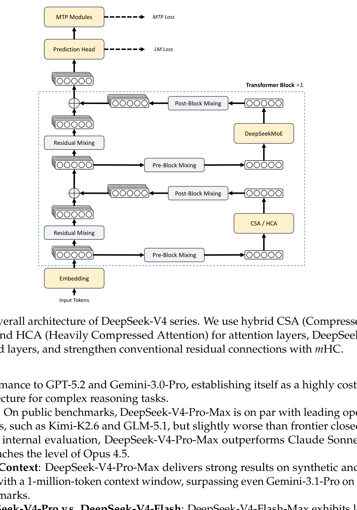
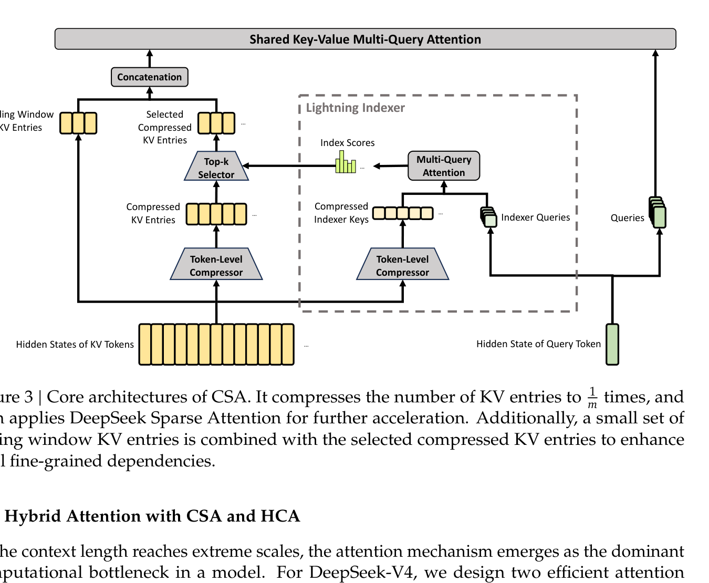
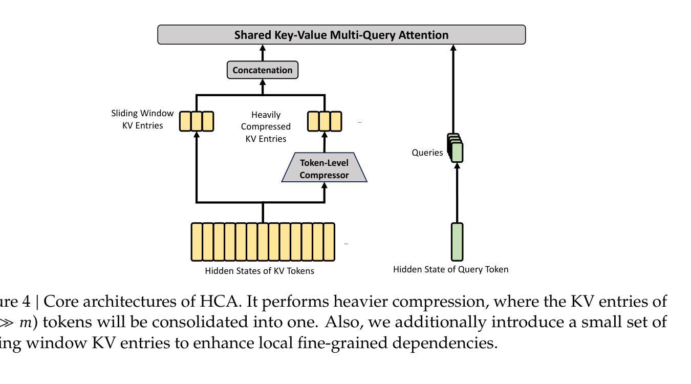
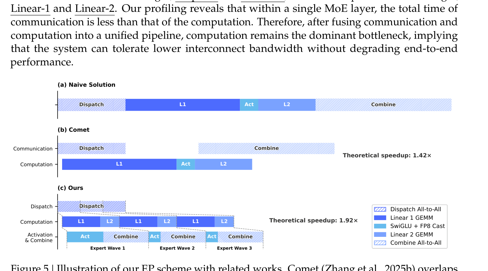
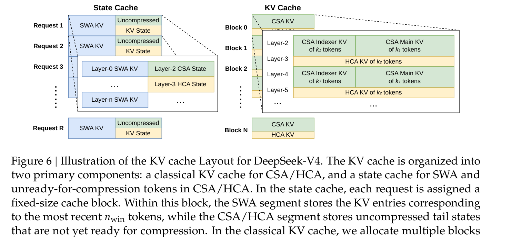
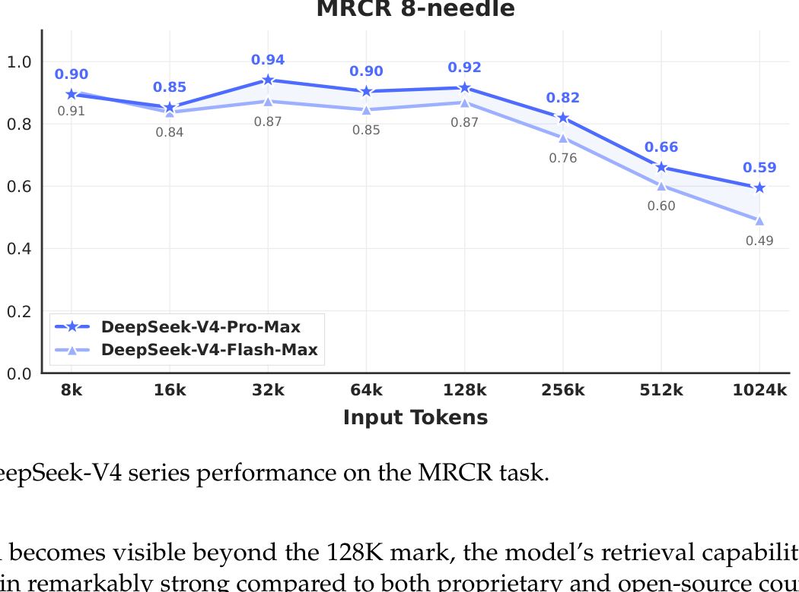

# Week 9 (Paper 2) — Paper Notes
**Paper:** DeepSeek-V4: Towards Highly Efficient Million-Token Context Intelligence, DeepSeek-AI 2026

---

## Table of Contents

1. [Overview](#overview)
2. [Things That Came Up During Reading](#things-that-came-up-during-reading)
3. [Key Points](#key-points)
4. [Architecture](#architecture)
   - [What's Inherited from V3](#whats-inherited-from-v3)
   - [Manifold-Constrained Hyper-Connections (mHC)](#manifold-constrained-hyper-connections-mhc)
   - [Hybrid Attention: CSA and HCA](#hybrid-attention-csa-and-hca)
   - [Muon Optimizer](#muon-optimizer)
5. [Infrastructure](#infrastructure)
6. [Pre-training](#pre-training)
   - [Model Configurations](#model-configurations)
   - [Training Schedule and Stability](#training-schedule-and-stability)
   - [Base Model Results](#base-model-results)
7. [Post-training](#post-training)
   - [Specialist Training](#specialist-training)
   - [Reasoning Modes](#reasoning-modes)
   - [On-Policy Distillation (OPD)](#on-policy-distillation-opd)
   - [FP4 Quantization-Aware Training](#fp4-quantization-aware-training)
8. [Evaluation Results](#evaluation-results)
9. [Connections to Previous Weeks](#connections-to-previous-weeks)
10. [Glossary](#glossary)

---

## Overview
*Paper reference: Abstract & Section 1 (pp. 1, 4–6)*

DeepSeek-V4 is a preview of DeepSeek's next-generation MoE language model series, released in two sizes: **V4-Pro** (1.6T total parameters, 49B activated) and **V4-Flash** (284B total, 13B activated). The headline contribution is **native, efficient support for one-million-token contexts**. The series is built around three architectural upgrades over DeepSeek-V3: (1) a hybrid attention design combining **Compressed Sparse Attention (CSA)** and **Heavily Compressed Attention (HCA)** that compresses the KV cache along the sequence dimension; (2) **Manifold-Constrained Hyper-Connections (mHC)** that strengthen residual connections while preventing the numerical instability seen with naive Hyper-Connections; and (3) the **Muon optimizer** for the majority of weights, which improves convergence speed and training stability.

The efficiency story is the most concrete contribution: at 1M-token context, DeepSeek-V4-Pro uses only **27% of the single-token inference FLOPs and 10% of the KV cache** compared to DeepSeek-V3.2 — despite V4-Pro having a larger activated-parameter count. V4-Flash pushes this to **10% FLOPs and 7% KV cache**, with a KV cache size of approximately **2% of a BF16 GQA-8 baseline** at 1M context. DeepSeek-V4-Pro is pre-trained on 33T tokens (V4-Flash on 32T), then post-trained through a two-stage pipeline: domain-specialist training (SFT + GRPO) followed by **multi-teacher On-Policy Distillation (OPD)**, which fully replaces the mixed-RL stage used in V3.2.

The series sets a new state of the art among open models on knowledge (SimpleQA-Verified 57.9, narrowly beating GLM-5.1 and Kimi K2.6), reasoning (HMMT 2026 Feb 95.2), code agent tasks, and 1M-token retrieval (MRCR 1M score 83.5). It still trails the leading proprietary frontier models (Opus 4.6, Gemini 3.1 Pro, GPT-5.4) on knowledge and some reasoning benchmarks, by what the authors estimate is a 3–6 month gap.

---

## Things That Came Up During Reading

> *(Add specific observations, confusions, and aha moments here as you read.)*

- The hybrid CSA / HCA design is, in some sense, an extension of the *MLA* idea (compress KV along the head dimension) into the *sequence* dimension. Two compression rates ($m = 4$ and $m' = 128$) interleaved through the model.
- **mHC** is shared with W9 Paper 1 (Engram). Both papers treat the multi-branch residual stream as a structural primitive — different from a one-off architectural detail.
- **Anticipatory Routing**: at step $t$, use *current* network params for feature compute but *historical* ($t - \Delta t$) routing indices. Decoupling routing updates is a stability hack — what does this say about the sensitivity of MoE training?
- The shift from RL → On-Policy Distillation is interesting. V3.2 had a mixed RL stage; V4 cuts that entirely. The argument: distill many specialists into one student instead of running joint multi-domain RL.
- The **Codeforces evaluation** is wonderfully concrete: V4-Pro-Max is given a contest's problems, has its 32 sampled solutions ranked, and then placed in a real-world rating distribution. They land at **rating 3206**, compared to GPT-5.4-xHigh's 3168 and Gemini-3.1-Pro's 3052.
- The infrastructure section (TileLang, MegaMoE, batch-invariance, deterministic kernels) is unusually deep for a model paper — suggests these are the actual cost-drivers in production training.

---

## Key Points
*Paper reference: Sections 1–2, 4–5 (pp. 4–14, 24–28)*

- DeepSeek-V4 series — **V4-Pro (1.6T total, 49B activated)** and **V4-Flash (284B, 13B activated)** — natively support **1M-token context**.
- The KV cache shrinks to **~10%** (V4-Pro) and **~7%** (V4-Flash) of V3.2's at 1M context; vs. a BF16 GQA-8 baseline, **~2%**.
- **mHC** (Manifold-Constrained Hyper-Connections) constrains the residual mapping matrix $B_\ell$ to the **Birkhoff polytope** of doubly stochastic matrices via Sinkhorn-Knopp iterations. This bounds spectral norm by 1, preventing the numerical blow-ups that plagued naive HC stacking.
- **CSA** compresses every $m$ KV entries into one (here $m = 4$), then applies DeepSeek Sparse Attention with a **lightning indexer** that picks top-$k$ compressed blocks (FP4 attention scoring) for the dense attention.
- **HCA** uses a much heavier compression rate $m' = 128$ but applies *dense* attention over the resulting compressed sequence, complementing CSA.
- **Muon optimizer**: a Newton-Schulz orthogonalizing optimizer used for the majority of parameters; AdamW only for embedding, prediction head, RMSNorm weights, and mHC's static biases/gating. Hybrid Newton-Schulz: 8 fast steps with $(a,b,c) = (3.4445, -4.7750, 2.0315)$, then 2 stabilizing steps with $(2, -1.5, 0.5)$.
- Two stability fixes: **Anticipatory Routing** (decouple backbone updates from routing-index updates) and **SwiGLU clamping** (clamp linear component to $[-10, 10]$, gate upper bound at 10) — applied without compromising performance.
- Pre-training corpus is **>32T tokens**, vocab 128K, with sample-level attention masking (different from V3's pretraining masking strategy).
- Post-training pipeline: independent **domain specialists** (math, code, agent, instruction-following) via SFT + GRPO → **multi-teacher On-Policy Distillation** (full-vocabulary KL, ~10 teachers) into a single unified model.
- Three reasoning modes — **Non-think**, **Think High**, **Think Max** — surfaced via `<think>...</think>` tags. "Think Max" injects a hard system prompt demanding exhaustive deliberation.
- **FP4 Quantization-Aware Training** during post-training for MoE expert weights and the CSA QK path (lossless dequantization to FP8 because FP8-E4M3 has 2 more exponent bits than FP4-E2M1).
- A heterogeneous KV cache layout combining a **state cache** for SWA and uncompressed tail tokens with a **block cache** for CSA/HCA compressed entries; on-disk cache reuse for shared-prefix requests.
- New evaluation breakthrough: **Putnam-2025 reaches 120/120** under the hybrid formal-informal pipeline; under the lightweight Putnam-200 Pass@8 setting, V4-Flash-Max scores **81.0** vs. Seed-2.0-Pro's 35.5.
- Internal R&D coding evaluation: V4-Pro-Max **outperforms Claude Sonnet 4.5 (47%) and approaches Opus 4.5 (70%)** with a 67% pass rate.

---

## Architecture
*Paper reference: Section 2 (pp. 6–14)*

### What's Inherited from V3

DeepSeek-V4 keeps the V3 backbone scaffolding:

| Component | Inherited Design | V4 Tweak |
|-----------|------------------|----------|
| **MoE feed-forward** | DeepSeekMoE (fine-grained routed experts + shared experts, auxiliary-loss-free balancing) | Sigmoid → Sqrt(Softplus) for affinity scoring; routing-target-node constraint *removed* |
| **Multi-Token Prediction (MTP)** | MTP modules + objective (depth = 1) | Unchanged |
| **First few MoE layers** | Standard routing | **Hash routing** for the first 3 MoE layers (predefined hash → expert) |

The Hash-routing-for-early-layers move is interesting: it forces a deterministic routing pattern at the bottom of the stack, removing learned-router instability where the model's representations are still primitive.



*Figure 2: A V4 Transformer block uses CSA/HCA in the attention layer, DeepSeekMoE in the FFN layer, and mHC for residual mixing (pre-block, residual, and post-block mixing operations).*

### Manifold-Constrained Hyper-Connections (mHC)

Standard residual connections add layer outputs to a single hidden vector. **Hyper-Connections (HC)** generalize this by expanding the residual stream into $n_\mathrm{hc}$ parallel slots, then mixing across them with three linear maps per layer:

$$X_{\ell+1} = B_\ell X_\ell + C_\ell \mathcal{F}_\ell(A_\ell X_\ell)$$

Where:
- $X_\ell \in \mathbb{R}^{n_\mathrm{hc} \times d}$ = the expanded residual state (rather than $\mathbb{R}^d$)
- $A_\ell \in \mathbb{R}^{1 \times n_\mathrm{hc}}$ = input mixing (which slots feed the layer)
- $B_\ell \in \mathbb{R}^{n_\mathrm{hc} \times n_\mathrm{hc}}$ = residual mixing
- $C_\ell \in \mathbb{R}^{n_\mathrm{hc} \times 1}$ = output mixing
- $\mathcal{F}_\ell$ = the layer (attention or MoE)
- $d$ = hidden size

The trouble with naive HC is that stacking many of these is numerically unstable — gradients explode in deep stacks. **mHC** fixes this by **constraining $B_\ell$ to the Birkhoff polytope** of doubly stochastic matrices:

$$B_\ell \in \mathcal{M} := \{M \in \mathbb{R}^{n \times n} \mid M\mathbf{1}_n = \mathbf{1}_n,\; \mathbf{1}_n^\top M = \mathbf{1}_n^\top,\; M \geq 0\}$$

Where:
- $\mathcal{M}$ = the manifold of doubly stochastic matrices (rows and columns each sum to 1)
- The constraint ensures $\Vert B_\ell \Vert_2 \leq 1$, so the residual mapping is non-expansive across the stack

To project an unconstrained raw matrix $\tilde{B}_\ell$ onto $\mathcal{M}$, the **Sinkhorn-Knopp** algorithm is used: first exponentiate ($M^{(0)} = \exp(\tilde{B}_\ell)$) to enforce non-negativity, then iterate column / row normalization $t_\mathrm{max} = 20$ times.

Additionally, $A_\ell$ and $C_\ell$ are passed through a **sigmoid** to ensure non-negativity and bounded magnitude:

$$A_\ell = \sigma(\tilde{A}_\ell), \quad C_\ell = 2\sigma(\tilde{C}_\ell)$$

This combination — manifold constraint on $B$, sigmoid bounds on $A$ and $C$ — is what makes HC stable enough to scale to 1.6T parameters.

### Hybrid Attention: CSA and HCA

The attention bottleneck at long context is the dominant problem the paper attacks. Rather than betting on one approach, V4 *interleaves* two complementary attention designs.

#### Compressed Sparse Attention (CSA)

CSA does **two-stage compression**: first compress the KV cache by a factor $m$, then apply sparse top-$k$ attention over the compressed entries.



*Figure 3: Token-level compressors fold every $m = 4$ KV entries into a single compressed entry. A lightning indexer (multi-query attention with FP4 scoring) selects top-$k$ compressed blocks per query. Sliding-window KV entries supplement the local context.*

**Stage 1: Compress KV by factor $m$.** From hidden states $H \in \mathbb{R}^{n \times d}$, two streams of KV entries and weights are computed:

$$C^a = H \cdot W^{aKV}, \quad C^b = H \cdot W^{bKV}$$

$$Z^a = H \cdot W^{aZ}, \quad Z^b = H \cdot W^{bZ}$$

Then for each compressed block $i$, a softmax-weighted sum over $2m$ surrounding entries (with overlap) produces the compressed entry $C_i^\mathrm{Comp} \in \mathbb{R}^c$ at $\frac{n}{m}$ length:

$$[S^a_{mi:m(i+1)-1}; S^b_{m(i-1):mi-1}] = \mathrm{Softmax}_\mathrm{row}([Z^a_{mi:m(i+1)-1} + B^a;\; Z^b_{m(i-1):mi-1} + B^b])$$

$$C_i^\mathrm{Comp} = \sum_{j=mi}^{m(i+1)-1} S_j^a \odot C_j^a + \sum_{j=m(i-1)}^{mi-1} S_j^b \odot C_j^b$$

Where $B^a, B^b \in \mathbb{R}^{m \times c}$ are learnable positional biases. Each compressed entry pools $2m$ raw tokens (with overlap), so although the KV cache shrinks to $\frac{1}{m}$, neighboring compressed entries share a window.

**Stage 2: Lightning indexer + top-$k$ selection.** A small auxiliary attention scores each query against each compressed block to pick the top-$k$ blocks. Compressed indexer keys are computed via the same compression scheme on $K^\mathrm{IComp}$. Indexer queries are produced from a low-rank latent $\mathbf{c}_t^Q$:

$$\mathbf{c}_t^Q = \mathbf{h}_t \cdot W^{DQ}$$

$$[\mathbf{q}^I_{t,1}; \ldots; \mathbf{q}^I_{t,n_h^I}] = \mathbf{q}_t^Q \cdot W^{IUQ}$$

The index score uses a per-head ReLU (rather than softmax) for sparsity:

$$I_{t,s} = \sum_{h=1}^{n_h^I} w^I_{t,h} \cdot \mathrm{ReLU}\big(\mathbf{q}^I_{t,h} \cdot K_s^\mathrm{IComp}\big)$$

The top-$k$ compressed entries by $I_{t,s}$ are kept:

$$C_t^\mathrm{SprsComp} = \{C_s^\mathrm{Comp} \mid I_{t,s} \in \mathrm{Top}\text{-}k(I_{t,:})\}$$

The final core attention is a **shared-KV MQA** over $C_t^\mathrm{SprsComp}$ plus the sliding-window uncompressed KV — and importantly, the latent query vector $\mathbf{c}_t^Q$ is shared between the indexer and the main attention, saving a matmul.

#### Heavily Compressed Attention (HCA)

HCA uses much more aggressive compression ($m' = 128$) but applies *dense* attention over the resulting short sequence:



*Figure 4: Each block of $m' = 128$ KV entries is compressed into a single entry; sliding-window uncompressed entries supply local detail. No top-$k$ selection — all compressed entries participate in attention.*

The compression formula is the same shape as CSA's first stage (without the overlap):

$$C^\mathrm{Comp}_i = \sum_{j=m'i}^{m'(i+1)-1} S_j \odot C_j, \quad S = \mathrm{Softmax}_\mathrm{row}(Z + B)$$

#### Why the Combination Works

CSA and HCA are interleaved across layers. Intuitively:

| Layer Type | Compression Strength | Attention Pattern | Captures |
|------------|----------------------|--------------------|----------|
| **CSA** | Medium ($m=4$, top-$k$ sparse) | Sparse over $\frac{n}{m}$ entries | Fine-grained, content-selective long-range |
| **HCA** | Heavy ($m'=128$, dense) | Dense over $\frac{n}{m'}$ entries | Coarse, global summarization |

Both designs employ **shared-KV MQA** (every selected compressed entry serves as both attention key and value) and **grouped output projection** (project $g$ groups of head outputs separately to keep output projection compute manageable when $n_h$ is large).

#### Other Details

- **Partial RoPE** (last 64 dimensions only) is applied on Q, K, and the core attention output — applying RoPE with position $-i$ on each output entry maintains relative-position semantics through the weighted sum.
- **Sliding-window branch** ($n_\mathrm{win} = 128$ uncompressed KV entries per query) supplements local detail and preserves causality across compression boundaries.
- **Attention sink**: per-head learnable sink logits $z'_h$ add an extra term to the softmax denominator, letting heads route attention "to nowhere" when needed:

$$s_{h,i,j} = \frac{\exp(z_{h,i,j})}{\sum_k \exp(z_{h,i,k}) + \exp(z'_h)}$$

Where:
- $s_{h,i,j}$ = attention score from query $i$ to key $j$ in head $h$
- $z'_h$ = the per-head learnable sink logit; allows total attention to sum to less than 1

#### Efficiency Snapshot

Taking BF16 GQA-8 with head dim 128 as the baseline, V4 series can compress the KV cache to roughly **2%** of that baseline at 1M context. Even compared to V3.2 (already an efficient design), V4 cuts inference FLOPs and KV cache substantially — see Fig. 1 (right) in the original paper.

### Muon Optimizer

The majority of parameters use **Muon** (Jordan et al. 2024 + Liu et al. 2025 scaling). The full algorithm:

```
For each step t:
  For each weight W ∈ R^{n×m}:
    G_t = ∇_W L(W_{t-1})           # gradient
    M_t = μ M_{t-1} + G_t            # momentum
    O'_t = HybridNewtonSchulz(μ M_t + G_t)   # Nesterov + orthogonalize
    O_t = O'_t · √max(n, m) · γ      # rescale RMS for AdamW LR re-utilization
    W_t = W_{t-1} (1 - ηλ) − η O_t   # decoupled decay + update
```

Where Hybrid Newton-Schulz iterates $M_k = a M_{k-1} + b(M_{k-1} M_{k-1}^\top) M_{k-1} + c(M_{k-1}M_{k-1}^\top)^2 M_{k-1}$ for 10 steps in two stages: 8 fast-convergence steps with $(a,b,c) = (3.4445, -4.7750, 2.0315)$, then 2 stabilizing steps with $(2, -1.5, 0.5)$. The overall update orthogonalizes the gradient (approximately mapping it from $U \Sigma V^\top$ to $UV^\top$) before applying it.

**Why this matters:** orthogonalized updates are more numerically benign and produce a more uniform step size across singular directions, which empirically gives faster convergence and better stability than plain AdamW for hidden-layer weights.

**What Muon is *not* used for:** the embedding module, prediction head, RMSNorm weights, and mHC's static biases / gating factors stay on AdamW. RMSNorm + direct application on Q and KV entries replaces the QK-Clip technique used in earlier Muon recipes.

---

## Infrastructure
*Paper reference: Section 3 (pp. 15–23)*

The infra section is unusually long — these are the production hot paths.

### Fine-Grained Communication-Computation Overlap

Standard Expert Parallel (EP) suffers from communication latency dominating compute. V4's scheme **splits experts into "waves"** and pipelines them, so that as soon as a wave's communication finishes, its computation starts immediately while the next wave's communication begins.



*Figure 5: Theoretical speedups vs. naive (1.0×) and Comet (1.42×) baselines. The wave-based fine-grained EP achieves ~1.92× theoretical speedup; measured 1.5–1.73× on standard inference, up to 1.96× on RL rollouts.*

The CUDA implementation is open-sourced as **MegaMoE** (part of DeepGEMM).

### Other Infra Highlights

- **TileLang**: a domain-specific language used to fuse hundreds of fine-grained Torch operators into a small set of fused kernels, with Z3 SMT solver support for integer-arithmetic verification during compilation.
- **Batch-invariant kernels**: bitwise-identical token outputs regardless of batch position. Required avoiding split-KV attention (replaced with a dual-kernel batch-invariant design) and split-K matmul (replaced via DeepGEMM).
- **Deterministic kernels**: separate accumulation buffers per SM + global deterministic summation for attention backward pass; pre-processed token ordering for MoE backward; deterministic split-K for mHC's small output dimension (24).
- **Hybrid ZeRO for Muon**: dense parameters use a knapsack-balanced ZeRO bucket allocation; MoE parameters skip ZeRO partitioning limits; Newton-Schulz iterations stay stable in BF16 for MoE gradient communication.
- **Two-stage contextual parallelism** for compressed attention training: first stage exchanges last $m$ uncompressed entries between adjacent ranks, second stage all-gathers compressed KV across all CP ranks.
- **Tensor-level activation checkpointing** with automatic differentiation support — finer granularity than module-level checkpointing.
- **KV cache layout**: separate state cache (SWA + uncompressed tail) vs. block cache (compressed CSA/HCA entries). Compressed blocks are sized as multiples of $\mathrm{lcm}(m, m')$ tokens to satisfy alignment requirements.



*Figure 6: Two-tier cache. The state cache holds per-request SWA windows and uncompressed tail tokens. The KV cache holds blocks of $\mathrm{lcm}(m, m')$ original tokens, each producing $k_1 = \mathrm{lcm}(m,m')/m$ CSA tokens and $k_2 = \mathrm{lcm}(m,m')/m'$ HCA tokens.*

- **On-disk KV cache reuse** for shared-prefix requests: full SWA caching, periodic checkpointing, or zero SWA caching (recompute via cached CSA/HCA + last $n_\mathrm{win} \cdot L$ tokens) — chosen per deployment.

---

## Pre-training
*Paper reference: Section 4 (pp. 24–28)*

### Model Configurations

| Hyperparameter | V4-Flash | V4-Pro |
|----------------|----------|--------|
| Total parameters | 284B | 1.6T |
| Activated parameters | 13B | 49B |
| Transformer layers | 43 | 61 |
| Hidden dim $d$ | 4,096 | 7,168 |
| First-2 layer attention | Pure SWA (p. 24) | HCA (p. 25) |
| Subsequent layer attention | Interleaved CSA / HCA | Interleaved CSA / HCA |
| CSA compression rate $m$ | 4 | 4 |
| CSA top-$k$ | 512 | 1,024 |
| CSA indexer query heads | 64 | 64 |
| CSA indexer head dim | 128 | 128 |
| HCA compression rate $m'$ | 128 | 128 |
| HCA query heads $n_h$ | 64 | 128 |
| HCA core dim $c$ | 512 | 512 |
| Output projection groups $g$ | 8 | 16 |
| Sliding window $n_\mathrm{win}$ | 128 | 128 |
| MoE shared / routed experts | 1 / 256 | 1 / 384 |
| Top-$k$ activated experts | 6 | 6 |
| Expert hidden dim | 2,048 | 3,072 |
| First-3 MoE layer routing | Hash | Hash |
| MTP depth | 1 | 1 |
| mHC expansion factor $n_\mathrm{hc}$ | 4 | 4 |
| Sinkhorn-Knopp iterations $t_\mathrm{max}$ | 20 | 20 |

### Training Schedule and Stability

| Hyperparameter | Value |
|----------------|-------|
| Pre-training tokens (V4-Flash) | 32T |
| Pre-training tokens (V4-Pro) | 33T |
| Vocab size | 128K |
| Optimizer (most params) | Muon |
| Optimizer (embedding / head / RMSNorm / mHC bias) | AdamW |
| AdamW $\beta_1, \beta_2, \epsilon$ | 0.9, 0.95, $10^{-20}$ |
| AdamW weight decay | 0.1 |
| Muon momentum, weight decay | 0.95, 0.1 |
| Muon RMS rescale ($\gamma$) | 0.18 |
| LR warmup steps | 2,000 |
| V4-Flash max LR | $2.7 \times 10^{-4}$ |
| V4-Flash final LR | $2.7 \times 10^{-5}$ |
| V4-Pro max LR | $2.0 \times 10^{-4}$ |
| V4-Pro final LR | $2.0 \times 10^{-5}$ |
| V4-Flash max batch (tokens) | 75.5M |
| V4-Pro max batch (tokens) | 94.4M |
| Sequence length curriculum | 4K → 16K → 64K → 1M |
| Sparse attention warmup | first 1T tokens dense, then sparse from 64K seq length |
| MTP loss weight | 0.3 (decay to 0.1 near end) |
| Auxiliary balance loss weight | 0.0001 |
| Bias update speed (load-free balancing) | 0.001 |

#### Two Stability Tricks

**1. Anticipatory Routing.** At training step $t$, the backbone uses current parameters $\theta_t$ for feature computation but uses *historical* parameters $\theta_{t - \Delta t}$ to compute the routing indices. The routing indices for step $t$ are pre-computed at step $t - \Delta t$ (one extra forward pass on the previous parameters). The intuition: routing changes are a strong source of MoE training instability, and decoupling routing-index updates from feature updates breaks the feedback loop where a bad routing decision at step $t-1$ propagates to a worse decision at step $t$.

A spike-detection mechanism activates Anticipatory Routing only when a loss spike occurs; afterward, training reverts to standard routing. The wall-clock overhead is bounded to ~20% during active periods.

**2. SwiGLU Clamping.** During training, the linear component of SwiGLU is clamped to $[-10, 10]$, and the gate's upper bound is capped at 10. This eliminates the outlier activations that the authors empirically identified as a root cause of MoE loss spikes — without compromising performance.

### Base Model Results

#### Benchmark Descriptions (selected new benchmarks)

| Benchmark | What It Tests | Format | Metric |
|-----------|---------------|--------|--------|
| **MMLU-Pro** | Hardened MMLU with 10 options and reasoning emphasis | 5-shot MC | EM — higher is better |
| **MMMLU** | Multilingual MMLU across 14 languages | 5-shot MC | EM — higher is better |
| **MultiLoKo** | Multi-locale knowledge | 5-shot MC | EM — higher is better |
| **Simple-QA Verified** | Open factual single-answer QA, human-verified | 25-shot pass@1 | EM — higher is better |
| **SuperGPQA** | Hard graduate-level science | 5-shot MC | EM — higher is better |
| **FACTS Parametric** | Whether the model can recall a known fact from parameters alone | 25-shot EM | EM — higher is better |
| **CLUEWSC** | Chinese Winograd-style coreference | 0-shot MC | EM — higher is better |
| **LongBench v2** | Long-context multi-task suite | 1-shot | EM — higher is better |

#### Selected Base Model Results (Table 1)

| Category | Benchmark | DeepSeek-V3.2 Base | DeepSeek-V4-Flash Base | DeepSeek-V4-Pro Base |
|----------|-----------|---------------------|-------------------------|----------------------|
| Architecture / Activated Params | — | MoE / 37B / 671B | MoE / 13B / 284B | MoE / 49B / 1.6T |
| World Knowl. | MMLU | 87.8 | 88.7 | **90.1** |
| World Knowl. | MMLU-Pro | 65.5 | 68.3 | **73.5** |
| World Knowl. | MMMLU | 87.9 | 88.8 | **90.3** |
| World Knowl. | C-Eval | 90.4 | 92.1 | **93.1** |
| World Knowl. | Simple-QA Verified | 28.3 | 30.1 | **55.2** |
| World Knowl. | SuperGPQA | 45.0 | 46.5 | **53.9** |
| World Knowl. | FACTS Parametric | 27.1 | 33.9 | **62.6** |
| Lang. & Reas. | BBH | 87.6 | 86.9 | 87.5 |
| Lang. & Reas. | DROP (F1) | 88.2 | 88.6 | **88.7** |
| Lang. & Reas. | HellaSwag | 86.4 | 85.7 | **88.0** |
| Code & Math | HumanEval | 62.8 | 69.5 | **76.8** |
| Code & Math | GSM8K | 91.1 | 90.8 | **92.6** |
| Code & Math | MATH | 60.5 | 57.4 | **64.5** |
| Long Context | LongBench v2 | 40.2 | 44.7 | **51.5** |

V4-Flash beats V3.2 on most benchmarks **despite having a third the total parameters and a third the activated parameters**. V4-Pro then opens a further large gap, particularly on knowledge benchmarks (FACTS Parametric: 62.6 vs. 27.1 — a $2.3\times$ jump).

---

## Post-training
*Paper reference: Section 5 (pp. 28–35)*

### Specialist Training

The post-training pipeline departs from V3.2 by **replacing the mixed-RL stage with multi-teacher On-Policy Distillation**. The shape of the pipeline is:

1. **Specialist phase** — for each domain (math, code, agent, instruction-following), train a *separate* specialist model:
   - SFT on high-quality domain data
   - GRPO RL with domain-specific reward models
2. **Unification phase** — distill all specialists into a single student via On-Policy Distillation.

### Reasoning Modes

Three reasoning effort levels are supported through `<think>...</think>` markers and budget control:

| Mode | Characteristic | Use Case | Format |
|------|----------------|----------|--------|
| **Non-think** | Fast, intuitive, habit-based | Routine queries | `</think>` summary |
| **Think High** | Conscious logical analysis | Complex problem-solving | `<think>` tokens `</think>` summary |
| **Think Max** | Pushed-to-the-limit reasoning | Boundary-of-capability tests | Special "Max" system prompt + `<think>` tokens `</think>` summary |

The **Think Max** system prompt is explicit: *"Reasoning Effort: Absolute maximum with no shortcuts permitted. You MUST be very thorough... rigorously stress-test your logic against all potential paths, edge cases, and adversarial scenarios."*

A **Generative Reward Model (GRM)** replaces a traditional scalar reward model for hard-to-verify tasks. The actor model itself functions as the GRM, jointly optimizing generation and judging. Tool calls use a new `<|DSML|>` XML-based schema instead of JSON, which the authors claim reduces escaping errors.

**Interleaved Thinking.** In agentic / tool-calling scenarios, V4 retains the *complete* reasoning history across user-message boundaries (V3.2 discarded thinking traces on each new user turn). For general conversational scenarios, the V3.2 strategy of clearing thinking on new user messages is kept.

### On-Policy Distillation (OPD)

The student $\pi_\theta$ is trained on its own samples $\{y\}$ with reverse-KL to a weighted sum of teacher distributions:

$$\mathcal{L}_\mathrm{OPD}(\theta) = \sum_{i=1}^{N} w_i \cdot D_\mathrm{KL}\big(\pi_\theta \;\Vert\; \pi_{E_i}\big)$$

Where:
- $\pi_\theta$ = the student policy being trained
- $\pi_{E_i}$ = the $i$-th expert / teacher (math, code, agent, instruction-following, etc.)
- $w_i$ = expert weight (set by relative importance for the task distribution)
- $N \geq 10$ teachers in practice
- $D_\mathrm{KL}$ = forward KL on full vocabulary distributions (not token-level estimates)

The authors emphasize that they use **full-vocabulary KL** rather than the token-level estimator $\mathrm{sg}[\log(\pi_{E_i}(y_t \mid x, y_{<t}) / \pi_\theta(y_t \mid x, y_{<t}))]$ that previous work has used. Reasons given:
- Full-vocabulary KL has lower gradient variance than the token-level estimate
- It distills the complete output distribution faithfully, not just the realized token

Since materializing teacher logits for $|V| > 100$K across 10+ teachers is prohibitively memory-heavy, the system caches **only the last-layer hidden states** of each teacher; the prediction head is invoked on-the-fly to reconstruct the logits during the loss computation. Training samples are ordered by teacher index so each prediction head is loaded once per minibatch.

**Why OPD over multi-domain RL?** Multi-domain RL trains specialists jointly, which causes credit-assignment conflicts (gradients from math RL may unlearn code capabilities). Separate specialists + OPD avoids this by using teacher signal directly: the student learns each domain's distribution from a teacher that was specifically optimized for it.

### FP4 Quantization-Aware Training

Two components are FP4-quantized (MXFP4) during post-training:

1. **MoE expert weights** — major source of GPU memory pressure
2. **CSA QK path** — accelerating attention scoring on long context

The FP4 → FP8 dequantization during compute is **lossless** because FP8-E4M3 has 2 more exponent bits than FP4-E2M1. As long as the ratio between max/min FP4 sub-block scales (1×32 tiles) within an FP8 block (128×128 tiles) doesn't exceed FP8's representable range, the fine-grained scale info is fully absorbed. This means the FP4 QAT pipeline reuses the existing FP8 training framework with **no algorithmic modifications** — Straight-Through Estimator handles the gradient.

Index scores $I_{t,s}$ are also quantized from FP32 to BF16, providing 2× speedup on the top-$k$ selector while preserving 99.7% of KV-entry recall.

---

## Evaluation Results
*Paper reference: Section 5.3 (pp. 36–40)*

### Headline Comparison (Table 6, condensed)

DeepSeek-V4-Pro-Max vs. closed/open frontier models. "Max", "xHigh", "High" denote reasoning effort.

| Benchmark (Metric) | Opus 4.6 (Max) | GPT-5.4 (xHigh) | Gemini-3.1-Pro (High) | Kimi K2.6 Thinking | GLM-5.1 Thinking | **DS-V4-Pro Max** |
|--------------------|----------------|------------------|------------------------|----------------------|--------------------|---------------------|
| MMLU-Pro | 89.1 | 87.5 | **91.0** | 87.1 | 86.0 | 87.5 |
| SimpleQA-Verified | 46.2 | 45.3 | **75.6** | 36.9 | 38.1 | 57.9 |
| Chinese-SimpleQA | 76.5 | 76.8 | **85.9** | 75.9 | 75.0 | 84.4 |
| GPQA Diamond | 91.3 | **93.0** | 94.3 | 90.5 | 86.2 | 90.1 |
| HLE (no tools) | **40.0** | 39.8 | 44.4 | 36.4 | 34.7 | 37.7 |
| LiveCodeBench | 88.8 | — | 91.7 | 89.6 | — | **93.5** |
| Codeforces (rating) | — | 3168 | 3052 | — | — | **3206** |
| HMMT 2026 Feb | 96.2 | **97.7** | 94.7 | 92.7 | 89.4 | 95.2 |
| IMOAnswerBench | 75.3 | **91.4** | 81.0 | 86.0 | 83.8 | 89.8 |
| Apex Pass@1 | 34.5 | 54.1 | **60.9** | 24.0 | 11.5 | 38.3 |
| MRCR 1M | **92.9** | — | 76.3 | — | — | 83.5 |
| CorpusQA 1M | **71.7** | — | 53.8 | — | — | 62.0 |
| Terminal Bench 2.0 | 65.4 | **75.1** | 68.5 | 66.7 | 63.5 | 67.9 |
| SWE Verified | 80.8 | — | 80.6 | 80.2 | — | 80.6 |
| BrowseComp | 83.7 | 82.7 | **85.9** | 83.2 | 79.3 | 83.4 |
| GDPval-AA (Elo) | 1619 | **1674** | 1314 | 1482 | 1535 | 1554 |

#### Reading the Table

- **Knowledge gap**: V4-Pro-Max trails Gemini-3.1-Pro by **17.7 points on SimpleQA-Verified** — knowledge is V4's weakest area relative to frontier proprietary models.
- **Code agent strength**: leads on LiveCodeBench (93.5) and Codeforces (rating 3206 — ranked 23rd among human candidates on the leaderboard).
- **Long context**: trails Opus 4.6 on MRCR 1M (83.5 vs. 92.9), but beats Gemini-3.1-Pro (76.3) decisively. Retrieval performance is stable up to 128K, with degradation visible past that.
- **Reasoning effort scales**: V4-Pro Non-Think gets 7.7 on HLE; with Max mode it climbs to **37.7**.

### Reasoning Effort Effects (Table 7, condensed)

| Benchmark | V4-Flash Non-Think | V4-Flash High | V4-Flash Max | V4-Pro Non-Think | V4-Pro High | V4-Pro Max |
|-----------|--------------------|----------------|---------------|--------------------|---------------|-------------|
| AIME-style HMMT 2026 Feb | 40.8 | 91.9 | 94.8 | 31.7 | 94.0 | 95.2 |
| LiveCodeBench | 55.2 | 88.4 | 91.6 | 56.8 | 89.8 | **93.5** |
| Codeforces (rating) | — | 2816 | 3052 | — | 2919 | **3206** |
| HLE | 8.1 | 29.4 | 34.8 | 7.7 | 34.5 | **37.7** |
| MRCR 1M | 37.5 | 76.9 | 78.7 | 44.4 | 83.3 | **83.5** |

Notably, V4-Flash-Max (94.8 on HMMT) sometimes matches V4-Pro-High (94.0) — extra reasoning effort partially substitutes for parameter scale on test-time-compute-friendly tasks.

### Putnam-2025 Result

Under the lightweight Putnam-200 Pass@8 setting, V4-Flash-Max scores **81.0/100**, vs. Seed-2.0-Pro 35.5 and Gemini-3-Pro 28.5. Under the frontier hybrid formal-informal regime (Putnam-2025), DeepSeek-V4 reaches **120/120**, vs. Aristotle 100/120, Seed-1.5-Prover 110/120, Axiom 120/120.

### Internal R&D Coding Evaluation

30 real internal engineering tasks (PyTorch, CUDA, Rust, C++) — feature dev, bug fixing, refactoring:

| Model | Pass Rate (%) |
|-------|---------------|
| Haiku 4.5 | 13 |
| Sonnet 4.5 | 47 |
| **DeepSeek-V4-Pro-Max** | **67** |
| Opus 4.5 | 70 |
| Opus 4.5 Thinking | 73 |
| Opus 4.6 Thinking | 80 |

A survey of 85 internal DeepSeek developers reports 91% (52% yes + 39% leaning yes) consider V4-Pro ready as their primary coding model.

### MRCR Long-Context Stability



*Figure 9: V4-Pro-Max maintains 0.85+ Average MMR through 128K, dropping to 0.59 at 1024K. V4-Flash-Max trails by ~0.10 across lengths, dropping to 0.49 at 1024K. Retrieval remains stable up to 128K but degrades past that — though the 1M result still exceeds many proprietary baselines.*

---

## Connections to Previous Weeks

> **Attention Is All You Need (W2):** V4's hybrid CSA/HCA is a deep reimagining of the W2 attention. The original $O(n^2)$ scaled-dot-product attention is now factorized into two compression dimensions: head dimension (via MLA-style latent compression) and sequence dimension (via CSA's $m$ and HCA's $m'$). The fundamental QKV mechanism is preserved, but the *what gets attended to* is heavily restructured.

> **Mistral 7B (W6):** Mistral's contribution was Sliding Window Attention — a fixed local window with implicit long-range via depth. V4 keeps a sliding-window branch in *both* CSA and HCA but supplements it with explicit long-range compression. The progression is: SWA (W6) → SWA + sparse top-k (NSA-style) → SWA + CSA + HCA (V4). Each step preserves the previous strengths while attacking a new dimension of the long-context bottleneck.

> **Mixtral / DeepSeekMoE (W6):** V4 inherits DeepSeekMoE (fine-grained routed + shared experts, auxiliary-loss-free balancing) directly. Two innovations on top: (1) Hash routing for the first 3 MoE layers, (2) Anticipatory Routing for stability. The expert *count* (256 for V4-Flash, 384 for V4-Pro) dwarfs Mixtral's 8 — a continued bet on DeepSeekMoE's "more, smaller experts" thesis.

> **Llama 3 (W6):** Llama 3 chose dense at all costs (405B activated = 405B total), explicitly arguing against MoE for engineering simplicity. V4 makes the opposite bet: 49B activated out of 1.6T total. The fact that V4-Pro matches and beats Llama 3 on knowledge benchmarks (MMLU, MMLU-Pro) at 1/8 the inference compute is a strong vote for the MoE direction — at least for those willing to invest in the EP infra V4 details.

> **DeepSeek-R1 (W8):** R1 demonstrated that pure RL on a strong base produces emergent CoT. V4's post-training extends R1's RL (now via GRPO) to *domain specialists* and replaces the unified-RL phase with OPD. The "Think Max" mode is a direct descendant of R1's chain-of-thought scaling — including the explicit `<think>...</think>` tags inherited from the R1/V3.2 lineage.

> **Engram (W9 Paper 1):** The two papers share two primitives — **mHC** (the multi-branch residual scaffolding) and the **Muon optimizer**. They target different sparsity axes: Engram attacks the *embedding lookup* axis (knowledge); V4 attacks the *attention sequence* axis (context). The papers are best understood as parallel investigations within DeepSeek's broader "decouple storage, compute, and attention" research program.

---

## Glossary

| Term | Definition |
|------|------------|
| **CSA (Compressed Sparse Attention)** | Two-stage attention: (1) compress every $m = 4$ KV entries into one via softmax-weighted pooling, (2) apply DSA-style top-$k$ selection over the compressed entries. |
| **HCA (Heavily Compressed Attention)** | Single-stage heavy compression ($m' = 128$) followed by *dense* attention over the (much shorter) compressed sequence. Complements CSA. |
| **DSA (DeepSeek Sparse Attention)** | The sparse-attention strategy where each query attends to only $k$ selected KV entries; introduced in DeepSeek-V3.2 and reused inside CSA's stage 2. |
| **mHC (Manifold-Constrained Hyper-Connections)** | Generalized residual connection where the residual matrix $B_\ell$ is projected onto the Birkhoff polytope (doubly stochastic matrices), bounding spectral norm and enabling stable deep-stack training. |
| **Hyper-Connections (HC)** | Predecessor to mHC: expand the residual stream to $n_\mathrm{hc}$ slots with three linear maps per layer, but unconstrained — numerically unstable when stacked deep. |
| **Birkhoff Polytope** | The convex polytope of doubly stochastic $n \times n$ matrices (rows and columns each sum to 1, entries non-negative). Closed under multiplication. |
| **Sinkhorn-Knopp** | Iterative algorithm for projecting a non-negative matrix onto the Birkhoff polytope by alternately normalizing rows and columns. Used in mHC with $t_\mathrm{max} = 20$. |
| **Lightning Indexer** | The auxiliary multi-query attention inside CSA that scores compressed KV blocks against the query to pick top-$k$. Uses ReLU per-head scoring + FP4 attention scoring at inference. |
| **Shared-KV MQA** | Multi-Query Attention variant where the same compressed KV entry serves as both attention key and value, halving the KV memory. |
| **Grouped Output Projection** | Splitting attention head outputs into $g$ groups, projecting each group to a smaller intermediate dim $d_g$ before concatenating. Reduces output projection compute when $n_h$ is large. |
| **Muon Optimizer** | Newton-Schulz-based orthogonalizing optimizer for hidden weights. Approximately maps gradient $U\Sigma V^\top$ to $UV^\top$ before applying. |
| **Hybrid Newton-Schulz** | The 10-iteration scheme used inside Muon: 8 fast steps with coefficients $(3.4445, -4.7750, 2.0315)$ then 2 stabilizing steps with $(2, -1.5, 0.5)$. |
| **Anticipatory Routing** | Stability fix: at step $t$, use current params for feature compute but params from step $t-\Delta t$ for routing-index compute. Activated on demand by spike detection. |
| **SwiGLU Clamping** | Stability fix: clamp the linear component of SwiGLU to $[-10, 10]$ and cap gate upper bound at 10. Eliminates outlier-driven loss spikes. |
| **MTP (Multi-Token Prediction)** | Auxiliary training objective predicting multiple future tokens; used at depth 1 in V4 (same as V3). MTP loss weight 0.3 → 0.1. |
| **GRPO (Group Relative Policy Optimization)** | RL algorithm used in DeepSeek's domain-specialist phase; samples $K$ rollouts and uses their relative advantages. Same algo used in DeepSeek-R1. |
| **GRM (Generative Reward Model)** | A reward model that *generates* its judgment rather than producing a scalar. V4 uses the actor itself as the GRM, jointly optimizing generation and judging. |
| **OPD (On-Policy Distillation)** | Post-training paradigm: train the student on its *own* generated trajectories with reverse-KL to a weighted mix of expert teacher distributions. Replaces V3.2's joint RL stage. |
| **Full-Vocabulary KL** | Computing the KL divergence over the entire vocabulary distribution, not just at realized tokens. Lower variance than the token-level estimator $\mathrm{sg}[\log(\pi_E / \pi_\theta)]$ but more memory-heavy. |
| **MXFP4 / FP4 (E2M1)** | A 4-bit floating-point format with 2 exponent bits and 1 mantissa bit; used here for MoE expert weights and CSA QK path during QAT. |
| **FP4 → FP8 Lossless Dequant** | Because FP8-E4M3 has 2 more exponent bits than FP4-E2M1, the FP4 sub-block scales fit fully within FP8's dynamic range — so dequantizing FP4 weights to FP8 for compute incurs no precision loss. |
| **STE (Straight-Through Estimator)** | Gradient through a non-differentiable op (e.g., quantization) by treating it as identity in the backward pass. |
| **TileLang** | DSL for fused kernel development used throughout V4's training/inference stack; integrates with Z3 SMT solver for compile-time integer-arithmetic verification. |
| **MegaMoE** | V4's open-sourced CUDA mega-kernel for fine-grained EP communication-computation overlap. Part of DeepGEMM. |
| **Batch-Invariance** | Property that a token's output is bitwise-identical regardless of where it sits in the batch. V4 implements this end-to-end, abandoning split-KV attention and split-K matmul. |
| **DSec (DeepSeek Elastic Compute)** | V4's production agent-AI sandbox infrastructure, with four execution substrates (Function Call, Container, microVM, fullVM) sharing a unified Python SDK. |
| **Interleaved Thinking** | V4 keeps `<think>` traces across user messages in tool-calling settings, allowing cumulative reasoning over long-horizon agent tasks. (V3.2 discarded thinking on each user turn.) |
| **MRCR / CorpusQA** | OpenAI's MRCR (1M Multi-Round Coreference Resolution) and CorpusQA (1M corpus QA) — the canonical 1M-context evaluation benchmarks. |
| **Putnam-2025 / Putnam-200** | Mathematical Olympiad-derived benchmarks. Putnam-200 Pass@8 is a fixed random subset under Seed-Prover protocol; Putnam-2025 hybrid formal-informal is the frontier mode. |
| **GDPval-AA** | Real-world economically-valuable task benchmark from Artificial Analysis; reports an Elo score across model outputs. |
