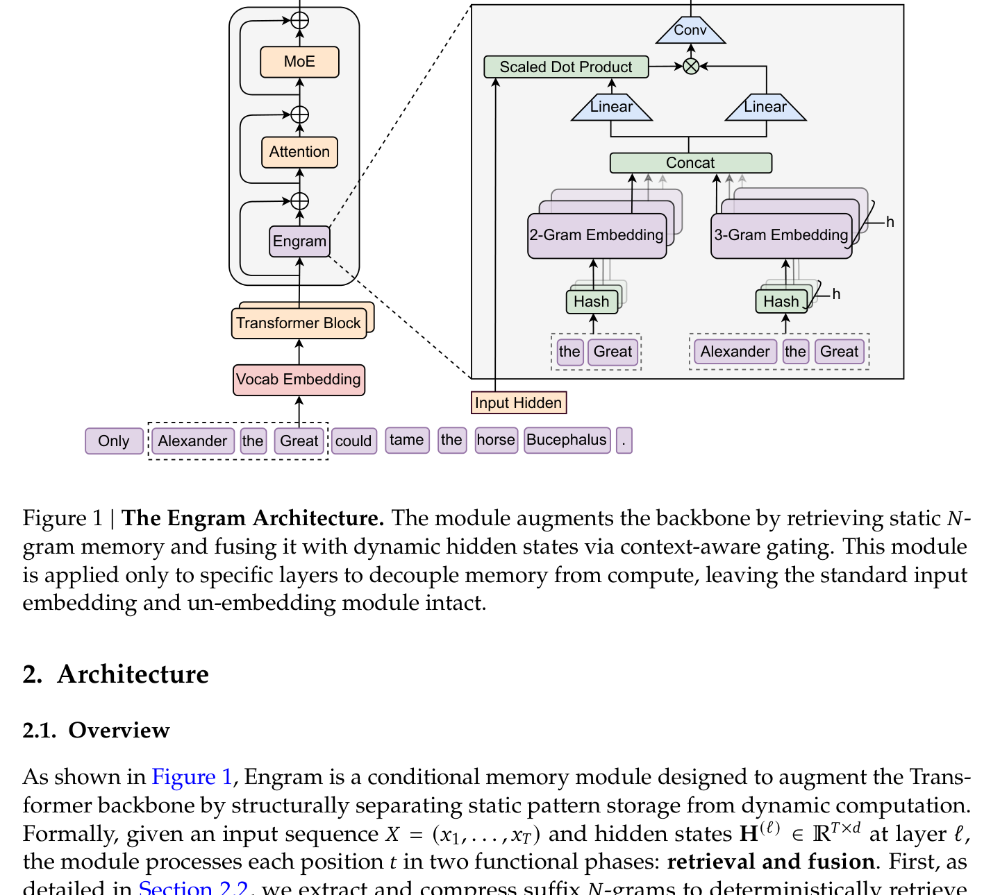
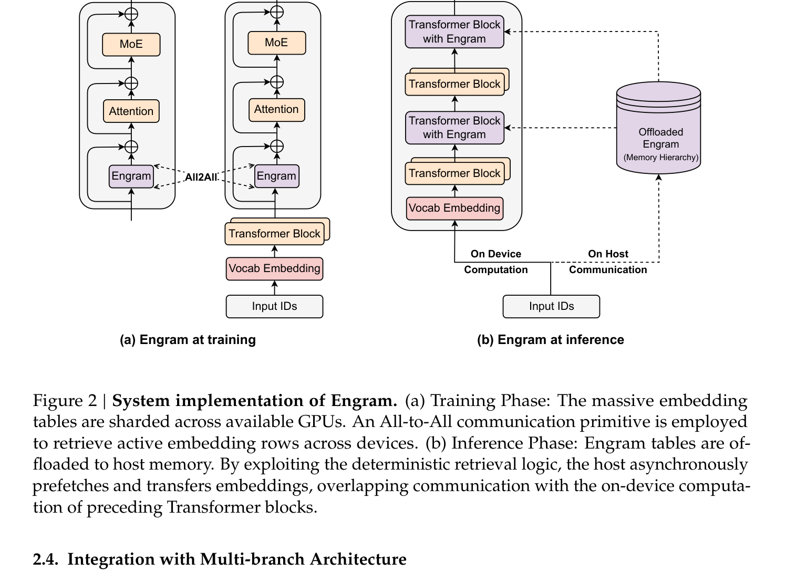
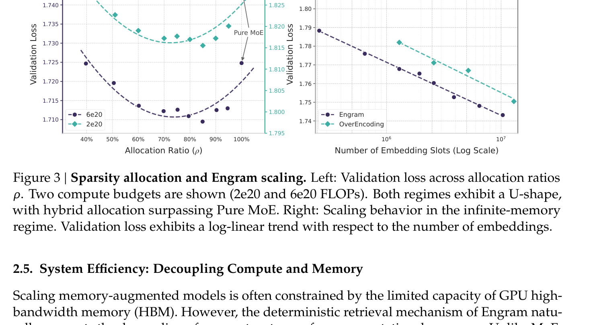
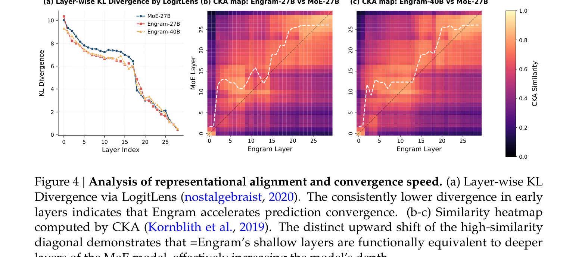
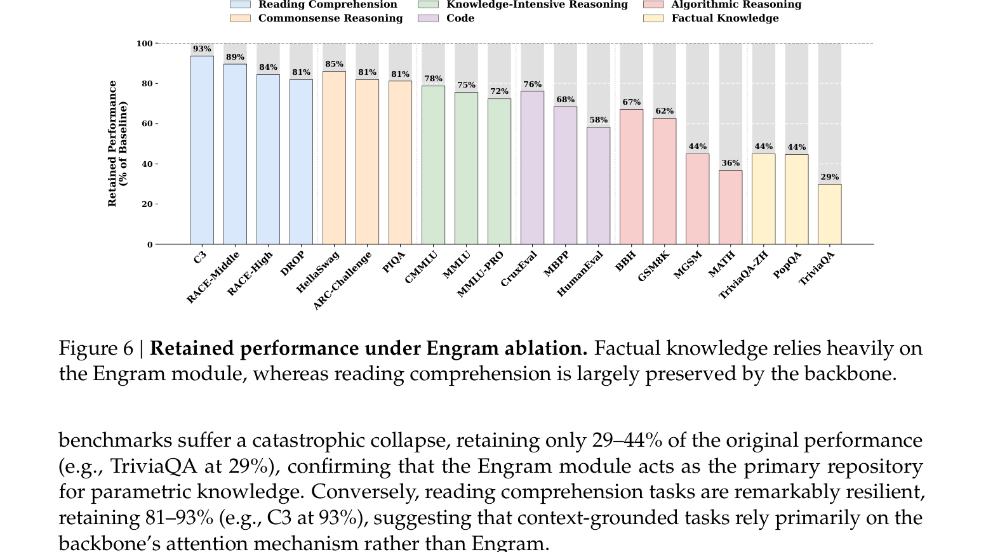
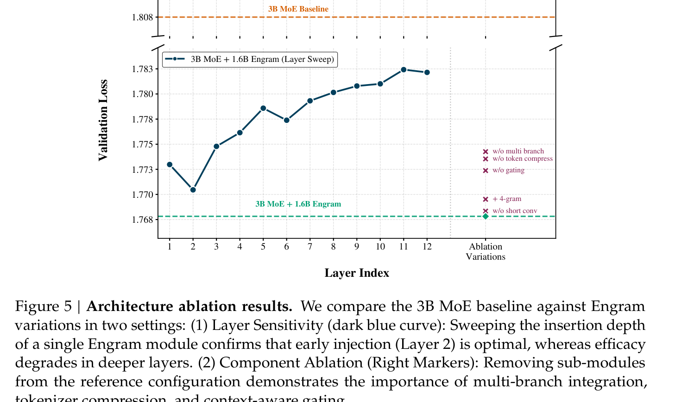

# Week 9 (Paper 1) — Paper Notes
**Paper:** Conditional Memory via Scalable Lookup: A New Axis of Sparsity for Large Language Models, Cheng et al. 2026 (Peking University & DeepSeek-AI)

---

## Table of Contents

1. [Overview](#overview)
2. [Things That Came Up During Reading](#things-that-came-up-during-reading)
3. [Key Points](#key-points)
4. [Architecture](#architecture)
   - [Two Axes of Sparsity](#two-axes-of-sparsity)
   - [Sparse Retrieval via Hashed N-grams](#sparse-retrieval-via-hashed-n-grams)
   - [Context-aware Gating](#context-aware-gating)
   - [Multi-branch Integration with mHC](#multi-branch-integration-with-mhc)
   - [System-level Co-design](#system-level-co-design)
5. [Sparsity Allocation Scaling Law](#sparsity-allocation-scaling-law)
   - [Compute-matched Formulation](#compute-matched-formulation)
   - [The U-shape Allocation Result](#the-u-shape-allocation-result)
   - [Infinite Memory Regime](#infinite-memory-regime)
6. [Large-scale Pre-training Results](#large-scale-pre-training-results)
7. [Long-context Performance](#long-context-performance)
8. [Mechanistic Analysis](#mechanistic-analysis)
9. [Ablations](#ablations)
10. [System Efficiency](#system-efficiency)
11. [Connections to Previous Weeks](#connections-to-previous-weeks)
12. [Glossary](#glossary)

---

## Overview
*Paper reference: Abstract & Section 1 (pp. 1–2)*

The paper introduces **conditional memory** as a new, complementary axis of sparsity for large language models, sitting alongside the now-standard **conditional computation** axis used by Mixture-of-Experts (MoE). The authors argue that Transformers lack a native primitive for *knowledge lookup* — when a model needs to recall a stereotyped entity like "Diana, Princess of Wales" or a phrase like "By the way", it must reconstruct that representation through several layers of attention and FFN computation, which is wasteful. Engram is their proposed module: a modernized **N-gram embedding table** retrieved in $O(1)$ time via hashing, which gives the Transformer an explicit, parameter-rich but computation-light memory store.

Engram is then evaluated under a strict **iso-parameter and iso-FLOPs** comparison against a pure MoE baseline. Reallocating ~25% of the sparse parameter budget from MoE experts to an Engram memory module produces a robust **U-shaped scaling law** in validation loss — neither pure MoE ($\rho = 1$) nor pure memory ($\rho = 0$) is optimal, but their hybrid is. Scaling the design to a 27B-parameter model (Engram-27B) produces gains not only on knowledge benchmarks (MMLU +3.0, CMMLU +4.0) but also on general reasoning (BBH +5.0, ARC-Challenge +3.7) and code/math (HumanEval +3.0, MATH +2.4). On long-context tasks the gains are especially large (Multi-Query NIAH 84.2 → 97.0).

The third contribution is **infrastructure-aware design**: because Engram lookups are *deterministic* (the hash IDs are known the moment the input tokens are known), the embedding table can be offloaded to host DRAM and prefetched asynchronously over PCIe, with throughput dropping by less than 3% even when 100B parameters of Engram memory live entirely off-device. Combined, the work positions conditional memory as a first-class architectural primitive for the next generation of sparse LLMs.

---

## Things That Came Up During Reading

> *(Add specific observations, confusions, and aha moments here as you read.)*

- The "U-shape" scaling result is striking: pure MoE is **strictly suboptimal** under iso-FLOPs/iso-parameter, even though MoE is the field's default. What does this say about how much of MoE expert capacity is being "wasted" on simulating lookup?
- The CKA + LogitLens analysis treats "model depth" as a proxy for compute, then claims Engram lets shallow layers of the Engram model behave like deep layers of the MoE baseline. This is a strong functional-equivalence claim — worth scrutinizing.
- Engram is *not* a long-context method per se, yet it produces enormous Multi-Query NIAH gains (84.2 → 97.0). The paper attributes this to "freeing up attention capacity" — is that the right causal story?
- The training-vs-inference mismatch: at training time embedding tables are sharded across GPUs with All-to-All; at inference they're offloaded to host DRAM. The whole design only works because retrieval IDs are deterministic.

---

## Key Points
*Paper reference: Section 1 & 4 (pp. 1–2, 8–11)*

- Engram is a **suffix N-gram embedding lookup module** inserted between the Vocab Embedding and Transformer blocks. It uses $K$ hash heads per N-gram order $n \in \{2,3\}$ to deterministically map local context to embedding rows.
- The paper formalizes the **Sparsity Allocation problem**: given a fixed sparse-parameter budget, what fraction $\rho$ should go to MoE experts vs. Engram memory? They find a **robust U-shape** with optimum at $\rho \approx 75\text{–}80\%$ — i.e., MoE keeps ~75% of the sparse budget and Engram takes ~25%.
- Engram-27B is built by reallocating from a 72-expert MoE-27B baseline down to **55 routed experts + a 5.7B-parameter Engram memory**, keeping total parameters (26.7B) and activated parameters (3.8B) constant.
- Engram-27B beats the iso-FLOPs MoE-27B baseline on **all** benchmark categories: knowledge (**MMLU 60.4 vs. 57.4**, CMMLU 61.9 vs. 57.9), reasoning (BBH 55.9 vs. 50.9, ARC-Challenge 73.8 vs. 70.1), code/math (HumanEval 40.8 vs. 37.8, MATH 30.7 vs. 28.3), and reading comprehension (DROP 59.0 vs. 55.7).
- On long-context (after YaRN extension to 32k), Engram-27B reaches **Multi-Query NIAH 97.0** vs. MoE-27B's 84.2, and **VT (Variable Tracking) 87.2 vs. 77.0** — the gains are largest on multi-hop / multi-key retrieval.
- Mechanistic interpretability (LogitLens KL divergence, CKA similarity heatmaps) shows Engram's **layer 5 representations align with the MoE baseline's layer 12** — a near-doubling of effective depth in early blocks.
- Sensitivity analysis: ablating Engram at inference catastrophically hurts factual knowledge (TriviaQA retains only **29%** of original performance) but reading comprehension is largely preserved (C3 retains **93%**), evidencing the desired *factual specialization*.
- Infinite-memory regime: with the MoE backbone fixed, scaling Engram from $2.58 \times 10^5$ to $1.0 \times 10^7$ slots (~13B added params) reduces validation loss in a clean **log-linear power law**.
- System: 100B-parameter Engram offloaded to host DRAM induces only **2.8% throughput drop** on an 8B-dense backbone, because deterministic IDs allow PCIe prefetching to overlap with prior-block compute.
- Critical placement insight: putting Engram at **layers 2 and 15** (split into two smaller modules) outperforms a single insertion. Layer 2 offloads bottom-layer local-pattern aggregation; layer 15 provides late, contextually-richer gating.
- Removing **multi-branch integration**, **context-aware gating**, or **tokenizer compression** each causes the largest validation-loss regressions among the ablations; removing the lightweight depthwise convolution barely matters.

---

## Architecture
*Paper reference: Section 2 (pp. 3–6)*

### Two Axes of Sparsity

The paper's central conceptual move is to distinguish two complementary sparsity primitives:

| Sparsity Type | Realized By | What's "Sparse" | Routing Logic | Where Capacity Goes |
|---------------|-------------|-----------------|---------------|---------------------|
| **Conditional Computation** | MoE | A few experts are activated per token | Learned, *dynamic* (depends on hidden state) | Adds parameter capacity for **logic / reasoning** |
| **Conditional Memory** | Engram | A few embedding rows are looked up per token | Deterministic *static* hash of input tokens | Adds parameter capacity for **stereotyped patterns / facts** |

The argument is that linguistic signals are heterogeneous: some are dynamic and compositional (best handled by deep computation) while a substantial fraction are local, formulaic, and highly repetitive (best handled by cheap lookup). Forcing a Transformer to *simulate* lookup with computation wastes early-layer depth on trivial reconstruction. Adding a real lookup primitive frees that depth for higher-level reasoning.

*Figure 1: Engram is inserted between the Vocab Embedding and the Transformer block. Suffix N-grams (e.g., the bigram "the Great" and the trigram "Alexander the Great" ending at the current token) are hashed to retrieve $K$ embeddings per order, concatenated, and fused with the current hidden state.*

### Sparse Retrieval via Hashed N-grams

**Tokenizer Compression.** Standard subword tokenizers prioritize lossless reconstruction, so semantically equivalent forms (e.g., `Apple` vs. `_apple`) get distinct IDs. Engram first applies a precomputed surjective map $\mathcal{P}: V \to V'$ that collapses raw IDs into canonical IDs (NFKC + lowercasing), achieving a **23% reduction in effective vocabulary** for a 128k tokenizer. For a token at position $t$, the canonical suffix N-gram is

$$g_{t,n} = (x'_{t-n+1}, \ldots, x'_t)$$

**Multi-Head Hashing.** The full combinatorial space of N-grams is intractable to parameterize. Instead, $K$ hash heads are used per N-gram order $n$:

$$z_{t,n,k} = \varphi_{n,k}(g_{t,n}), \quad \mathbf{e}_{t,n,k} = \mathbf{E}_{n,k}[z_{t,n,k}]$$

Where:
- $g_{t,n}$ = the canonical suffix N-gram of order $n$ ending at position $t$
- $\varphi_{n,k}$ = the $k$-th deterministic hash function for order $n$ (a lightweight multiplicative-XOR hash)
- $z_{t,n,k}$ = the integer index produced by hashing
- $\mathbf{E}_{n,k} \in \mathbb{R}^{M_{n,k} \times d_\mathrm{mem}}$ = the embedding table of prime size $M_{n,k}$
- $\mathbf{e}_{t,n,k} \in \mathbb{R}^{d_\mathrm{mem}}$ = the retrieved embedding row

The final memory vector at position $t$ concatenates all retrieved embeddings across $N \in \{2,3\}$ and $K = 8$ heads:

$$\mathbf{e}_t = \big\Vert_{n=2}^{N} \big\Vert_{k=1}^{K} \mathbf{e}_{t,n,k}$$

The $K$ hash heads mitigate collisions: even if one hash sends two different N-grams to the same row, the combined $K$-fold representation will (with high probability) distinguish them.

### Context-aware Gating

Static retrieved embeddings $\mathbf{e}_t$ are *context-independent*, so they can suffer from polysemy or hash noise. To fix this, Engram uses an attention-like gating mechanism that lets the current hidden state $\mathbf{h}_t$ — which has aggregated global context through the preceding Transformer layers — *modulate* what gets read out of memory.

The retrieved memory $\mathbf{e}_t$ provides both Key and Value projections:

$$\mathbf{k}_t = \mathbf{W}_K \mathbf{e}_t, \quad \mathbf{v}_t = \mathbf{W}_V \mathbf{e}_t$$

A scalar gate $\alpha_t \in (0,1)$ is computed (with RMSNorm applied to query and key for gradient stability):

$$\alpha_t = \sigma\!\left(\frac{\mathrm{RMSNorm}(\mathbf{h}_t)^\top \, \mathrm{RMSNorm}(\mathbf{k}_t)}{\sqrt{d}}\right)$$

Where:
- $\mathbf{h}_t \in \mathbb{R}^d$ = the current hidden state (the dynamic Query)
- $\mathbf{k}_t, \mathbf{v}_t \in \mathbb{R}^d$ = the Key and Value derived from the static retrieved memory
- $\sigma$ = the sigmoid function
- $d$ = the model's hidden size (2560 for the experiments)

The gated value $\tilde{\mathbf{v}}_t = \alpha_t \cdot \mathbf{v}_t$ is then refined by a short depthwise causal convolution (kernel width $w = 4$, dilation $\delta = N$, SiLU activation) and added back to the residual:

$$\mathbf{Y} = \mathrm{SiLU}\big(\mathrm{Conv1D}(\mathrm{RMSNorm}(\tilde{\mathbf{V}}))\big) + \tilde{\mathbf{V}}$$

$$\mathbf{H}^{(\ell)} \leftarrow \mathbf{H}^{(\ell)} + \mathbf{Y}$$

Where:
- $\tilde{\mathbf{V}} \in \mathbb{R}^{T \times d}$ = the sequence of gated values
- $\mathbf{Y} \in \mathbb{R}^{T \times d}$ = the final Engram contribution to the residual
- $\mathbf{H}^{(\ell)}$ = the residual stream at layer $\ell$ where Engram is inserted

The intuition is clean: if the retrieved memory contradicts the current context, the gate $\alpha_t \to 0$ and the noise is suppressed.

### Multi-branch Integration with mHC

Engram is integrated into the multi-branch backbone provided by **Manifold-Constrained Hyper-Connections (mHC)** (the same primitive that DeepSeek-V4 uses — see Paper 2 of W9). Under mHC the residual stream is expanded into $M = 4$ parallel branches, each modulated by learnable connection weights.

Engram's adaptation is parameter-sharing across branches: a single sparse embedding table and a single Value projection $\mathbf{W}_V$ are shared across all $M$ branches, while $M$ distinct Key projections $\{\mathbf{W}_K^{(m)}\}_{m=1}^M$ enable branch-specific gating. The branch-$m$ gate is

$$\alpha_t^{(m)} = \sigma\!\left(\frac{\mathrm{RMSNorm}(\mathbf{h}_t^{(m)})^\top \, \mathrm{RMSNorm}(\mathbf{W}_K^{(m)} \mathbf{e}_t)}{\sqrt{d}}\right)$$

This design fuses the $M$ key projections into a single dense FP8 GEMM at inference, which keeps GPU utilization high.

### System-level Co-design

*Figure 2: At training time, embedding tables are sharded across GPUs and accessed via All-to-All. At inference, tables are offloaded to host DRAM; the host asynchronously prefetches embeddings over PCIe while the GPU executes preceding Transformer blocks, hiding communication behind computation.*

The deterministic nature of Engram's retrieval is the system-level superpower: indices for layer $\ell$'s Engram lookup are known the moment the input tokens are known. This enables a **prefetch-and-overlap** strategy: while GPU runs the first few Transformer blocks, the host pulls the relevant embedding rows over PCIe, so they are resident before layer $\ell$ executes. The optimal layer for Engram placement is therefore a hardware-algorithm co-design problem: too early and the gating query has no context; too late and the prefetch window is gone.

Natural-language N-grams follow a **Zipfian distribution**, so a multi-level cache hierarchy (HBM → Host DRAM → NVMe SSD) keeps the head of the distribution hot and lets the long tail spill to slower media without inflating effective latency.

---

## Sparsity Allocation Scaling Law
*Paper reference: Section 3 (pp. 7–8)*

### Compute-matched Formulation

The authors define three parameter quantities that must be tracked separately:

| Symbol | Definition |
|--------|-----------|
| $P_\mathrm{tot}$ | Total trainable parameters (excluding vocab embedding and LM head) |
| $P_\mathrm{act}$ | Activated parameters per token (controls FLOPs) |
| $P_\mathrm{sparse} \triangleq P_\mathrm{tot} - P_\mathrm{act}$ | Inactive parameters — the "free" capacity that doesn't cost FLOPs |

For MoE, $P_\mathrm{sparse}$ is the unselected experts. For Engram, scaling the embedding table grows $P_\mathrm{tot}$ but not $P_\mathrm{act}$, because only a *constant* number of slots (a fixed multi-head/N-gram set) is retrieved per token.

The **allocation ratio** $\rho \in [0, 1]$ controls the split:

$$P_\mathrm{MoE}^{(\mathrm{sparse})} = \rho \, P_\mathrm{sparse}, \qquad P_\mathrm{Engram} = (1 - \rho) \, P_\mathrm{sparse}$$

Where:
- $\rho = 1$: pure MoE (all sparse capacity in routed experts)
- $\rho = 0$: pure memory (no MoE; all sparse capacity in Engram tables)
- $0 < \rho < 1$: hybrid, with the rest reallocated from experts to embedding rows

### The U-shape Allocation Result

*Figure 3 (Left): Validation loss vs. $\rho$ at two compute budgets. Both curves bow downward — a hybrid allocation strictly outperforms either extreme. The optimum sits around $\rho \approx 75\text{–}80\%$. (Right): With the MoE backbone fixed, Engram's validation loss decays log-linearly with the number of embedding slots, while OverEncoding (an averaging-based baseline) saturates much earlier.*

Two compute regimes are tested at $P_\mathrm{tot}/P_\mathrm{act} \approx 10$:

| Compute Budget | $P_\mathrm{tot}$ | $P_\mathrm{act}$ | Pure-MoE Experts ($\rho = 1$) |
|----------------|----|----|----|
| $C = 2 \times 10^{20}$ FLOPs | ~5.7B | ~568M | 106 experts |
| $C = 6 \times 10^{20}$ FLOPs | ~9.9B | ~993M | 99 experts |

In the 10B regime, validation loss improves from **1.7248 (pure MoE)** to **1.7109 (optimum near $\rho = 80\%$)** — a $\Delta = 0.0139$ improvement. The optimum location is stable across the two compute scales, suggesting a robust allocation law.

The intuition for the U-shape:
- $\rho \to 100\%$ (MoE-dominated): the model lacks dedicated memory, so it must reconstruct stereotyped patterns through depth, wasting compute.
- $\rho \to 0\%$ (Engram-dominated): the model loses the dynamic computation needed for compositional reasoning; memory cannot replace computation.

### Infinite Memory Regime

Once the MoE backbone is fixed (3B total / 568M activated), Engram embedding slots can be scaled aggressively because they don't change FLOPs. The authors sweep slot counts $M$ from $2.58 \times 10^5$ to $1.0 \times 10^7$ — adding up to **~13B inactive parameters** for free at inference time (offloaded to host).

The result: validation loss decreases as a **strict power law in log-space** across the entire range. The OverEncoding baseline (which averages N-gram embeddings into the vocab embedding) saturates much earlier — it benefits less from larger memory tables. Engram acts as a *predictable scaling knob* in this dimension.

---

## Large-scale Pre-training Results
*Paper reference: Section 4 (pp. 8–11)*

### Model Configurations

Four 30-block, $d_\mathrm{model} = 2560$ models trained for **262B tokens** with the DeepSeek-V3 128k tokenizer:

| Model | Total Params | Activated Params | Routed Experts | Engram Params |
|-------|--------------|------------------|----------------|---------------|
| **Dense-4B** | 4.1B | 3.8B | — | — |
| **MoE-27B** | 26.7B | 3.8B | 72 (top-6) + 2 shared | — |
| **Engram-27B** | 26.7B | 3.8B | 55 (top-6) + 2 shared | 5.7B |
| **Engram-40B** | 39.5B | 3.8B | 55 (top-6) + 2 shared | 18.5B |

All models use **MLA** attention with 32 heads, FFN expansion rate 4, and **mHC** with $n_\mathrm{hc} = 4$. The Engram configuration: layers 2 and 15, $N$-gram order $\{2, 3\}$, $K = 8$ heads, $d_\mathrm{mem} = 1280$. Backbone optimizer is Muon; embedding parameters use Adam with a $5\times$ LR multiplier and zero weight decay. Convolution parameters are zero-initialized so the Engram contribution starts as identity.

### Benchmark Results

Engram-27B is **iso-parameter and iso-activated-FLOPs with MoE-27B** — it just reallocates from experts (72 → 55) into a 5.7B Engram memory ($\rho = 74.3\%$).

#### Benchmark Descriptions (selected)

| Benchmark | What It Tests | Format | Metric |
|-----------|---------------|--------|--------|
| **MMLU** | Multitask language understanding across 57 subjects | 5-shot multiple choice | Accuracy — higher is better |
| **MMLU-Pro** | Harder MMLU variant with 10 options and reasoning emphasis | 5-shot MC | Accuracy — higher is better |
| **CMMLU** | Chinese MMLU | 5-shot MC | Accuracy — higher is better |
| **BBH** | Big-Bench Hard, 23 challenging reasoning subtasks | 3-shot exact match | EM — higher is better |
| **ARC-Challenge** | Grade-school science questions, hard subset | 25-shot MC | Accuracy — higher is better |
| **TriviaQA** | Open-domain factual QA | 5-shot exact match | EM — higher is better |
| **DROP** | Discrete reasoning over paragraphs | 1-shot F1 | F1 — higher is better |
| **HumanEval** | Python function synthesis from docstrings | 0-shot | pass@1 — higher is better |
| **GSM8K** | Grade-school math word problems | 8-shot exact match | EM — higher is better |
| **MATH** | Competition-level mathematics | 4-shot EM | EM — higher is better |

#### Pre-training Performance (selected from Table 1)

| Category | Benchmark | Dense-4B | MoE-27B | **Engram-27B** | Engram-40B |
|----------|-----------|----------|---------|----------------|------------|
| Lang. Modeling | Pile (loss ↓) | 2.091 | 1.960 | **1.950** | 1.942 |
| Lang. Modeling | Validation (loss ↓) | 1.768 | 1.634 | **1.622** | 1.610 |
| Knowledge | MMLU (Acc.) | 48.6 | 57.4 | **60.4** | 60.6 |
| Knowledge | MMLU-Pro (Acc.) | 21.1 | 28.3 | **30.1** | 31.3 |
| Knowledge | CMMLU (Acc.) | 47.9 | 57.9 | **61.9** | 63.4 |
| Knowledge | TriviaQA (EM) | 33.0 | 48.8 | **50.7** | 51.8 |
| Reasoning | ARC-Challenge | 59.3 | 70.1 | **73.8** | 76.4 |
| Reasoning | BBH (EM) | 42.8 | 50.9 | **55.9** | 57.5 |
| Reasoning | HellaSwag | 64.3 | 71.8 | **72.7** | 73.1 |
| Reading | DROP (F1) | 41.6 | 55.7 | **59.0** | 60.7 |
| Reading | RACE-High | 66.0 | 75.4 | **78.2** | 79.2 |
| Code | HumanEval (pass@1) | 26.8 | 37.8 | **40.8** | 38.4 |
| Code | MBPP (pass@1) | 35.4 | 46.6 | **48.2** | 46.2 |
| Math | GSM8K (EM) | 35.5 | 58.4 | **60.6** | 62.6 |
| Math | MATH (EM) | 15.2 | 28.3 | **30.7** | 30.6 |

The takeaway is that the gains are **broad-spectrum, not just knowledge-specific**: BBH (+5.0), ARC-Challenge (+3.7), HumanEval (+3.0), and MATH (+2.4) all see meaningful improvement. The authors interpret this as evidence that conditional memory frees the backbone for higher-level reasoning rather than serving narrowly as a fact lookup.

Note: Engram-40B (with 18.5B memory) does not strictly dominate Engram-27B on every metric, which the authors attribute to under-training within the fixed 262B-token budget. The training-loss gap between the two continues to widen at the end of training.

> **Comparison to Mixtral (W6):** Mixtral 8×7B is the canonical "increase capacity via more experts" strategy: 47B total, 13B activated, 8 experts with top-2 routing. Engram inverts the ratio: keep the *same* activated capacity, *reduce* expert count, and put the freed parameters into a static, $O(1)$-lookup memory. Both are sparse, but only Engram offers the deterministic-routing property that lets parameters live off-device.

---

## Long-context Performance
*Paper reference: Section 5 (pp. 11–13)*

After pre-training, both MoE-27B and Engram-27B are extended to a 32k context window via **YaRN** (5,000 steps, 30B tokens of long-context data, scaling factor $f = 0.707$).

### Benchmark Descriptions

| Benchmark | What It Tests | Format | Metric |
|-----------|---------------|--------|--------|
| **LongPPL** | Perplexity on key-information tokens in long documents | Per-token PPL | Lower is better (↓) |
| **RULER NIAH** | Needle-in-a-Haystack retrieval; Single (S), Multi-keys (MK), Multi-values (MV), Multi-queries (MQ) | Locate hidden facts | Accuracy — higher is better |
| **RULER VT** | Variable Tracking — multi-hop chain reasoning across long context | Chain following | Accuracy — higher is better |
| **RULER CWE / FWE** | Common / Frequent Words Extraction | Top-k word extraction | Accuracy — higher is better |
| **RULER QA** | Long-document QA | Q&A | Accuracy — higher is better |

### Results (Table 2, condensed)

The authors report at three Engram-27B checkpoints to disentangle base-model capability from architectural superiority:

| Model | Pre-train Steps / Loss | LongPPL Avg | RULER MQ-NIAH | RULER VT |
|-------|------------------------|-------------|----------------|----------|
| MoE-27B (50k, 1.63) | 50k / 1.63 | 14.16 | 84.2 | 77.0 |
| Engram-27B **(41k, 1.66)** — *82% compute* | 41k / 1.66 | 14.26 | 89.5 | 83.2 |
| Engram-27B **(46k, 1.63)** — *iso-loss* | 46k / 1.63 | 13.59 | **97.0** | **87.2** |
| Engram-27B (50k, 1.62) — *iso-FLOPs* | 50k / 1.62 | **13.41** | 97.0 | 89.0 |

The two key findings:

1. **At iso-loss (46k vs. baseline at 50k)**, Engram still wins on every metric — so the gain isn't just due to a better base model; the architecture itself is more long-context-efficient.
2. **At only 82% of pre-training FLOPs (41k)**, Engram already matches the baseline's LongPPL and surpasses it on RULER.

The authors' explanation: by offloading local-pattern reconstruction to memory, Engram **frees attention capacity** to focus on global, long-range dependencies. Multi-Query NIAH gains are largest because that benchmark stresses exactly the kind of multi-hop retrieval that benefits from cleaner attention.

---

## Mechanistic Analysis
*Paper reference: Section 6.1 (pp. 13–15)*

The authors use two interpretability tools to test the hypothesis that Engram makes the network **functionally deeper** by relieving early layers of static-knowledge reconstruction.

### LogitLens Analysis

LogitLens projects each intermediate layer's hidden state through the final LM Head and computes its KL divergence to the model's final output distribution. The smaller the KL, the more "prediction-ready" that representation is.

**Result:** Both Engram-27B and Engram-40B show systematically lower KL divergence than MoE-27B at every layer, with the largest gap in the **early blocks**. Engram models reach high-confidence predictions earlier — consistent with the lookup primitive substituting for the early reconstruction work that pure MoE has to do through attention + FFN composition.

*Figure 4: (a) Layer-wise KL divergence — Engram curves are systematically below the MoE baseline, with the gap concentrated in early layers. (b–c) CKA similarity heatmaps between Engram-27B/40B and MoE-27B layers. The off-diagonal upward shift means an Engram layer aligns most strongly with a *deeper* MoE layer.*

### CKA Representational Alignment

Centered Kernel Alignment (CKA) measures how similar two sets of internal representations are:

$$\mathrm{CKA}(K, L) = \frac{\mathrm{HSIC}(K, L)}{\sqrt{\mathrm{HSIC}(K,K)\,\mathrm{HSIC}(L,L)}}$$

Where:
- $K = XX^\top$ and $L = YY^\top$ are linear-kernel Gram matrices over the two representation sets $X, Y$
- $\mathrm{HSIC}$ = Hilbert-Schmidt Independence Criterion (an unbiased estimator is used)

A pairwise similarity matrix $S \in [0,1]^{L \times L}$ is built by computing CKA between every Engram layer and every MoE layer. The "soft alignment" of Engram layer $j$ to the MoE side is

$$a_j = \frac{\sum_{i \in \mathcal{I}_j} S_{i,j} \cdot i}{\sum_{i \in \mathcal{I}_j} S_{i,j}}, \quad \mathcal{I}_j = \mathrm{argtop}\text{-}k_i (S_{i,j})$$

with $k = 5$. If Engram simply added depth-equivalent representational capacity, we'd expect $a_j \approx j$. Instead the heatmaps show $a_j > j$ across many layers — most strikingly, **Engram-27B's layer 5 aligns with MoE-27B's layer 12**, an effective depth increase of about $2.4\times$ in the early stack.

### Sensitivity Analysis (Engram Ablation at Inference)

Suppressing the Engram output during inference, while keeping the trained backbone unchanged, exposes a sharp dichotomy:

*Figure 6: Bar chart of % retained performance when Engram is silenced at inference. Reading-comprehension and commonsense tasks retain 81–93%; factual-knowledge tasks collapse to 29–44%.*

| Task Type | Examples | Retained % |
|-----------|----------|------------|
| Reading comprehension | C3 (93%), RACE-Middle (89%), DROP (84%), RACE-High (81%) | 81–93% |
| Commonsense | HellaSwag (85%), ARC-Challenge (81%), PIQA (81%) | 81–85% |
| Knowledge-intensive | C-Eval (76%), MMLU (75%), MMLU-Pro (72%) | 72–78% |
| Code | MBPP (68%), HumanEval (62%) | 62–68% |
| Algorithmic | BBH (67%), GSM8K (44%), MGSM (44%), MATH (36%) | 36–67% |
| **Factual knowledge** | **TriviaQA-ZH (44%)**, **PopQA (44%)**, **TriviaQA (29%)** | **29–44%** |

This is exactly the predicted pattern: factual tasks rely on the lookup module, while context-grounded tasks rely on the backbone's attention.

---

## Ablations
*Paper reference: Section 6.2 (pp. 15–16)*

The reference ablation backbone is a 12-layer 3B MoE model (0.56B activated) trained on 100B tokens. The reference Engram setup adds a 1.6B-parameter Engram with $\{2,3\}$-grams at layers 2 and 6, achieving val loss = **1.768** (vs. 1.808 for the bare MoE baseline, $\Delta = 0.04$).

*Figure 5: (Dark blue curve) sweeping the insertion layer of a single Engram module from 1 to 12 — best at layer 2, monotonically degrading from there. (Right markers) component ablations all show worse loss than the reference; w/o multi-branch, w/o tokenizer compression, and w/o gating cause the largest regressions.*

### Layer Placement

Sweeping a single 1.6B Engram module across layers 1–12 reveals an inherent placement trade-off:

- **Inject early**: maximizes computational depth available downstream, fits the Transformer's natural hierarchy where local features dominate the bottom layers.
- **Inject late**: gives the gating query $\mathbf{h}_t$ richer global context, so the gate can be more selective.

The single-module sweep prefers **layer 2** (val loss 1.770), but splitting the same 1.6B budget into two smaller modules at **layers 2 and 6** improves loss further to **1.768**. This is also better for system efficiency: spreading the Engram lookups across the network gives the prefetcher more compute to hide behind.

### Component Ablations

Starting from the reference configuration, removing each design element:

| Variant Removed | Effect on Val Loss | Severity |
|-----------------|-------------------|----------|
| Multi-branch integration | Largest regression | High |
| Tokenizer compression | Large regression | High |
| Context-aware gating | Large regression | High |
| Adding 4-grams (extending capacity) | Slight regression | Low (dilutes 2/3-gram budget) |
| Short depthwise convolution | Marginal regression | Low |

Three components are load-bearing: multi-branch integration (lets each branch select different memory rows), tokenizer compression (removes equivalence-class duplicates), and gating (suppresses noise). The depthwise convolution is nice-to-have.

---

## System Efficiency
*Paper reference: Section 6.4 (p. 17)*

The system test uses a nano-vLLM-based inference harness on dense backbones (Dense-4B, Dense-8B). A 100B-parameter Engram layer is inserted at the second Transformer block with the embedding table living entirely in **host DRAM**. The host asynchronously prefetches embeddings over PCIe while the GPU executes the first block.

| Base Model | Configuration | Throughput (tok/s) | Drop |
|------------|---------------|---------------------|------|
| 4B-Dense | Baseline | 9,031.62 | — |
| 4B-Dense | + 100B Engram (CPU offload) | 8,858.28 | 1.9% |
| 8B-Dense | Baseline | 6,315.52 | — |
| 8B-Dense | + 100B Engram (CPU offload) | 6,140.02 | 2.8% |

Workload: 512 sequences, lengths uniform $[100, 1024]$, NVIDIA H800. The drop is small and the authors note this is a *conservative* baseline — every retrieval traverses PCIe. A locality-aware HBM cache for the head of the Zipfian distribution would reduce overhead further.

The case study in §6.5 visualizes the gating scalar $\alpha_t$ across samples and confirms it **fires strongly on completed stereotyped patterns**: multi-token named entities ("Alexander the Great", "Princess of Wales"), formulaic phrases ("By the way"), and Chinese idioms / historical entities ("Four Great Inventions" 四大发明). This is exactly the static-pattern population that an N-gram lookup module *should* be picking up, and it generalizes across English and Chinese.

---

## Connections to Previous Weeks

> **Attention Is All You Need (W2):** The original Transformer leans entirely on attention + FFN composition to do everything — including the static-pattern recall that Engram now offloads. Engram's gating mechanism is itself a single-step attention with the retrieved memory as both Key and Value, an elegant reuse of the W2 primitive.

> **GPT-3 (W1) and Mistral 7B (W6):** GPT-3 scaled dense parameters; Mistral 7B added architectural efficiency (SWA, GQA) to compress capacity per parameter. Engram pushes this further: instead of compressing computation, it *separates* knowledge storage (parameter-rich, FLOP-cheap) from reasoning (parameter-light, FLOP-heavy) at the architectural level — letting both scale on their own axis.

> **InstructGPT (W4):** RLHF's purpose was to align *behavior* without re-pretraining. Engram is orthogonal — it changes how *knowledge* is stored at pre-training time. But the two share a "decoupling" philosophy: separate concerns into modules with their own training signals (RLHF: reward model vs. policy; Engram: memory embedding vs. backbone) rather than forcing one homogeneous network to learn everything.

> **Mixtral / DeepSeekMoE (W6):** Mixtral introduced sparse MoE at the production scale; DeepSeekMoE refined the recipe with fine-grained experts and shared experts. Engram is the explicit complement — it **reallocates** parameters that DeepSeekMoE would have spent on more routed experts into a static memory table. The Engram-27B configuration uses DeepSeekMoE (shared + routed experts, auxiliary-loss-free balancing) as its MoE half, so it's a strict superset of the W6 design.

> **Llama 3 (W6):** Llama 3 chose a *dense* architecture and accepted the FLOPs cost in exchange for engineering simplicity. Engram's argument runs the other direction: the right way forward is *more* sparsity, not less, but along multiple axes (computation **and** memory) rather than only experts. The deterministic-routing property also distinguishes Engram from Llama 3's reliance on full attention computation — Engram's lookup pattern is predictable enough to push parameters off-device, which a dense model cannot do.

> **DeepSeek-R1 (W8):** R1 demonstrated that pure RL on a strong base produces emergent reasoning. Engram improves the *base* — particularly on multi-step reasoning (BBH, ARC-Challenge, MATH). If R1's pipeline were applied on top of an Engram-style backbone, the freed-up attention capacity could plausibly support longer / more compositional chains-of-thought.

> **DeepSeek-V4 (W9 Paper 2):** The two papers share the **mHC** primitive (manifold-constrained hyper-connections) and the **Muon** optimizer, both from the same DeepSeek architectural research line. Engram operates at the embedding/lookup axis; DeepSeek-V4 operates at the attention/long-context axis. They are two slices of the same broader "compute less, store more, lookup faster" research program.

---

## Glossary

| Term | Definition |
|------|------------|
| **Conditional Memory** | The proposed sparsity axis: per-token capacity comes from looking up a few rows of a large embedding table, with the row indices computed deterministically from the input tokens. Constant FLOPs regardless of table size. |
| **Conditional Computation** | The MoE-style sparsity axis: per-token capacity comes from activating a few of many possible expert FFNs. The router is *learned* and depends on the hidden state. |
| **Engram** | The paper's specific instantiation of conditional memory: hashed suffix N-gram lookup ($N \in \{2,3\}$, $K = 8$ heads) + tokenizer compression + context-aware gating + depthwise causal conv. |
| **Suffix N-gram** | The sequence of the last $n$ canonical token IDs ending at the current position. Used as the hash key. |
| **Multi-Head Hashing** | Using $K$ distinct hash functions per N-gram order to map a context to $K$ different rows, mitigating hash collisions through redundancy. |
| **Tokenizer Compression** | A precomputed surjective map $\mathcal{P}: V \to V'$ that collapses semantically-equivalent token IDs (e.g., `Apple` and `_apple`) before hashing. Reduces effective vocab by ~23% on 128k tokenizers. |
| **Sparsity Allocation Ratio $\rho$** | Fraction of the inactive-parameter budget allocated to MoE experts (vs. Engram memory). $\rho = 1$ is pure MoE, $\rho = 0$ is pure memory. |
| **Iso-FLOPs / Iso-parameter** | A controlled-comparison protocol where activated parameters and total parameters are held constant, so any performance gap is attributable to architecture, not capacity. |
| **mHC (Manifold-Constrained Hyper-Connections)** | Multi-branch residual variant where the residual stream is expanded into $M$ branches and the residual transformation matrix is constrained to the Birkhoff polytope (doubly stochastic matrices), bounding spectral norm by 1. Used here as the backbone scaffolding. |
| **MLA (Multi-head Latent Attention)** | DeepSeek-V3 attention variant with low-rank latent projections of K and V, used in the Engram backbone. |
| **Muon Optimizer** | Newton-Schulz-based orthogonalizing optimizer for hidden-layer weights; embedding parameters use Adam instead. |
| **YaRN** | Yet another RoPE extensioN — a method for extending the effective context window by interpolating rotary embeddings. Used here for 32k context training. |
| **LongPPL** | A perplexity-style metric for long-context language modeling that focuses on key-information tokens, designed to be more meaningful than vanilla perplexity for long sequences. |
| **RULER** | A long-context benchmark suite with 14 subtasks across 8 categories (Single/Multi-keys/values/queries NIAH, Variable Tracking, CWE/FWE, QA). |
| **NIAH (Needle-in-a-Haystack)** | Long-context evaluation where the model must retrieve a specific fact ("needle") hidden inside a long, otherwise-unrelated context ("haystack"). |
| **CKA (Centered Kernel Alignment)** | A representation-similarity metric robust to orthogonal transformations and scaling, defined via HSIC. |
| **LogitLens** | Interpretability tool that projects each layer's hidden state through the final LM Head to read off "what the model would predict if it stopped here." |
| **PCIe Prefetching** | Asynchronously transferring data from host DRAM to GPU memory across the PCIe bus while the GPU does other compute, so the data is resident before it's needed. |
| **Zipfian Distribution** | Power-law distribution typical of natural-language frequencies (a few words/N-grams are very common, most are rare). Justifies a tiered memory cache. |
| **Hyperparameter $\rho$** | Synonymous with allocation ratio; named to evoke "rho" as in "ratio of MoE to total sparse capacity." |
